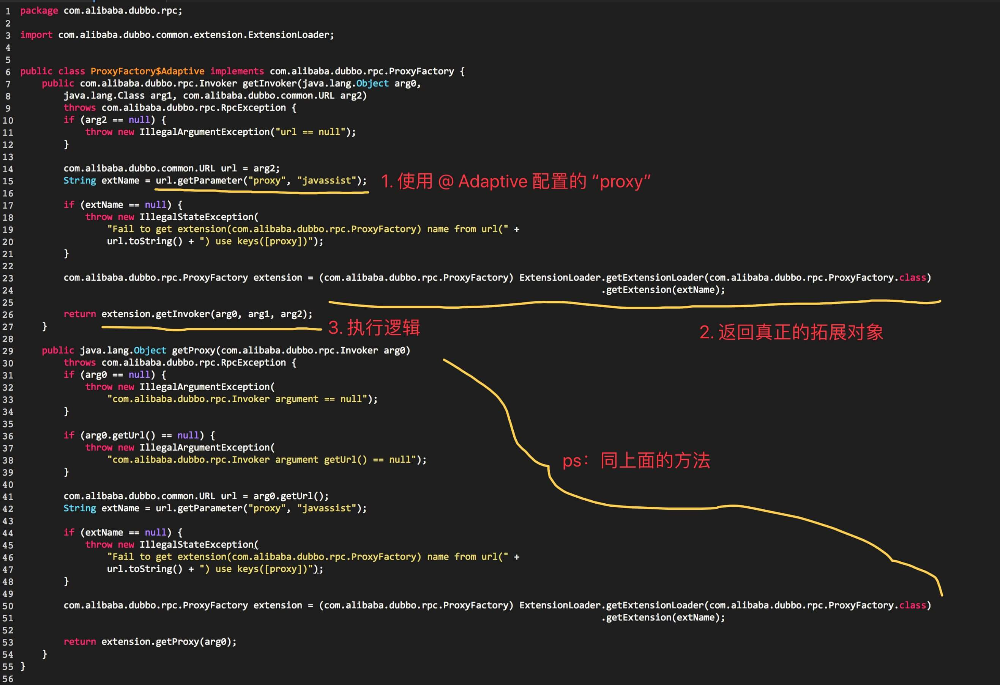

```java
/**
 * ThreadPool
 */
@SPI("fixed")
public interface ThreadPool {

    /**
     * Thread pool
     *
     * @param url URL contains thread parameter
     * @return thread pool
     */
    @Adaptive({THREADPOOL_KEY})
    Executor getExecutor(URL url);

}
```

分析下上面的@Adaptive注解如何加载对应的类：  
只要类的方法上打了@Adaptive注解,那么在调用getAdaptiveExtension时，就会对这个类生成字节码文件，然后根据@Adaptive注解的参数获取对应的Extension，此时是在字节码文件调用getExtension()方法。
1. 根据ThreadPool.class，获取对应的ExtensionLoadar,填充类的泛型与type字段。
2. 在获取自适应扩展类时，会生成对应的字节码文件，根据url上的参数名，获取对应的扩展类。此时是利用ExtensionLoadar.getAdaptiveExtension()方法。

### 在寻找这个ProxyFactory类的自适应扩展类时生成的字节码：
