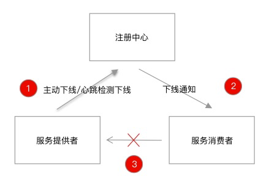

# 目标
Dubbo 的优雅下线主要依赖于注册中心组件，由其通知消费者摘除下线的节点，如下图所示：



上述的操作旨在让服务消费者避开已经下线的机器，但这样就算实现了优雅停机了吗？似乎还漏掉了一步，在应用停机时，可能还存在执行到了一半的任务，试想这样一个场景：一个 Dubbo 请求刚到达提供者，服务端正在处理请求，收到停机指令后，提供者直接停机，留给消费者的只会是一个没有处理完毕的超时请求。

结合上述的案例，我们总结出 Dubbo 优雅停机需要满足两点基本诉求：  
- 服务消费者不应该请求到已经下线的服务提供者  
- 在途请求需要处理完毕，不能被停机指令中断  

```优雅停机的意义```：应用的重启、停机等操作，不影响业务的连续性。

# 纯dubbo环境
在纯dubbo环境下，此时并没有spring容器的启动，此时的dubbo类ioc机制为SpiExtensionFactory，因此也不会触发spring bean初始化的那一套逻辑。
```java
// 纯dubbo环境，服务暴露是手动调用api方式
ServiceConfig<DemoServiceImpl> service = new ServiceConfig<>();
service.setInterface(DemoService.class);
service.setRef(new DemoServiceImpl());
service.setApplication(new ApplicationConfig("dubbo-demo-api-provider"));
service.setRegistry(new RegistryConfig("zookeeper://127.0.0.1:2181"));
service.export();

System.out.println("dubbo service started");
new CountDownLatch(1).await();

// 跟进export()
public synchronized void export() {
    if (bootstrap == null) {
        bootstrap = DubboBootstrap.getInstance();
        bootstrap.initialize();
    }
    .....
}
// 查看 DubboBootstrap.getInstance()
private DubboBootstrap() {
    configManager = ApplicationModel.getConfigManager();
    environment = ApplicationModel.getEnvironment();

    // 在创建 DubboBootstrap时，注册了dubbo关闭的钩子
    DubboShutdownHook.getDubboShutdownHook().register();
    ShutdownHookCallbacks.INSTANCE.addCallback(new ShutdownHookCallback() {
        @Override
        public void callback() throws Throwable {
            // 注册callback，调用dubbo真正的销毁方法
            DubboBootstrap.this.destroy();
        }
    });
}
// 跟进register()方法
public void register() {
    if (registered.compareAndSet(false, true)) {
        // 获取dubbo钩子
        DubboShutdownHook dubboShutdownHook = getDubboShutdownHook();
        // 注册到JVM钩子
        Runtime.getRuntime().addShutdownHook(dubboShutdownHook);
        dispatch(new DubboShutdownHookRegisteredEvent(dubboShutdownHook));
    }
}
// getDubboShutdownHook
public static DubboShutdownHook getDubboShutdownHook() {
    // DubboShutdownHook继承Thread
    return DUBBO_SHUTDOWN_HOOK;
}

@Override
public void run() {
    if (logger.isInfoEnabled()) {
        logger.info("Run shutdown hook now.");
    }
    // 会调用此方法，此时会调用创建 DubboBootstrap时，注册的callback事件
    callback();
    doDestroy();
}

private final ShutdownHookCallbacks callbacks = ShutdownHookCallbacks.INSTANCE;
private void callback() {
    callbacks.callback();
}
```

# dubbo整合spring环境
```java
// org.apache.dubbo.config.spring.ServiceBean#setApplicationContext
// ServiceBean实现了ApplicationContextAware
@Override
public void setApplicationContext(ApplicationContext applicationContext) {
    this.applicationContext = applicationContext;
    SpringExtensionFactory.addApplicationContext(applicationContext);
}

public static void addApplicationContext(ApplicationContext context) {
    CONTEXTS.add(context);
    if (context instanceof ConfigurableApplicationContext) {
        // 注册spring关闭钩子
        ((ConfigurableApplicationContext) context).registerShutdownHook();
    }
}
// 此时dubbo的关闭钩子注册时机：
//org.apache.dubbo.config.spring.context.DubboBootstrapApplicationListener#onApplicationContextEvent

@Override
public void onApplicationContextEvent(ApplicationContextEvent event) {
    if (event instanceof ContextRefreshedEvent) {
        onContextRefreshedEvent((ContextRefreshedEvent) event);
    } else if (event instanceof ContextClosedEvent) {
        // 监听spring容器关闭事件。
        onContextClosedEvent((ContextClosedEvent) event);
    }
}
// 底层仍然调用的是 dubbo的destroy方法
private void onContextClosedEvent(ContextClosedEvent event) {
    dubboBootstrap.stop();
}
public DubboBootstrap stop() throws IllegalStateException {
    destroy();
    return this;
}
```
## 如果防止spring钩子与dubbo钩子并发执行带来的问题？
由于 Spring 框架本身也依赖于 shutdown hook 执行优雅停机，并且与 Dubbo 的优雅停机会并发执行，而 Dubbo 的一些 Bean 受 Spring 托管，当 Spring 容器优先关闭时，会导致 Dubbo 的优雅停机流程无法获取相关的 Bean，从而优雅停机失效。```因此，dubbo会监听spring容器关闭事件，然后再调用dubbo的关闭方法，从而避免了两个钩子并发执行带来的问题。```


# dubbo整合springboot环境
```java
// 利用springboot自动注册spring关闭钩子方法
// org.springframework.boot.SpringApplication#refreshContext
private void refreshContext(ConfigurableApplicationContext context) {
    refresh(context);
    if (this.registerShutdownHook) {
        try {
            // 注册spring关闭钩子
            context.registerShutdownHook();
        }
        catch (AccessControlException ex) {
            // Not allowed in some environments.
        }
    }
}
// dubbo关闭钩子注册与spring整合dubbo相同。
```

# dubbo优雅停机的原理
说明：
- dubbo的优雅停机是建立在JVM的addShutdownHook回调的机制上的，通过注册回调调用停机的逻辑ProtocolConfig.destroyAll()
- ProtocolConfig.destroyAll()执行逻辑是：1、关闭注册中心；2、关闭发布协议服务
- 关闭注册中心：AbstractRegistryFactory.destroyAll()
- 关闭发布的协议服务：protocol.destroy()
```java
// org.apache.dubbo.config.bootstrap.DubboBootstrap#destroy
public void destroy() {
    if (destroyLock.tryLock()) {
        try {
            DubboShutdownHook.destroyAll();

            ....
        } finally {
            destroyLock.unlock();
        }
    }
}

public static void destroyAll() {
    if (destroyed.compareAndSet(false, true)) {
        // 注册中心销毁
        // 大致逻辑删除掉注册中心中当前服务器对应的服务提供者地址
        AbstractRegistryFactory.destroyAll();
        // 关闭请求
        destroyProtocols();
    }
}
```
## 优雅停机过程-注册中心关闭
说明：
- 注册中心关闭通过LOCK来保证不重入，此例中以ZookeeperRegistry为例。
- ZookeeperRegistry的关闭顺序：1、关闭注册中心；2、断开和zookeeper的连接。
- 关闭注册中心按照调用链路走到FailbackRegistry，关闭注册中心并停掉重试操作。
- 关闭注册中心按照调用链路走到AbstractRegistry，按照先移除作为provider的URL，再移除作为consumer的订阅的consumer信息。

```java
// org.apache.dubbo.registry.support.AbstractRegistryFactory#destroyAll
public abstract class AbstractRegistryFactory implements RegistryFactory {
    public static void destroyAll() {
        if (LOGGER.isInfoEnabled()) {
            LOGGER.info("Close all registries " + getRegistries());
        }
        // Lock up the registry shutdown process
        LOCK.lock();
        try {
            for (Registry registry : getRegistries()) {
                try {
                    registry.destroy();
                } catch (Throwable e) {
                    LOGGER.error(e.getMessage(), e);
                }
            }
            REGISTRIES.clear();
        } finally {
            // Release the lock
            LOCK.unlock();
        }
    }
}


public class ZookeeperRegistry extends FailbackRegistry {
    public void destroy() {
        // 调用父类FailbackRegistry关闭注册中心
        super.destroy();
        try {
            // 关闭zkClient客户端保证临时provider节点下线
            zkClient.close();
        } catch (Exception e) {
            logger.warn("Failed to close zookeeper client " + getUrl() + ", cause: " + e.getMessage(), e);
        }
    }
}


public abstract class FailbackRegistry extends AbstractRegistry {
    public void destroy() {
        if (!canDestroy()){
            return;
        }
        super.destroy();
        try {
            // 首先要明白FailbackRegistry的核心就在于失败重试，所以这一层的关闭只要关闭retryFuture就可以
            retryFuture.cancel(true);
        } catch (Throwable t) {
            logger.warn(t.getMessage(), t);
        }
    }
}


public abstract class AbstractRegistry implements Registry {
    public void destroy() {
        if (!destroyed.compareAndSet(false, true)) {
            return;
        }

        if (logger.isInfoEnabled()) {
            logger.info("Destroy registry:" + getUrl());
        }
        // 作为provider，取消所有的服务注册
        Set<URL> destroyRegistered = new HashSet<URL>(getRegistered());
        if (!destroyRegistered.isEmpty()) {
            for (URL url : new HashSet<URL>(getRegistered())) {
                if (url.getParameter(Constants.DYNAMIC_KEY, true)) {
                    try {
                        // 从已注册的列表中移除该URL
                        unregister(url);
                        if (logger.isInfoEnabled()) {
                            logger.info("Destroy unregister url " + url);
                        }
                    } catch (Throwable t) {
                        logger.warn("Failed to unregister url " + url + " to registry " + getUrl() + " on destroy, cause: " + t.getMessage(), t);
                    }
                }
            }
        }
        // 作为consumer，取消所有的订阅关系
        Map<URL, Set<NotifyListener>> destroySubscribed = new HashMap<URL, Set<NotifyListener>>(getSubscribed());
        if (!destroySubscribed.isEmpty()) {
            for (Map.Entry<URL, Set<NotifyListener>> entry : destroySubscribed.entrySet()) {
                URL url = entry.getKey();
                for (NotifyListener listener : entry.getValue()) {
                    try {
                        unsubscribe(url, listener);
                        if (logger.isInfoEnabled()) {
                            logger.info("Destroy unsubscribe url " + url);
                        }
                    } catch (Throwable t) {
                        logger.warn("Failed to unsubscribe url " + url + " to registry " + getUrl() + " on destroy, cause: " + t.getMessage(), t);
                    }
                }
            }
        }
    }


    public void unregister(URL url) {
        if (url == null) {
            throw new IllegalArgumentException("unregister url == null");
        }
        if (logger.isInfoEnabled()) {
            logger.info("Unregister: " + url);
        }
        registered.remove(url);
    }


    public void unsubscribe(URL url, NotifyListener listener) {
        if (url == null) {
            throw new IllegalArgumentException("unsubscribe url == null");
        }
        if (listener == null) {
            throw new IllegalArgumentException("unsubscribe listener == null");
        }
        if (logger.isInfoEnabled()) {
            logger.info("Unsubscribe: " + url);
        }
        Set<NotifyListener> listeners = subscribed.get(url);
        if (listeners != null) {
            listeners.remove(listener);
        }
    }
}
```
## 优雅停机过程-协议关闭
说明：
- 协议关闭按照以下顺序进行：1、关闭provider端的监听；2、关闭作为consumer的reference的服务；3、调用父类针对exporter对象进行清理。
- 关闭provider端的监听：关闭provider端的监听（server.close）。
- 关闭consumer的服务：关闭dubbo服务引用的服务（client.close）。
- 调用父类清理exporter：清理exporter服务（super.destroy)。
```java
// org.apache.dubbo.rpc.protocol.dubbo.DubboProtocol#destroy
public void destroy() {
    for (String key : new ArrayList<>(serverMap.keySet())) {
        ProtocolServer protocolServer = serverMap.remove(key);

        if (protocolServer == null) {
            continue;
        }

        RemotingServer server = protocolServer.getRemotingServer();

        try {
            if (logger.isInfoEnabled()) {
                logger.info("Close dubbo server: " + server.getLocalAddress());
            }
            // 注销服务提供者
            server.close(ConfigurationUtils.getServerShutdownTimeout());

        } catch (Throwable t) {
            logger.warn(t.getMessage(), t);
        }
    }

    for (String key : new ArrayList<>(referenceClientMap.keySet())) {
        List<ReferenceCountExchangeClient> clients = referenceClientMap.remove(key);

        if (CollectionUtils.isEmpty(clients)) {
            continue;
        }

        for (ReferenceCountExchangeClient client : clients) {
            // 注销服务消费者
            closeReferenceCountExchangeClient(client);
        }
    }
    // 调用父类继续进行清理,针对exporter对象进行清理
    super.destroy();
}

// 跟进super.destroy();
// org.apache.dubbo.rpc.protocol.AbstractProtocol#destroy
@Override
    public void destroy() {
        for (Invoker<?> invoker : invokers) {
            if (invoker != null) {
                invokers.remove(invoker);
                try {
                    if (logger.isInfoEnabled()) {
                        logger.info("Destroy reference: " + invoker.getUrl());
                    }
                    // 销毁invoker
                    invoker.destroy();
                } catch (Throwable t) {
                    logger.warn(t.getMessage(), t);
                }
            }
        }
        for (String key : new ArrayList<String>(exporterMap.keySet())) {
            Exporter<?> exporter = exporterMap.remove(key);
            if (exporter != null) {
                try {
                    if (logger.isInfoEnabled()) {
                        logger.info("Unexport service: " + exporter.getInvoker().getUrl());
                    }
                    // 销毁exporter
                    exporter.unexport();
                } catch (Throwable t) {
                    logger.warn(t.getMessage(), t);
                }
            }
        }
    }
```
## provider监听的close过程
说明：
- provider监听的close过程：关闭心跳检测操作，关闭底层netty服务的监听channel管道。
- 关闭心跳检测操作：doClose()。
- 关闭底层netty监听：server.close(timeout)。
```java
public class HeaderExchangeServer implements ExchangeServer {
    public void close(final int timeout) {
        startClose();
        if (timeout > 0) {
            final long max = (long) timeout;
            final long start = System.currentTimeMillis();
            if (getUrl().getParameter(Constants.CHANNEL_SEND_READONLYEVENT_KEY, true)) {
                sendChannelReadOnlyEvent();
            }

            // 如果还有进行中的任务并且没有到达等待时间的上限，则继续等待
            while (HeaderExchangeServer.this.isRunning()
                    && System.currentTimeMillis() - start < max) {
                try {
                    // 休息10毫秒再检查
                    Thread.sleep(10);
                } catch (InterruptedException e) {
                    logger.warn(e.getMessage(), e);
                }
            }
        }
        // 关闭心跳，停止应答
        doClose();

        // 关闭通信通道NettyServer
        server.close(timeout);
    }

    private void doClose() {
        // 修改标记位，该标记为设置为true后，provider不再对上游请求做应答
        if (!closed.compareAndSet(false, true)) {
            return;
        }
         // 取消心跳的Futrue
        stopHeartbeatTimer();
        try {
             // 关闭心跳的线程池
            scheduled.shutdown();
        } catch (Throwable t) {
            logger.warn(t.getMessage(), t);
        }
    }
}
```
## client的清理过程
说明：
- client的关闭过程本质上是关闭引用服务的channel对象。
- client的关闭顺序按照：设置关闭标记位，关闭心跳检测，关闭通道。

# 优雅停机初始方案总结
```
Registry 注销
等待 -Ddubbo.service.shutdown.wait 秒，等待消费方收到下线通知
Protocol 注销
    DubboProtocol 注销
        NettyServer 注销
            等待处理中的请求完毕
            停止发送心跳
            关闭 Netty 相关资源
        NettyClient 注销
            停止发送心跳
            等待处理中的请求完毕
            关闭 Netty 相关资源
```