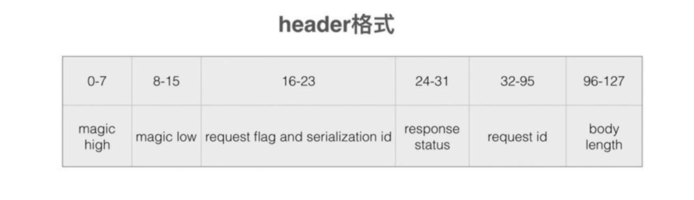

# Dubbo协议
Dubbo协议也是参考了TCP协议栈中的协议，协议内容由header和body两部分组成。


# 服务消费方编码原理&源码
## 调用过程原理
## 发送请求数据RpcInvocation到channel
消费端发起一次调用后，最终会通过DubboInvoker的doInvoke（）方法内的远程调用客户端对象currentClient的request（）方法把请求发送出去。当网络传输使用Netty时，实际上是把请求转换为任务并投递到了NettyClient对应的Channel管理的异步队列里，这样当前的业务线程就会返回了，Netty会使用I/O线程去异步地执行该任务，把请求通过TCP链接发送出去。   
整体来说：上层业务通过nettyClient把请求接口所需数据发送到channel
## outBoundHandler编码处理
nettyClient发送到channel需要经过outBoundHandler，其中一个就是InternalEncoder
## consumer request过程源码
```java
// org.apache.dubbo.rpc.protocol.dubbo.DubboInvoker#doInvoke
@Override
protected Result doInvoke(final Invocation invocation) throws Throwable {
    // RpcInvocation包含了调用需要的参数(方法名、参数等)
    RpcInvocation inv = (RpcInvocation) invocation;
    final String methodName = RpcUtils.getMethodName(invocation);
    inv.setAttachment(PATH_KEY, getUrl().getPath());
    inv.setAttachment(VERSION_KEY, version);

    ExchangeClient currentClient;
    if (clients.length == 1) {
        currentClient = clients[0];
    } else {
        currentClient = clients[index.getAndIncrement() % clients.length];
    }
    try {
        boolean isOneway = RpcUtils.isOneway(getUrl(), invocation);
        int timeout = calculateTimeout(invocation, methodName);
        invocation.put(TIMEOUT_KEY, timeout);
        if (isOneway) {
            boolean isSent = getUrl().getMethodParameter(methodName, Constants.SENT_KEY, false);
            currentClient.send(inv, isSent);
            return AsyncRpcResult.newDefaultAsyncResult(invocation);
        } else {
            ExecutorService executor = getCallbackExecutor(getUrl(), inv);
            // 发送request请求server端
            CompletableFuture<AppResponse> appResponseFuture =
                    currentClient.request(inv, timeout, executor).thenApply(obj -> (AppResponse) obj);
            // save for 2.6.x compatibility, for example, TraceFilter in Zipkin uses com.alibaba.xxx.FutureAdapter
            FutureContext.getContext().setCompatibleFuture(appResponseFuture);
            AsyncRpcResult result = new AsyncRpcResult(appResponseFuture, inv);
            result.setExecutor(executor);
            return result;
        }
    } catch (TimeoutException e) {
        throw new RpcException(RpcException.TIMEOUT_EXCEPTION, "Invoke remote method timeout. method: " + invocation.getMethodName() + ", provider: " + getUrl() + ", cause: " + e.getMessage(), e);
    } catch (RemotingException e) {
        throw new RpcException(RpcException.NETWORK_EXCEPTION, "Failed to invoke remote method: " + invocation.getMethodName() + ", provider: " + getUrl() + ", cause: " + e.getMessage(), e);
    }
}
```
我们继续跟进request方法：

```java
// org.apache.dubbo.remoting.exchange.support.header.HeaderExchangeChannel#request(java.lang.Object, int, java.util.concurrent.ExecutorService)
@Override
public CompletableFuture<Object> request(Object request, int timeout, ExecutorService executor) throws RemotingException {
    // request就是RpcInvocation
    if (closed) {
        throw new RemotingException(this.getLocalAddress(), null, "Failed to send request " + request + ", cause: The channel " + this + " is closed!");
    }
    // create request. 把RpcInvocation封装成新的Request对象
    Request req = new Request();
    req.setVersion(Version.getProtocolVersion());
    req.setTwoWay(true);
    req.setData(request);  // 设置Data
    DefaultFuture future = DefaultFuture.newFuture(channel, req, timeout, executor);
    try {
        // 利用netty发送
        channel.send(req);
    } catch (RemotingException e) {
        future.cancel();
        throw e;
    }
    return future;
}
```
跟进channel.send
```java
// org.apache.dubbo.remoting.transport.AbstractPeer#send
public void send(Object message) throws RemotingException {
    send(message, url.getParameter(Constants.SENT_KEY, false));
}

// org.apache.dubbo.remoting.transport.AbstractClient#send
@Override
public void send(Object message, boolean sent) throws RemotingException {
    if (needReconnect && !isConnected()) {
        connect();
    }
    Channel channel = getChannel();
    if (channel == null || !channel.isConnected()) {
        throw new RemotingException(this, "message can not send, because channel is closed . url:" + getUrl());
    }
    channel.send(message, sent);
}
// org.apache.dubbo.remoting.transport.netty4.NettyChannel#send
public void send(Object message, boolean sent) throws RemotingException {
    // whether the channel is closed
    super.send(message, sent);

    boolean success = true;
    int timeout = 0;
    try {
        // 通过NettyChannel 发送数据到channel
        ChannelFuture future = channel.writeAndFlush(message);
        if (sent) {
            // wait timeout ms
            timeout = getUrl().getPositiveParameter(TIMEOUT_KEY, DEFAULT_TIMEOUT);
            success = future.await(timeout);
        }
        Throwable cause = future.cause();
        if (cause != null) {
            throw cause;
        }
    } catch (Throwable e) {
        removeChannelIfDisconnected(channel);
        throw new RemotingException(this, "Failed to send message " + PayloadDropper.getRequestWithoutData(message) + " to " + getRemoteAddress() + ", cause: " + e.getMessage(), e);
    }
    if (!success) {
        throw new RemotingException(this, "Failed to send message " + PayloadDropper.getRequestWithoutData(message) + " to " + getRemoteAddress()
                + "in timeout(" + timeout + "ms) limit");
    }
}
```
consumer端发送数据到channel中间会经过一系列 OutBoundHandler处理
```java
// org.apache.dubbo.remoting.transport.netty4.NettyCodecAdapter.InternalEncoder#encode
// 继承netty MessageToByteEncoder
private class InternalEncoder extends MessageToByteEncoder {
    @Override
    protected void encode(ChannelHandlerContext ctx, Object msg, ByteBuf out) throws Exception {
        org.apache.dubbo.remoting.buffer.ChannelBuffer buffer = new NettyBackedChannelBuffer(out);
        Channel ch = ctx.channel();
        NettyChannel channel = NettyChannel.getOrAddChannel(ch, url, handler);
        // 编码
        codec.encode(channel, buffer, msg);
    }
}
// org.apache.dubbo.remoting.exchange.codec.ExchangeCodec#encode
@Override
public void encode(Channel channel, ChannelBuffer buffer, Object msg) throws IOException {
    if (msg instanceof Request) {
        // Request请求
        encodeRequest(channel, buffer, (Request) msg);
    } else if (msg instanceof Response) {
        encodeResponse(channel, buffer, (Response) msg);
    } else {
        super.encode(channel, buffer, msg);
    }
}
// org.apache.dubbo.remoting.exchange.codec.ExchangeCodec#encodeRequest
// 按照dubbo规定的协议，把上层业务传过来的RpcInvocation 序列化为dubbo协议帧
protected void encodeRequest(Channel channel, ChannelBuffer buffer, Request req) throws IOException {
    Serialization serialization = getSerialization(channel);
    // header.
    byte[] header = new byte[HEADER_LENGTH];
    // set magic number.
    Bytes.short2bytes(MAGIC, header);

    // set request and serialization flag.
    header[2] = (byte) (FLAG_REQUEST | serialization.getContentTypeId());

    if (req.isTwoWay()) {
        header[2] |= FLAG_TWOWAY;
    }
    if (req.isEvent()) {
        header[2] |= FLAG_EVENT;
    }

    // set request id.
    Bytes.long2bytes(req.getId(), header, 4);

    // encode request data.
    int savedWriteIndex = buffer.writerIndex();
    buffer.writerIndex(savedWriteIndex + HEADER_LENGTH);
    ChannelBufferOutputStream bos = new ChannelBufferOutputStream(buffer);
    ObjectOutput out = serialization.serialize(channel.getUrl(), bos);
    if (req.isEvent()) {
        encodeEventData(channel, out, req.getData());
    } else {
        encodeRequestData(channel, out, req.getData(), req.getVersion());
    }
    out.flushBuffer();
    if (out instanceof Cleanable) {
        ((Cleanable) out).cleanup();
    }
    bos.flush();
    bos.close();
    int len = bos.writtenBytes();
    checkPayload(channel, len);
    Bytes.int2bytes(len, header, 12);

    // write
    buffer.writerIndex(savedWriteIndex);
    buffer.writeBytes(header); // write header.
    buffer.writerIndex(savedWriteIndex + HEADER_LENGTH + len);
}
```
编码encode完毕之后，最终会把编码后的数据传递到HeadContext调用 io.netty.channel.DefaultChannelPipeline.HeadContext#write  发送数据。

# 服务provider解码原理
netty server端读取数据，会经过一系列InBoundHandler
```java
// org.apache.dubbo.remoting.transport.netty4.NettyCodecAdapter.InternalDecoder
private class InternalDecoder extends ByteToMessageDecoder {
    @Override
    protected void decode(ChannelHandlerContext ctx, ByteBuf input, List<Object> out) throws Exception {

        ChannelBuffer message = new NettyBackedChannelBuffer(input);

        NettyChannel channel = NettyChannel.getOrAddChannel(ctx.channel(), url, handler);

        // decode object.
        do {
            int saveReaderIndex = message.readerIndex();
            Object msg = codec.decode(channel, message);
            if (msg == Codec2.DecodeResult.NEED_MORE_INPUT) {
                // 如果读到半包问题，重置input的saveReaderIndex，继续读。利用父类for循环
                message.readerIndex(saveReaderIndex);
                break;
            } else {
                //is it possible to go here ?
                if (saveReaderIndex == message.readerIndex()) {
                    throw new IOException("Decode without read data.");
                }
                if (msg != null) {
                    out.add(msg);
                }
            }
        } while (message.readable());
    }
}
```
InternalDecoder处理完毕(读到完整的包)，再经过NettyServerHandler把dubbo协议栈帧数据解析成业务数据
```java
// org.apache.dubbo.remoting.transport.netty4.NettyServerHandler#channelRead
@Override
public void channelRead(ChannelHandlerContext ctx, Object msg) throws Exception {
    NettyChannel channel = NettyChannel.getOrAddChannel(ctx.channel(), url, handler);
    handler.received(channel, msg);
}
// org.apache.dubbo.remoting.transport.dispatcher.all.AllChannelHandler#received
@Override
public void received(Channel channel, Object message) throws RemotingException {
    ExecutorService executor = getPreferredExecutorService(message);
    try {
        // 封装ChannelEventRunnable，快速释放IO thread
        executor.execute(new ChannelEventRunnable(channel, handler, ChannelState.RECEIVED, message));
    } catch (Throwable t) {
        if(message instanceof Request && t instanceof RejectedExecutionException){
            sendFeedback(channel, (Request) message, t);
            return;
        }
        throw new ExecutionException(message, channel, getClass() + " error when process received event .", t);
    }
}
// ChannelEventRunnable run方法
@Override
public void run() {
    // 来自消费端的请求为 ChannelState.RECEIVED
    if (state == ChannelState.RECEIVED) {
        try {
            handler.received(channel, message);
        } catch (Exception e) {
            logger.warn("ChannelEventRunnable handle " + state + " operation error, channel is " + channel
                    + ", message is " + message, e);
        }
    } 
    ....

}
// org.apache.dubbo.remoting.transport.DecodeHandler#received  (此时已经跟netty没关系了)
@Override
public void received(Channel channel, Object message) throws RemotingException {
    if (message instanceof Decodeable) {
        decode(message);
    }
    if (message instanceof Request) {
        // 解码
        decode(((Request) message).getData());
    }

    if (message instanceof Response) {
        decode(((Response) message).getResult());
    }
    // 解码完毕之后，调用HeaderExchangeHandler.received处理请求
    handler.received(channel, message);
}
// org.apache.dubbo.rpc.protocol.dubbo.DecodeableRpcInvocation#decode()
public void decode() throws Exception {
    if (!hasDecoded && channel != null && inputStream != null) {
        try {
            decode(channel, inputStream);
        } catch (Throwable e) {
            if (log.isWarnEnabled()) {
                log.warn("Decode rpc invocation failed: " + e.getMessage(), e);
            }
            request.setBroken(true);
            request.setData(e);
        } finally {
            hasDecoded = true;
        }
    }
}
// org.apache.dubbo.rpc.protocol.dubbo.DecodeableRpcInvocation#decode(org.apache.dubbo.remoting.Channel, java.io.InputStream)
// 处理协议栈帧到业务请求的数据，比如反序列化出请求的Service name、methodName、args、args具体的值(pojo)等提供给上层调用

```
上述是经过InBoundHandler解码器反序列化为业务对象

获取RpcInvocation后，provider端执行真正的方法调用，并且把结果通过channel发送到consumer端
```java
// 入口：org.apache.dubbo.remoting.exchange.support.header.HeaderExchangeHandler#received
public void received(Channel channel, Object message) throws RemotingException {
        final ExchangeChannel exchangeChannel = HeaderExchangeChannel.getOrAddChannel(channel);
        if (message instanceof Request) {
            // handle request.
            Request request = (Request) message;
            if (request.isEvent()) {
                handlerEvent(channel, request);
            } else {
                if (request.isTwoWay()) {
                    // 来自consumer端的request会经过这里
                    handleRequest(exchangeChannel, request);
                } else {
                    handler.received(exchangeChannel, request.getData());
                }
            }
        } else if (message instanceof Response) {
            handleResponse(channel, (Response) message);
        }
        .....
}
// 跟进handleRequest方法
void handleRequest(final ExchangeChannel channel, Request req) throws RemotingException {
    ....

    // find handler by message class.
    Object msg = req.getData();
    try {
        // provider端异步执行
        CompletionStage<Object> future = handler.reply(channel, msg);
        future.whenComplete((appResult, t) -> {
            try {
                if (t == null) {
                    res.setStatus(Response.OK);
                    res.setResult(appResult);
                } else {
                    res.setStatus(Response.SERVICE_ERROR);
                    res.setErrorMessage(StringUtils.toString(t));
                }
                // 当provider端执行结束，发送到channel到consumer端
                channel.send(res);
            } catch (RemotingException e) {
                logger.warn("Send result to consumer failed, channel is " + channel + ", msg is " + e);
            }
        });
    }
}
// 跟进reply方法
// org.apache.dubbo.remoting.exchange.support.ExchangeHandlerAdapter#reply
public CompletableFuture<Object> reply(ExchangeChannel channel, Object message) throws RemotingException {
    if (!(message instanceof Invocation)) {
        throw new RemotingException(channel, "Unsupported request: "
                + (message == null ? null : (message.getClass().getName() + ": " + message))
                + ", channel: consumer: " + channel.getRemoteAddress() + " --> provider: " + channel.getLocalAddress());
    }
    // 获取反序列化后的请求参数等
    Invocation inv = (Invocation) message;
    Invoker<?> invoker = getInvoker(channel, inv);
    // need to consider backward-compatibility if it's a callback
    if (Boolean.TRUE.toString().equals(inv.getObjectAttachments().get(IS_CALLBACK_SERVICE_INVOKE))) {
        String methodsStr = invoker.getUrl().getParameters().get("methods");

        ......
    }
    
    RpcContext.getContext().setRemoteAddress(channel.getRemoteAddress());
    // 真正执行provider调用
    // org.apache.dubbo.rpc.proxy.AbstractProxyInvoker#invoke
    Result result = invoker.invoke(inv);
    // thenApply为Future get结果时的回调函数
    return result.thenApply(Function.identity());
```

# 结束
decode（）方法在过程中使用“自定义协议header+body”的方式来解决粘包、半包问题。本质来讲是利用Header中规定了协议起始字符与body的数据长度来解决粘包问题。