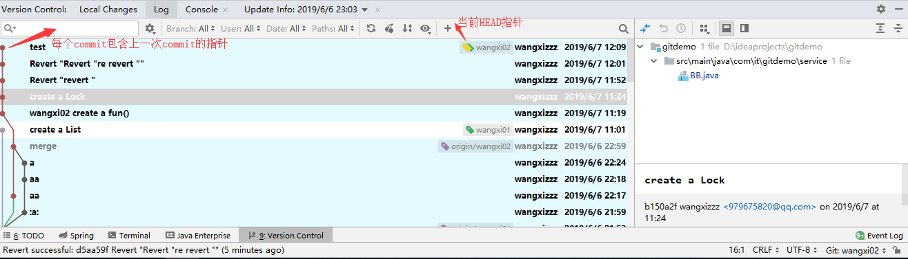
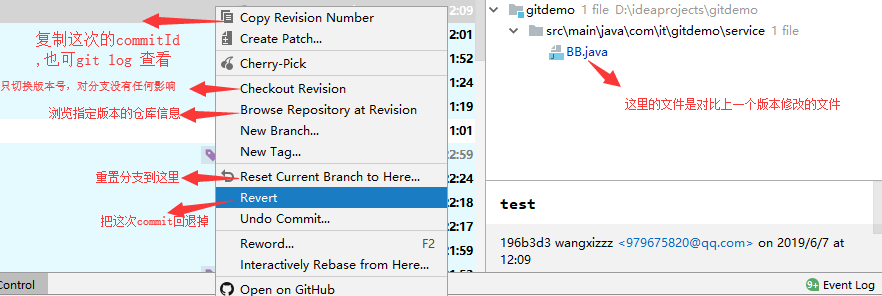
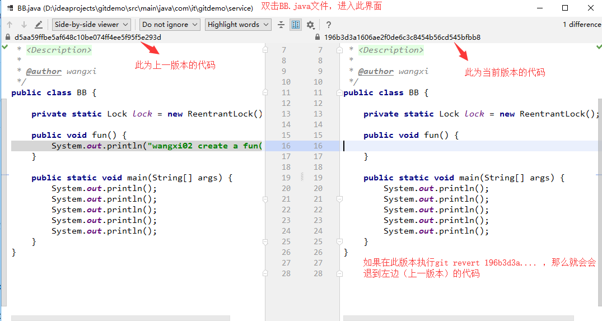
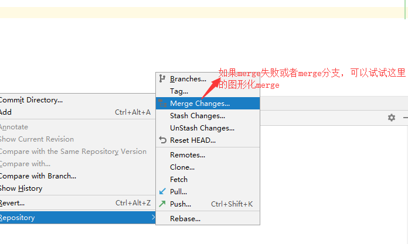

### 参考书籍：《Git》
### 这篇记载的git命令，都是经过真实环境测试可用的。
### 测试以  https://github.com/wangxizzz/gitdemo 仓库为基础进行测试，并且建立了三个分支，分别是master,wangxi01,wangxi02

```在idea中使用git，新创建的文件时红色，执行git add . 后,变为绿色，执行git commit 后，变为无色。```

Changes not staged for commit:  表示还没有到commit阶段，需要add  
Changes to be committed: 表示需要commit

### 常用命令：
**git add:**
- 把文件提交到暂存区。

**git commit**
- 把文件提交到本地仓库。(.git文件夹下)

**git clone https://github.com/wangxizzz/gitdemo test**  
- 把远程gitdemo仓库克隆下来，并且改名字为test(默认文件夹名字为gitdemo)。
- 初次克隆某个仓库的时候， 工作目录中的所有文件都属于已跟踪文件， 并处于未修改状态。

**git commit -a -m "test"**
- 会同时执行git add . 和 git cgitommit -m "test" 命令
- ```注意：```
    - 如果在git仓库新创建了一个文件，那么此命令不生效,因为untracked 。还是得git add . 然后commit
    - 如果是修改已经是暂存区的文件时，执行此命令生效。

**git rm 删除文件** 
- 删除git仓库的文件，并且也从磁盘删除了(不能ctrl Z 回退文件)。
- 如果直接在idea中删除，也删除了git仓库的文件，但是可以从磁盘中回退文件。  
- -r 递归删除(删除目录), -f 强制删除

**git rm --cached AA.java**
- 此命令针对已经commit了有效(亲测有效)。
- 此命令的变型：
    - git rm --cached --force -r .idea
        - 递归untracked .idea下的文件
- 我们想把文件从 Git 仓库中删除（ 亦即从暂存区(已经commit了也适用)域移除） ， 但仍然希望保留
在当前工作目录中。 换句话说， 你想让文件保留在磁盘， 但是并不想让 Git 继续跟踪。 当你
忘记添加 .gitignore 文件， 不小心把一个很大的日志文件或一堆 .a 这样的编译生成文件
添加到暂存区时， 这一做法尤其有用。

**git mv AA.java BB.java**
- 在 Git 中对文件改名。还得重新commit，不用add。
- 执行这个命令相当于执行了以下命令：
    - mv README.md README   // 先把源文件改名字
    - git rm README.md      // 然后删除掉原始文件
    - git add README        // 把新文件加入暂存区

**git log**
- ```这个命令在wangxi01分支下执性，那么就只会出现wangxi01的commit log。```
- 默认不用任何参数的话， git log 会按提交时间列出所有的更新， 最近的更新排在最上面。
- git log -p -2
    - 一个常用的选项是 -p ， 用来显示每次提交的内容差异。 你也可以加上 -2 来仅显示最近两
次提交
- git log --stat
    - 正如你所看到的， --stat 选项在每次提交的下面列出额所有被修改过的文件、 有多少文件被
修改了以及被修改过的文件的哪些行被移除或是添加了。
- git log --pretty=oneline
    - 一行输出剪短信息（还有内置参数，比如short,full, fuller）
- git log --pretty=format:"%h - %an, %ar : %s"
    - 可以格式化输出

git log --pretty=format 常用配置：

|选项| 说明|
|--|--|
|%H |提交对象（ commit） 的完整哈希字串|
|%h| 提交对象的简短哈希字串|
|%T| 树对象（ tree） 的完整哈希字串|
|%t| 树对象的简短哈希字串|
|%P| 父对象（ parent） 的完整哈希字串|
|%p| 父对象的简短哈希字串|
|%an| 作者（ author） 的名字|
|%ae| 作者的电子邮件地址|
|%ad| 作者修订日期（ 可以用 --date= 选项定制格式）|
|%ar| 作者修订日期， 按多久以前的方式显示|
|%cn| 提交者(committer)的名字|
|%ce| 提交者的电子邮件地址|
|%cd| 提交日期|
|%cr| 提交日期， 按多久以前的方式显示|
|%s| 提交说明|

**git log 搜索：**
- git log --since=2.weeks     两个星期之内的提交
- git log --since=2.hours       两个小时之内的提交
- git log --since=2.minutes     两分钟之内的提交
- git log -- ./     只列出当前目录的commit记录
- git log --author=wangxizzz

**搜索的参数如下：**
|选项 |说明|
|--|--|
|-(n) |仅显示最近的 n 条提交|
|--since , --after |仅显示指定时间之后的提交。|
|--until , --before |仅显示指定时间之前的提交。|
|--author| 仅显示指定作者相关的提交。|
|--committer| 仅显示指定提交者相关的提交。|
|--grep |仅显示含指定关键字的提交|
|-S |仅显示添加或移除了某个关键字的提交|


**git checkout -- BB.java**
- 丢弃掉对文件的修改。
- **注意：** 只适用于已经修改的文件，但还没放入暂存区(就是没执行git add .),此命令作用不大

****
## 远程仓库的使用：

**git remote**
- 列出远程仓库名称

**git remote -v**
- 会显示需要读写远程仓库使用的 Git 保存的简写与其对应的 URL。

比如这样：
```
$ git remote -v
origin https://github.com/schacon/ticgit (fetch)
origin https://github.com/schacon/ticgit (push)
```

**git remote add shortname url**
- 添加一个新的远程 Git 仓库， 同时指定一个你可以轻松引用的简写
-例如：git remote add pb https://github.com/paulboone/ticgit

**git remote show origin**  
- 获取远程分支的信息

执行后的结果：  

```
* remote origin
  Fetch URL: git@github.com:wangxizzz/gitdemo.git
  Push  URL: git@github.com:wangxizzz/gitdemo.git
  HEAD branch: master
  Remote branches:
    master   tracked
    wangxi01 tracked
    wangxi02 tracked
  Local refs configured for 'git push':
    master   pushes to master   (up to date)
    wangxi01 pushes to wangxi01 (fast-forwardable)  // 本地wangxi01分支在远程wangxi01分支前面
    wangxi02 pushes to wangxi02 (up to date)

```

**git remote rename wxcangku wx**
- 把远程wxcangku重名为wx

**git remote rm wx**
- 删除远程仓库

## 打标签

****

## Git别名

$ git config --global alias.co checkout

$ git config --global alias.br branch

$ git config --global alias.ci commit

$ git config --global alias.st status

git config --global alias.last 'log -1 HEAD'  // 相当于git log -1


## 分支
**git pull origin master**
- git fetch + git merge == git pull

**git fetch origin wangxi01**
- 拉取wangxi01分支的提交, 只是拉取了远程wangxi01的一个副本，在本地的分支仍然看不到文件代码的变化,因为没自动merge，执行git merge wangxi01，就会把刚才fetch的代码合并。
- 最好直接使用git pull

**git merge wangxi01**
- 见上一条

**git checkout -b wangxi**
- 创建并且换到wangxi分支

**git checkout master**
- 切换到master分支
- 最好的方法是， 在你切换分支之前， 保持好一个干净的状态。
- 这条命令做了两件事。 一是使 HEAD 指回 master 分支， 二是将工作目录恢复成 master 分
支所指向的快照内容。 也就是说， 你现在做修改的话， 项目将始于一个较旧的版本。 本质上
来讲， 这就是忽略 其他 分支所做的修改， 以便于向另一个方向进行开发。
- ```注意：```分支切换会改变你工作目录中的文件
在切换分支时， 一定要注意你工作目录里的文件会被改变。 如果是切换到一个较
旧的分支， 你的工作目录会恢复到该分支最后一次提交时的样子。 如果 Git 不能
干净利落地完成这个任务， 它将禁止切换分支。也就是说在checkout时，如果当前分支还有没commit的文件，那么就会切换失败。

**HEAD 指向当前所在的分支，当checkout哪个分支，HEAD就会指向谁。HEAD 分支随着提交操作自动向前移动**

**git log --oneline -- decorate**
- 列出各个分支当前所指的对象

**git branch**
- 列出本地分支。* 字符： 它代表现在检出的那一个分支（ 也就是说，当前 HEAD 指针所指向的分支）

**git branch -v**
- 可以查看每个分支最后一次提交的记录

**git branch -a**
- 查看本地与远程所有分支

**git branch --merged**
- 可以查看哪些分支已经合并到当前分支

**git branch --no-merged**
- 可以查看哪些没有分支已经合并到当前分支

**git branch -d wangxi01**
- 删除wangxi01本地分支（在主分支中）
- 没合并的分支，-d删不掉。使用-D强制删除，强制删除就意味着直接丢掉那个分支的工作。

**git push origin --delete wangxi01**
- 删除远程wangxi01分支

****

**git分支的原理：**
由于 Git 的分支实质上仅是包含所指对象校验和（ 长度为 40 的 SHA-1 值字符串） 的文件，
所以它的创建和销毁都异常高效。 创建一个新分支就像是往一个文件中写入 41 个字节（ 40
个字符和 1 个换行符） ， 如此的简单能不快吗？

## Git回退：

**git stash**
- 保存当前工作进度(此时工作空间回到上次commit的状态)。
- git stash pop : 回复上次保存的进度。
- 更多命令参考网址：https://blog.csdn.net/daguanjia11/article/details/73810577


**git revert**
- 参考文章：https://juejin.im/post/5b0e5adc6fb9a009d82e4f20
- 也可以参照下面的 revert与reset的区别

**git reset**
- 参照下面的   git使用情景：commit之后，想撤销commit 。

**git rebase**
- git rebase wangxi02 : 把wangxi02分支修改的东西在当前分支重演一遍。
- 参考网址：https://blog.csdn.net/qq_36387730/article/details/91127707

**revert与reset的区别：**
- git revert是用一次新的commit来回滚之前的commit(把需要revert的版本回滚到上一版本，然后重新commit了一个，之前的版本都在)，git reset是直接删除指定的commit(reset的中间所有commit全部直接丢掉了)
- git reset 是把HEAD向后移动了一下，而git revert是HEAD继续前进
- 如果回退分支的代码以后还需要的话用git revert就再好不过了；如果分支我就是提错了没用了还不想让别人发现我错的代码，那就git reset吧
- 例如：develop分支已经合并了a、b、c、d四个分支，我忽然发现b分支没用啊，代码也没必要，这个时候就不能用reset了，因为使用reset之后c和d的分支也同样消失了。这时候只能用git revert b分支commit号，这样c和d的代码依然还在。
- 参考文章：https://juejin.im/post/5b0e5adc6fb9a009d82e4f20


## Git应用场景：

**git使用情景：commit之后，想撤销commit**（reset的用法）

这样凉拌：（亲测有效）

git reset --soft HEAD^

这样就成功的撤销了你的commit

注意，仅仅是撤回commit操作，您写的代码仍然保留。

说一下个人理解：

HEAD^的意思是上一个版本，也可以写成HEAD~1

如果你进行了2次commit，想都撤回，可以使用HEAD~2

至于这几个参数：

--mixed 
意思是：不删除工作空间改动代码，撤销commit，并且撤销git add . 操作
这个为默认参数,git reset --mixed HEAD^ 和 git reset HEAD^ 效果是一样的。

--soft  
不删除工作空间改动代码，撤销commit，不撤销git add . 

--hard
删除工作空间改动代码，撤销commit，撤销git add . 

注意完成这个操作后，就恢复到了上一次的commit状态。

```注意：如果回退后，想要push到远程分支，会出现 Updates were rejected because the tip of your current branch is behind its remote counterpart 错误。本地分支落后于远程分支。因此需要使用命令：git push origin wangxi01 --force```

```顺便说一下，如果commit注释写错了，只是想改一下注释，只需要：```

```git commit --amend -m "新注释"```

此时会进入默认vim编辑器，修改注释完毕后保存就好了。

- 参考网址： https://blog.csdn.net/w958796636/article/details/53611133


**遇到问题-----git-----You have not concluded your merge (MERGE_HEAD exists) git拉取失败**  
```亲测有效```
保留你本地的修改

git merge --abort

git reset --merge

合并后记得一定要提交这个本地的合并

然后在获取线上仓库

git pull origin 分支名
- 参考网址： https://blog.csdn.net/zzq900503/article/details/71173234


**git如果在merge时，不小心merge漏了几行代码，然后就点击了ok。后来发现想重新pull,把那几行代码拉下来，但是现实pull no items??** （亲测有效）
- 为什么会pull no items呢？
    - 因为已经merge过了，那么这两个分支会在同一个点上，你再怎么拉，仍然拉不下来（即使文件不一样）。
- 解决办法:
    - 回退到merge之前的版本，然后重新pull，重新merge,这回需要看仔细了！！
        - 回退命令： git reste --hard commitId  (commitId最好从idea的可视化界面看Version Control-> log, 也可以git log查看)

**Git设置当前分支为默认push分支**
- git config --global push.default "current"
- 参考网址：https://blog.csdn.net/zhihuirensheng123/article/details/82773914
- git pull 就没必要设置默认分支了。

## 关于idea中的Version Control的可视化界面的操作：






