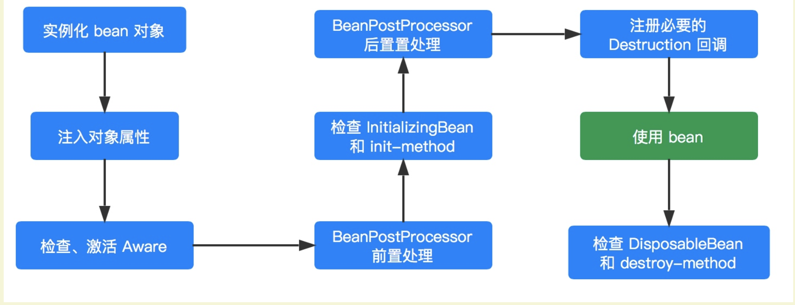

## bean的生命周期是从doCreateBean方法开始的


代码测试如下：
```java
public class LifeCycleBean implements BeanNameAware,BeanFactoryAware,BeanClassLoaderAware,BeanPostProcessor,
        InitializingBean,DisposableBean {

    private String test;

    public String getTest() {
        return test;
    }

    public void setTest(String test) {
        System.out.println("属性注入....");
        this.test = test;
    }

    public LifeCycleBean(){ // 构造方法
        System.out.println("构造函数调用...");
    }

    public void display(){
        System.out.println("方法调用...");
    }

    @Override
    public void setBeanFactory(BeanFactory beanFactory) throws BeansException {
        System.out.println("BeanFactoryAware 被调用...");
    }

    @Override
    public void setBeanName(String name) {
        System.out.println("BeanNameAware 被调用...");
    }

    @Override
    public void setBeanClassLoader(ClassLoader classLoader) {
        System.out.println("BeanClassLoaderAware 被调用...");
    }

    @Override
    public Object postProcessBeforeInitialization(Object bean, String beanName) throws BeansException {
        System.out.println("BeanPostProcessor postProcessBeforeInitialization 被调用...");
        return bean;
    }

    @Override
    public Object postProcessAfterInitialization(Object bean, String beanName) throws BeansException {
        System.out.println("BeanPostProcessor postProcessAfterInitialization 被调用...");
        return bean;
    }

    @Override
    public void destroy() throws Exception {
        System.out.println("DisposableBean destroy 被调动...");
    }

    @Override
    public void afterPropertiesSet() throws Exception {
        System.out.println("InitializingBean afterPropertiesSet 被调动...");
    }

    public void initMethod(){
        System.out.println("init-method 被调用...");
    }

    public void destroyMethdo(){
        System.out.println("destroy-method 被调用...");
    }

}
```
LifeCycleBean 继承了 BeanNameAware , BeanFactoryAware , BeanClassLoaderAware , BeanPostProcessor , InitializingBean , DisposableBean 六个接口，同时定义了一个 test 属性用于验证属性注入和提供一个 #display() 方法用于模拟调用。

配置如下：
```xml
<bean id="lifeCycle" class="org.springframework.core.test.lifeCycleBean"
        init-method="initMethod" destroy-method="destroyMethdo">
    <property name="test" value="test"/>
</bean>
```

测试代码：
```java
// BeanFactory 容器一定要调用该方法进行 BeanPostProcessor 注册
factory.addBeanPostProcessor(new LifeCycleBean()); // <1>

LifeCycleBean lifeCycleBean = (LifeCycleBean) factory.getBean("lifeCycle");
lifeCycleBean.display();

System.out.println("方法调用完成，容器开始关闭....");
// 关闭容器
factory.destroySingletons();
```

运行结果：
```
构造函数调用...
构造函数调用...
属性注入....
BeanNameAware 被调用...
BeanClassLoaderAware 被调用...
BeanFactoryAware 被调用...
BeanPostProcessor postProcessBeforeInitialization 被调用...
InitializingBean afterPropertiesSet 被调动...
init-method 被调用...
BeanPostProcessor postProcessAfterInitialization 被调用...
方法调用...
方法调用完成，容器开始关闭....
DisposableBean destroy 被调动...
destroy-method 被调用...
```

有两个构造函数调用，是因为要 <1> 处注入一个 BeanPostProcessor（你也可以另外提供一个 BeanPostProcessor 实例）。

**```根据执行的结果已经上面的分析，我们就可以对 Spring Bean 的声明周期过程如下（方法级别）：```**  
1. Spring 容器根据实例化策略对 Bean 进行实例化。
2. 属性填充。实例化完成后，如果该 bean 设置了一些属性的话，则利用 set 方法设置一些属性。
3. 如果该 Bean 实现了 BeanNameAware 接口，则调用 ```setBeanName(String beanName)``` 方法。
4. 如果该 bean 实现了 BeanClassLoaderAware 接口，则调用 ```setBeanClassLoader(ClassLoader classLoader)``` 方法。
5. 如果该 bean 实现了 BeanFactoryAware接口，则调用 ```setBeanFactory(BeanFactory beanFactory)``` 方法。
6. 如果该容器注册了 BeanPostProcessor，则会调用```postProcessBeforeInitialization(Object bean, String beanName) ```方法,完成 bean 前置处理
7. 如果该 bean 实现了 InitializingBean 接口，则调用```afterPropertiesSet()``` 方法。
8. 如果该 bean 配置了 ```init-method ```方法，则调用其指定的方法。
9. 初始化完成后，如果该容器注册了 BeanPostProcessor 则会调用 ```postProcessAfterInitialization(Object bean, String beanName) ```方法,完成 bean 的后置处理。
10. 对象完成初始化，开始方法调用。
11. 在容器进行关闭之前，如果该 bean 实现了 DisposableBean 接口，则调用 ```destroy() ```方法。
12. 在容器进行关闭之前，如果该 bean 配置了 ```destroy-method``` ，则调用其指定的方法。
13. 到这里一个 bean 也就完成了它的一生。