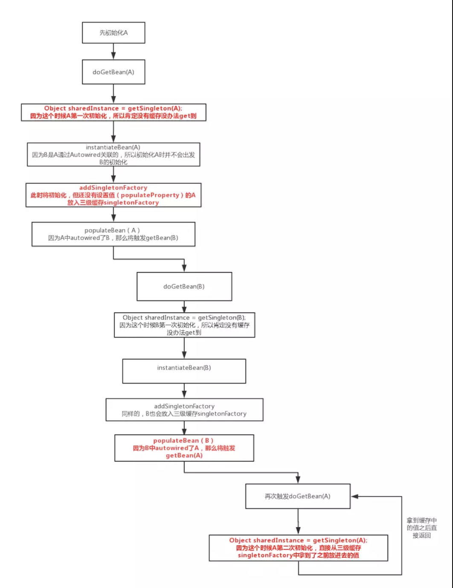

# 什么是循环依赖
循环依赖，其实就是循环引用，就是两个或者两个以上的 bean 互相引用对方，最终形成一个闭环，如 A 依赖 B，B 依赖 C，C 依赖 A。如下图所示：


Spring 循环依赖的场景有两种：分别是```构造函数循环依赖、属性注入循环依赖```。对于构造器的循环依赖，Spring 是无法解决的，只能抛出 BeanCurrentlyInCreationException 异常表示循环依赖。

循环依赖，其实就是一个死循环的过程，当Spring容器在创建A时，会发现其引用了B，从而会先去创建B。同样的，创建B时，会先去创建C，而创建C时，又先去创建A。最后A、B、C之间互相等待，谁都没法创建成功。

要想打破这个环，那么这个环中至少需要有一个bean可以在自身的依赖还没有得到满足前，就能够被创建出来（最起码要被实例化出来，可以先不注入其需要的依赖）。这种bean只能是通过属性注入依赖的类，因为它们可以先使用默认构造器创建出实例，然后再通过setter方法注入依赖。而通过构造器注入依赖的类，在初始化A时，必然先要初始化B，那么A在关键的方法```addSingletonFactory()```之前就去初始化了B，导致三级缓存中根本没有A，所以会发生死循环。正常的属性填充是发生在addSingletonFactory()之后的(**```这也是为什么spring可以解决属性注入循环依赖，而不能解决构造函数循环依赖```**)。而且这个bean，还必须是singleton，不能prototype。至于为什么不能prototype，往下看

## 看一个单例bean循环解决的例子
背景：A依赖B,B依赖A:

Spring容器启动后，如果我们去获取singletonA，那么容器的操作步骤大致如下：
1. 尝试创建bean singletonA，发现singletonA是singleton，且不是通过构造器注入依赖，那么先使用默认构造器创建一个A的实例，并保存对它的引用(ObjectFactory)，并且将singletonA标记为“正在创建中的singleton”。然后发现singletonA依赖了singletonB，所以尝试创建singletonB。
2. 尝试创建bean singletonB，发现singletonB是singleton，且不是通过构造器注入依赖，那么先使用默认构造器创建一个B的实例，并保存对它的引用，并且将singletonB标记为“正在创建中的singleton”。然后发现singletonB依赖了singletonA，所以尝试创建singletonA。
3. 尝试创建singletonA，注意，这时Spring容器发现singletonA“正在创建中”，那么就不会再去创建singletonA，而是返回容器之前保存了的对singletonA的引用。
4. 容器将singletonA通过setter方法注入到singletonB，从而singletonB完成创建。
5. 容器将singletonB通过setter方法注入到singletonA，从而singletonA完成创建。
上述步骤，最重要的是第1步和第3步。在第1步中，容器会保存对singletonA的引用，在第3步中，再返回对singletonA的引用，从而可以成功创建那些依赖了singletonA的bean（本例中是singletonB）。这样，循环依赖的环就在singletonA这个点这里被打破。

## 那为什么prototype不能成为打破这个环的一个点呢？
原因就在于Spring容器只会对singleton保存引用，而对于prototype，并不会对其保存引用，这就导致在第3步中并不能获得之前创建的bean（因为引用不到它）。代码如下：
```java
    // 解决单例模式的循环依赖
    boolean earlySingletonExposure = (mbd.isSingleton() // 单例模式
            && this.allowCircularReferences &&
            isSingletonCurrentlyInCreation(beanName));
    if (earlySingletonExposure) {
        if (logger.isTraceEnabled()) {
            logger.trace("Eagerly caching bean '" + beanName +
                    "' to allow for resolving potential circular references");
        }
        // 提前将创建的 bean 实例加入到 singletonFactories 中。
        // 这里是为了后期避免循环依赖
        addSingletonFactory(beanName, () -> getEarlyBeanReference(beanName, mbd, bean));
    }
```
# 总结：
spring无法解决构造函数注入bean的依赖,不论是单例还是多例。

当循环依赖的bean都是通过```属性注入依赖```的时候，根据bean的作用域是singleton还是prototpye，会有不同的表现。
- 如果循环依赖的bean都是singleton，那么无论先获取哪个bean，都能成功。
- 如果循环依赖的bean都是prototype，那么无论先获取哪个bean，都会失败。
- 如果循环依赖的bean中有singleton，也有prototype，那么当先获取的那个bean是singleton时，就会成功，否则失败。


# 单例bean依赖解决源码分析：

## getSingleton
我们先从加载 bean 最初始的方法 AbstractBeanFactory 的 #doGetBean(final String name, final Class<T> requiredType, final Object[] args, boolean typeCheckOnly) 方法开始。

在 #doGetBean(...) 方法中，首先会根据 beanName 从单例 bean 缓存中获取，如果不为空则直接返回。代码如下：
```java
// AbstractBeanFactory.java

Object sharedInstance = getSingleton(beanName);

```
调用 #getSingleton(String beanName, boolean allowEarlyReference) 方法，从单例缓存中获取。代码如下：
```java
// DefaultSingletonBeanRegistry.java

@Nullable
protected Object getSingleton(String beanName, boolean allowEarlyReference) {
    // 从单例缓冲中加载 bean
    Object singletonObject = this.singletonObjects.get(beanName);
    // 缓存中的 bean 为空，且当前 bean 正在创建
    if (singletonObject == null && isSingletonCurrentlyInCreation(beanName)) {
        // 加锁
        synchronized (this.singletonObjects) {
            // 从 earlySingletonObjects 获取
            singletonObject = this.earlySingletonObjects.get(beanName);
            // earlySingletonObjects 中没有，且允许提前创建
            if (singletonObject == null && allowEarlyReference) {
                // 从 singletonFactories 中获取对应的 ObjectFactory
                ObjectFactory<?> singletonFactory = this.singletonFactories.get(beanName);
                if (singletonFactory != null) {
                    // 获得 bean.ObjectFactory是一个FunctionalInterface，其getObject()是在把singletonFactory放入缓存时，重写了getObject方法的。
                    singletonObject = singletonFactory.getObject();
                    // 添加 bean 到 earlySingletonObjects(二级缓存) 中
                    this.earlySingletonObjects.put(beanName, singletonObject);
                    // 从 singletonFactories 中移除对应的 ObjectFactory
                    this.singletonFactories.remove(beanName);
                }
            }
        }
    }
    return singletonObject;
}
```
这个方法主要是从三个缓存中获取，分别是：singletonObjects、earlySingletonObjects、singletonFactories 。三者定义如下：
```java
// DefaultSingletonBeanRegistry.java

一级缓存：
/** 保存所有的singletonBean的实例 */
private final Map<String, Object> singletonObjects = new ConcurrentHashMap<String, Object>(64);

二级缓存：
/** 保存所有早期创建的Bean对象，这个Bean还没有完成依赖注入(属性填充) */
private final Map<String, Object> earlySingletonObjects = new HashMap<String, Object>(16);
三级缓存：
/** 保存bean的早期引用ObjectFactory*/
private final Map<String, ObjectFactory<?>> singletonFactories = new HashMap<String, ObjectFactory<?>>(16);
 
/** 保存所有已经完成初始化的Bean的名字（name） */
private final Set<String> registeredSingletons = new LinkedHashSet<String>(64);
 
/** 标识指定name的Bean对象是否处于创建状态  这个状态非常重要 */
private final Set<String> singletonsCurrentlyInCreation =
	Collections.newSetFromMap(new ConcurrentHashMap<String, Boolean>(16));
```
- singletonObjects ：单例对象的 Cache 。
- singletonFactories ： 单例对象工厂的 Cache 。
- earlySingletonObjects ：提前曝光的单例对象的 Cache 。

它们三，就是 Spring 解决 singleton bean 的关键因素所在，我称他们为三级缓存：
- 第一级为 singletonObjects
- 第二级为 earlySingletonObjects
- 第三级为 singletonFactories

这里，我们已经通过 #getSingleton(String beanName, boolean allowEarlyReference) 方法，看到他们是如何配合的。详细分析该方法之前，提下其中的 #isSingletonCurrentlyInCreation(String beanName) 方法和 allowEarlyReference 变量：
- #isSingletonCurrentlyInCreation(String beanName) 方法：判断当前 singleton bean 是否处于创建中。bean 处于创建中，也就是说 bean 在初始化但是没有完成初始化，有一个这样的过程其实和 Spring 解决 bean 循环依赖的理念相辅相成。因为 Spring 解决 singleton bean 的核心就在于提前曝光 bean 。
- allowEarlyReference 变量：从字面意思上面理解就是允许提前拿到引用。其实真正的意思是，是否允许从 singletonFactories 缓存中通过 #getObject() 方法，拿到对象。为什么会有这样一个字段呢？原因就在于 singletonFactories 才是 Spring 解决 singleton bean 的诀窍所在，这个我们后续分析。

getSingleton(String beanName, boolean allowEarlyReference) 方法，整个过程如下：

- 首先，从一级缓存 singletonObjects 获取。
- 如果，没有且当前指定的 beanName 正在创建，就再从二级缓存 earlySingletonObjects 中获取。
- 如果，还是没有获取到且允许 singletonFactories 通过 #getObject() 获取，则从三级缓存 singletonFactories 获取。如果获取到，则通过其 #getObject() 方法，获取对象，并将其加入到二级缓存 earlySingletonObjects 中，并从三级缓存 singletonFactories 删除。代码如下：
```java
// DefaultSingletonBeanRegistry.java

singletonObject = singletonFactory.getObject();
this.earlySingletonObjects.put(beanName, singletonObject);
this.singletonFactories.remove(beanName);
```
这样，就从三级缓存升级到二级缓存了。  
所以，二级缓存存在的意义，就是缓存三级缓存中的 ObjectFactory(这是一个FunctionalInterface，有回调方法getObject) 的 #getObject() 方法的执行结果，提早曝光的单例 Bean 对象。

## addSingletonFactory
上面是从缓存中获取，但是缓存中的数据从哪里添加进来的呢？一直往下跟会发现在 AbstractAutowireCapableBeanFactory 的 #doCreateBean(final String beanName, final RootBeanDefinition mbd, final Object[] args) 方法中，有这么一段代码：
```java
// AbstractAutowireCapableBeanFactory.java

boolean earlySingletonExposure = (mbd.isSingleton() // 单例模式
        && this.allowCircularReferences // 运行循环依赖
        && isSingletonCurrentlyInCreation(beanName)); // 当前单例 bean 是否正在被创建
if (earlySingletonExposure) {
    if (logger.isTraceEnabled()) {
        logger.trace("Eagerly caching bean '" + beanName +
                "' to allow for resolving potential circular references");
    }
    // 提前将创建的 bean 实例加入到 singletonFactories 中
    // getEarlyBeanReference 是重写了ObjectFactory的getObject().
    addSingletonFactory(beanName, () -> getEarlyBeanReference(beanName, mbd, bean));
}

// DefaultSingletonBeanRegistry.java

protected void addSingletonFactory(String beanName, ObjectFactory<?> singletonFactory) {
	Assert.notNull(singletonFactory, "Singleton factory must not be null");
	synchronized (this.singletonObjects) {
		if (!this.singletonObjects.containsKey(beanName)) {
			this.singletonFactories.put(beanName, singletonFactory);
			this.earlySingletonObjects.remove(beanName);
			this.registeredSingletons.add(beanName);
		}
	}
}
```
从这段代码我们可以看出，singletonFactories 这个三级缓存才是解决 Spring Bean 循环依赖的诀窍所在。同时这段代码发生在 ```createBeanInstance(...)``` 方法之后，也就是说这个 bean 其实已经被创建出来了，但是它还不是很完美（没有进行属性填充和初始化），但是对于其他依赖它的对象而言已经足够了（可以根据对象引用定位到堆中对象），能够被认出来了。所以 Spring 在这个时候，选择将该对象提前曝光出来让大家认识认识。

## addSingleton
介绍到这里我们发现三级缓存 singletonFactories 和 二级缓存 earlySingletonObjects 中的值都有出处了，那一级缓存在哪里设置的呢？在类 DefaultSingletonBeanRegistry 中，可以发现这个 #addSingleton(String beanName, Object singletonObject) 方法，代码如下：
```java
// 创建bean实例，如果是单例模式
if (mbd.isSingleton()) {
    // 第二个参数的回调接口，接口是 org.springframework.beans.factory.ObjectFactory#getObject
    // 接口实现的方法是 createBean(beanName, mbd, args)
    sharedInstance = getSingleton(beanName, () -> {
        try {
            // 真正加载bean的方法
            return createBean(beanName, mbd, args);
        }
        catch (BeansException ex) {
            // Explicitly remove instance from singleton cache: It might have been put there
            // eagerly by the creation process, to allow for circular reference resolution.
            // Also remove any beans that received a temporary reference to the bean.
            destroySingleton(beanName);
            throw ex;
        }
    });
    bean = getObjectForBeanInstance(sharedInstance, name, beanName, mbd);
}

// 这里放入真正创建好的bean实例(已经经过了属性填充与初始化)
public Object getSingleton(String beanName, ObjectFactory<?> singletonFactory) {
Assert.notNull(beanName, "Bean name must not be null");
....
...
	if (newSingleton) {
		// 加入一级缓存
		addSingleton(beanName, singletonObject);
	}
}
			return singletonObject;
		}

// addSingleton
protected void addSingleton(String beanName, Object singletonObject) {
    synchronized (this.singletonObjects) {
        // 加入一级缓存
        this.singletonObjects.put(beanName, singletonObject);
        this.singletonFactories.remove(beanName);
        this.earlySingletonObjects.remove(beanName);
        // 保存已经完成初始化的Bean的名字
        this.registeredSingletons.add(beanName);
    }
}
```
至此，Spring 关于 singleton bean 循环依赖已经分析完毕了。所以我们基本上可以确定 Spring 解决循环依赖的方案了：

Spring 在创建 bean 的时候并不是等它完全完成，而是在创建过程中将创建中的 bean 的 ObjectFactory 提前曝光（即加入到 singletonFactories 缓存中）。
这样，一旦下一个 bean 创建的时候需要依赖 bean ，则直接使用 ObjectFactory 的 #getObject() 方法来获取了。

# 流程图看spring解决循环依赖：
