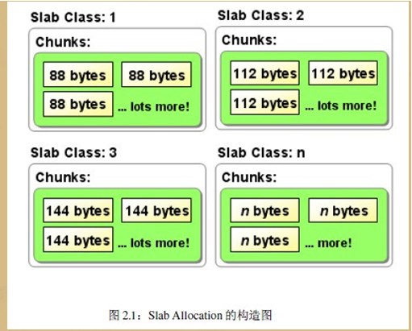

# 背景
通常情况下，一个高级操作系统必须要给进程提供基本的、能够在任意时刻申请和释放任意大小内存的功能，就像malloc 函数那样，然而，实现malloc 函数并不简单，```由于进程申请内存的大小是任意的```，如果操作系统对malloc 函数的实现方法不对，将直接导致一个不可避免的问题，那就是内存碎片。

内存碎片就是内存被分割成很小很小的一些块，这些块虽然是空闲的，但是却小到无法使用。随着申请和释放次数的增加，内存将变得越来越不连续。最后，整个内存将只剩下碎片，即使有足够的空闲页框可以满足请求，但要分配一个大块的连续页框就可能无法满足，所以减少内存浪费的核心就是尽量避免产生内存碎片。

# 伙伴分配
针对这样的问题，有很多行之有效的解决方法，其中伙伴算法被证明是非常行之有效的一套内存管理方法，因此也被相当多的操作系统所采用。

伙伴算法，简而言之，就是将内存分成若干块，然后尽可能以最适合的方式满足程序内存需求的一种内存管理算法，伙伴算法的一大优势是它能够完全避免外部碎片的产生。申请时，伙伴算法会给程序分配一个较大的内存空间，即保证所有大块内存都能得到满足。很明显分配比需求还大的内存空间，会产生内部碎片。所以伙伴算法虽然能够完全避免外部碎片的产生，但这恰恰是以产生内部碎片为代价的。

## 外部碎片
频繁的分配与回收物理页面会导致大量的、连续且小的页面块夹杂在已分配的页面中间，从而产生外部碎片。比如有一块共有100个单位的连续空闲内存空间，范围为0~99，如果从中申请了一块10 个单位的内存块，那么分配出来的就是0~9。这时再继续申请一块 5个单位的内存块，这样分配出来的就是 10~14。如果将第一块释放，此时整个内存块只占用了 10~14区间共 5个单位的内存块。然后再申请20个单位的内存块，此时只能从 15开始，分配15~24区间的内存块，如果以后申请的内存块都大于10个单位，那么 0~9 区间的内存块将不会被使用，变成外部碎片。

## 内部碎片
内部碎片的产生：因为所有的内存分配必须起始于可被4、8或16整除（内存对齐，视处理器体系结构而定）的地址或者因为MMU的分页机制的限制，决定内存分配算法仅能把预定大小的内存块分配客户。就是分配满足上面对齐条件的最小的大小内存，如果申请的不满足对齐条件，势必会多分配一点不需要的多余内存空间，造成内部碎片。如：申请43Byte，因为没有合适大小的内存，会分配44Byte或48Byte，就会存在1Byte或3Byte的多余空间。

# slab机制
用户应用程序对内存的需求是频繁的和任意的，而伙伴算法作为一个基础内存管理算法，并不具备提供这种任意性的条件，因此还需要以伙伴算法为基础，实现另外的内存管理机制，为用户提供申请任意大小内存的可能，这里就介绍 slab 分配器。

通俗的讲，slab 就是专门为某一模块预先一次性申请一定数量的内存备用，当这个模块想要使用内存的时候，就不再需要从系统中分配内存了（因为从系统中申请内存的时间开销相对来说比较大），而是直接从预申请的内存中拿出一部分来使用，这样就提高了这个模块的内存申请速度。

slab 要在合适的场合下使用才能发挥作用。使用 slab 通常需要满足以下两个条件：
- 第一条件是，当某一子系统需要```频繁地申请和释放内存时，使用 slab 才会合理一些```。如果某段程序中申请和释放内存的频率不高，就没必要预先申请一块很大的内存备用，然后再从这段私有空间中分配内存了。因为这样就意味着系统将会一次性损失过多内存，而由于内存请求的频率不高，也不会对系统性能有多大的提升。所以，对于频繁使用内存的程序来说，使用 slab 才有意义。
- 使用 slab 的另一个条件是，利用 slab 申请的内存必须是大小固定的。只有固定内存大小才有可能实现内存的高速申请和释放。

## slab allocation避免内存碎片
在解决小的内存碎片上，Linux 采用伙伴算法解决外部碎片的产生，但会因此产生内部碎片，基于此，Linux 内存管理采用了 slab allocation 机制：整理内存以便重复使用来避免常见的内部碎片问题。

重新说说slab 分配器的基本原理：按照预定固定的大小，将分配的内存分割成特定长度的块，以完全解决内存碎片问题。换句话说就是，将分配的内存分割成各种尺寸的块，并把相同尺寸的块分成组。另外分配到的内存不会释放，而是返回到对应的组，重复利用。



Linux 便是采用这著名的伙伴系统算法来解决外部碎片的问题。把所有的空闲页框分组为 11 块链表，每一块链表分别包含大小为1，2，4，8，16，32，64，128，256，512 和 1024 个连续的页框。对1024 个页框的最大请求对应着 4MB 大小的连续RAM 块。每一块的第一个页框的物理地址是该块大小的整数倍。例如，大小为 16个页框的块，其起始地址是 16 * 2^12 （2^12 = 4096，这是一个常规页的大小）的倍数。


参考：
- https://blog.csdn.net/wenqian1991/article/details/25652147
- https://blog.csdn.net/csdn_kou/article/details/82355452