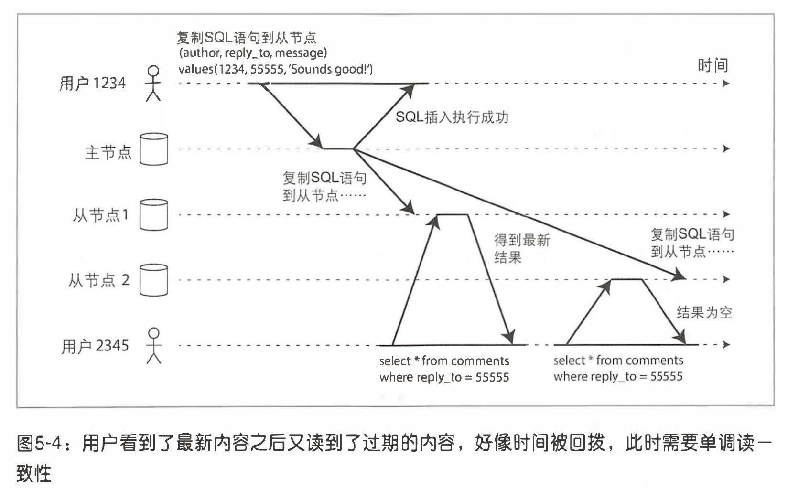
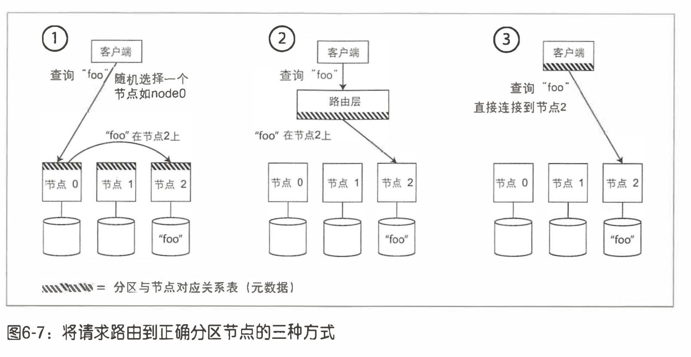

# 分布式数据系统
# 数据复制
## 复制滞后问题
- 主从复制要求所有写请求都经由主节点， 而任何副本只能接受只读查询。 对于读操作 密集的负载(如Web) , 这是一个不错的选择: 创建多个从副本， 将读请求分发给这 些从副本， 从而减轻主节点负载并允许读取请求就近满足。
- 在这种扩展体系下， 只需添加更多的从副本， 就可以提高读请求的服务吞吐最。 但 是， 这种方法实际上只能用千异步复制， 如果试图同步复制所有的从副本， 则单个节 点故障或网络中断将使整个系统无法写入。 而且节点越多， 发生故障的概率越高， 所 以完全同步的配置现实中反而非常不可靠。
- 不幸的是， 如果一个应用正好从一个异步的从节点读取数据， 而该副本落后于主节 点， 则应用可能会读到过期的信息。 这会导致数据库中出现明显的不一致:由千并非 所有的写入都反映在从副本上， 如果同时对主节点和从节点发起相同的查询， 可能 会得到不同的结果。 这种不一致只是一个暂时的状态， 如果停止写数据库， 经过一 段时间之后， 从节点最终会赶上并与主节点保持一致。 这种效应也被称为最终一致性。
- “最终” 一 词有些含糊不清， 总的来说， 副本落后的程度理论上并没有上限。 正常情 况下， 主节点和从节点上完成写操作之间的时间延迟(复制滞后)可能不足1秒， 这 样的滞后， 在实践中通常不会导致太大影响。 但是， 如果系统已接近设计上限， 或者
网络存在问题， 则滞后可能轻松增加到几秒甚至几分钟不等。当滞后时间太长时， 导致的不一 致性不仅仅是 一 个理论存在的问题， 而是个实实在在 的现实问题。

## 复制滞后问题解决方案
### 读自己的写
许多应用让用户提交一些数据， 接下来查看他们自己所提交的内容。 例如客户数据库 中的记录， 亦或者是讨论主题的评论等。 提交新数据须发送到主节点， 但是当用户读 取数据时， 数据可能来自从节点。 这对于读密集和偶尔写入的负载是个非常合适的方 案。

基于主从复制的系统该如何实现写后读一致性呢？
- 如果用户访问可能会被修改的内容， 从主节点读取;否则， 在从节点读取。 这背 后就要求有一些方法在实际执行查询之前， 就已经知道内容是否可能会被修改。 例如， 社交网络上的用户首页信息通常只能由所有者编辑， 而其他人无法编辑。
因此， 这就形成一个简单的规则:总是从主节点读取用户自己的首页配置文件， 而在从节点读取其他用户的配置文件。
### 单调读
问题如下：




单调读一致性可以确保不会发生这种异常。 这是一个比强一致性弱， 但比最终一致 性强的保证。 当读取数据时， 单调读保证， 如果某个用户依次进行多次读取， 则他绝 不会看到回滚现象， 即在读取较新值之后又发生读旧值的情况. 

实现单调读的一种方式是， 确保每个用户总是从固定的同一副本执行读取(而不同的 用户可以从不同的副本读取)。 例如 ， 基千用户ID的啥希的方法而不是随机选择副 本。 但如果该副本发生失效， 则用户的查询必须重新路由到另 一 个副本。

### 前缀一致读

对于一系列按照某 个顺序发生的写请求， 那么读取这些内容时也会按照当时写入的顺序。

如果数据 库总是以相同的顺序写入， 则读取总是看到一 致的序列， 不会发生这种反常。 然而，
在许多分布式数据库中， 不同的分区独立运行， 因此不存在全局写入顺序。 这就导致 当用户从数据库中读数据时， 可能会看到数据库的某部分旧值和另一部分新值。

一 个解决方案是确保任何具有因果顺序关系的写入都交给 一 个分区来完成， 但该方案 真实实现效率会大打折扣。 现在有一 些新的算法来显式地追踪事件因果关系，"Happened-before关系与并发 ” 。

#### Happened-before介绍

### 最终一致性
使用最终一致性系统时， 最好事先就思考这样的问题: 如果复制延迟增加到几分钟甚
至几小时， 那么应用层的行为会是什么样子?如果答案是 没问题 ， 那没得说。 但 是， 如果带来槽糕的用户体验， 那么在设计系统时， 就要考虑提供一 个更强的一致性 保证， 比如写后读;如果系统设计时假定是同步复制， 但最终它事实上成为了异步复制， 就可能会导致灾难性后果。

# 数据分区
## 请求路由
现在我们已经将数据集分布到多个节点上， 但是仍然有一个悬而未决的问题: 当客户 端需要发送请求时， 如何知道应该连接哪个节点?如果发生了分区再平衡， 分区与节 点的对应关系随之还会变化。 为了回答该问题， 我们需要一 段处理逻辑来感知这些变 化， 并负责处理客户端的连接， 例如想要读/写关键字 "foo" , 需要连接哪个IP地址 和那个端口号。

这其实属于```一类典型的服务发现问题```， 服务发现并不限于数据库， 任何通过网络访问 的系统都有这样的需求， 尤其是当服务目标支持高可用时(在多台机器上有冗余配置)

概括来讲， 这个问题有以下几种不同的处理策略(如下图)
- 允许客户端链接任意的节点(例如， 采用循环式的负载均衡器)。 如果某节点恰 好拥有所请求的分区， 则直接处理该请求;否则， 将请求转发到下 一 个合适的节 点， 接收答复， 并将答复返回给客户端。(例如redis)
- 将所有客户端的请求都发送到一个路由层， 由后者负责将请求转发到对应的分区 节点上。 路由层本身不处理任何请求， 它仅充 一 个分区感知的负载均衡器。
- 客户端感知分区和节点分配关系。 此时， 客户端可以直接连接到目标节点， 而不 需要任何中介。(例如dubbo)



这其实是一个很有挑战性的问题， 所有参与者都要达成共识这一点很重要。 否则请求 可能被发送到错误的节点， 而没有得到正确处理。 分布式系统中有专门的共识协议算法。

<a href="./经典工程算法/raft算法.md">分布式共识一致性算法-raft算法</a>

```许多分布式数据系统依靠独立的协调服务(如ZooKeeper)跟踪集群范围内的元数 据， 如上图所示。 每个节点都向ZooKeeper中注册自己， ZooKeeper维护了分区到节 点的最终映射关系。 其他参与者(如路由层或分区感知的客户端)可以向ZooKeeper 订阅此信息。 一且分区发生了改变， 或者添加 、 删除节点， ZooKeeper就会主动通知 路由层， 这样使路由信息保持最新状态。```

例子：
- HBase, SolrCloud和Kafka也使用ZooKeeper来跟踪分区分 配情况
- Cassandra和Redis则采用了不同的方法， 它们在节点之间使用gossip协议来同步群集状 态的变化。 请求可以发送到任何节点， 由该节点负责将其转发到目标分区节点，这种方式增加了数据库节点的复杂性， 但是避免了 对ZooKeeper之类的外部协调服务的依赖。

# 事务


