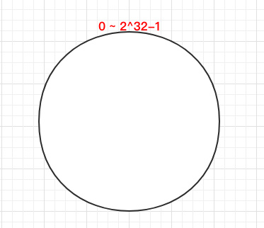
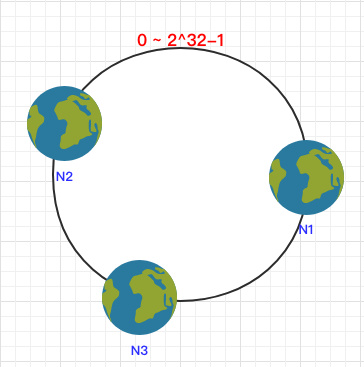
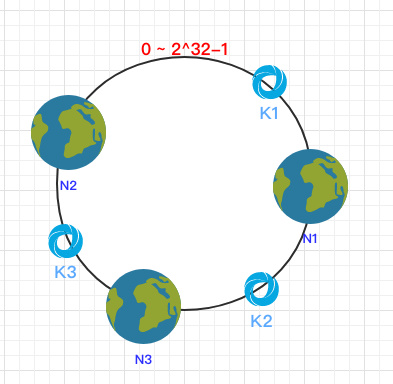
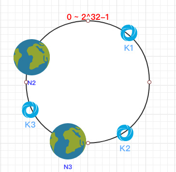
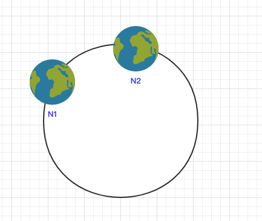
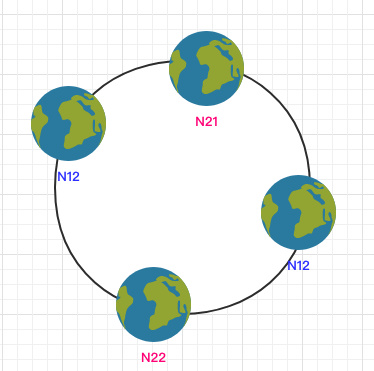

# 背景
当我们在做数据库分库分表或者是分布式缓存时，不可避免的都会遇到一个问题:

如何将数据均匀的分散到各个节点中，并且尽量的在加减节点时能使受影响的数据最少。

# Hash 取模
随机放置就不说了，会带来很多问题。通常最容易想到的方案就是 hash 取模了。

可以将传入的 Key 按照 index = hash(key) % N 这样来计算出需要存放的节点。其中 hash 函数是一个将字符串转换为正整数的哈希映射方法，N 就是节点的数量。

这样可以满足数据的均匀分配，但是这个算法的容错性和扩展性都较差。

比如增加或删除了一个节点时，所有的 Key 都需要重新计算，显然这样成本较高，为此需要一个算法满足分布均匀同时也要有良好的容错性和拓展性。

# 一致性hash
一致 Hash 算法是将所有的哈希值构成了一个环，其范围在 0 ~ 2^32-1。如下图：




之后将各个节点散列到这个环上，可以用节点的 IP、hostname 这样的唯一性字段作为 Key 进行 hash(key)，散列之后如下：



之后需要将数据定位到对应的节点上，使用同样的 hash 函数 将 Key 也映射到这个环上。



```这样按照顺时针方向就可以把 k1 定位到 N1节点，k2 定位到 N3节点，k3 定位到 N2节点。```

## 容错性
这时假设 N1 宕机了：



依然根据顺时针方向，k2 和 k3 保持不变，只有 k1 被重新映射到了 N3。这样就很好的保证了容错性，当一个节点宕机时只会影响到少少部分的数据。

## 拓展性
当新增一个节点时:


在 N2 和 N3 之间新增了一个节点 N4 ，这时会发现受印象的数据只有 k3，其余数据也是保持不变，所以这样也很好的保证了拓展性。

## 虚拟节点
到目前为止该算法依然也有点问题:

当节点较少时会出现数据分布不均匀的情况：



这样会导致大部分数据都在 N1 节点，只有少量的数据在 N2 节点。

为了解决这个问题，一致哈希算法引入了虚拟节点。将每一个节点都进行多次 hash，生成多个节点放置在环上称为虚拟节点:



计算时可以在 IP 后加上编号来生成哈希值。

这样只需要在原有的基础上多一步由虚拟节点映射到实际节点的步骤即可让少量节点也能满足均匀性。

# 一致性hash算法的开源实现
```java
// org.apache.dubbo.rpc.cluster.loadbalance.ConsistentHashLoadBalance


// 1. 构造虚拟节点环

// 利用TreeMap实现 顺时针寻找节点的功能
// TreeMap<Long, Invoker<T>>  key为Long型，代表虚拟节点的hash值。TreeMap默认Key是排序的，升序排序
private final TreeMap<Long, Invoker<T>> virtualInvokers;

private final int replicaNumber;

private final int identityHashCode;

private final int[] argumentIndex;

ConsistentHashSelector(List<Invoker<T>> invokers, String methodName, int identityHashCode) {
    this.virtualInvokers = new TreeMap<Long, Invoker<T>>();
    this.identityHashCode = identityHashCode;
    URL url = invokers.get(0).getUrl();
    this.replicaNumber = url.getMethodParameter(methodName, HASH_NODES, 160);
    String[] index = COMMA_SPLIT_PATTERN.split(url.getMethodParameter(methodName, HASH_ARGUMENTS, "0"));
    argumentIndex = new int[index.length];
    for (int i = 0; i < index.length; i++) {
        argumentIndex[i] = Integer.parseInt(index[i]);
    }
    // 构造虚拟节点Map
    for (Invoker<T> invoker : invokers) {
        String address = invoker.getUrl().getAddress();
        for (int i = 0; i < replicaNumber / 4; i++) {
            byte[] digest = Bytes.getMD5(address + i);
            for (int h = 0; h < 4; h++) {
                long m = hash(digest, h);
                // 构建虚拟节点与 实际Invoker的映射关系
                virtualInvokers.put(m, invoker);
            }
        }
    }
}

// 2. 利用 invocation 带的参数构造key，寻找对应的Invoker
protected <T> Invoker<T> doSelect(List<Invoker<T>> invokers, URL url, Invocation invocation) {
    String methodName = RpcUtils.getMethodName(invocation);
    String key = invokers.get(0).getUrl().getServiceKey() + "." + methodName;
    // using the hashcode of list to compute the hash only pay attention to the elements in the list
    int invokersHashCode = invokers.hashCode();
    ConsistentHashSelector<T> selector = (ConsistentHashSelector<T>) selectors.get(key);
    if (selector == null || selector.identityHashCode != invokersHashCode) {
        selectors.put(key, new ConsistentHashSelector<T>(invokers, methodName, invokersHashCode));
        selector = (ConsistentHashSelector<T>) selectors.get(key);
    }
    // 看下利用一致性hash怎样select的
    return selector.select(invocation);
}

public Invoker<T> select(Invocation invocation) {
    String key = toKey(invocation.getArguments());
    byte[] digest = Bytes.getMD5(key);
    return selectForKey(hash(digest, 0));
}

private Invoker<T> selectForKey(long hash) {
    // ceilingEntry 就可以实现顺时针寻找的功能
    Map.Entry<Long, Invoker<T>> entry = virtualInvokers.ceilingEntry(hash);
    if (entry == null) {
        entry = virtualInvokers.firstEntry();
    }
    return entry.getValue();
}

```
