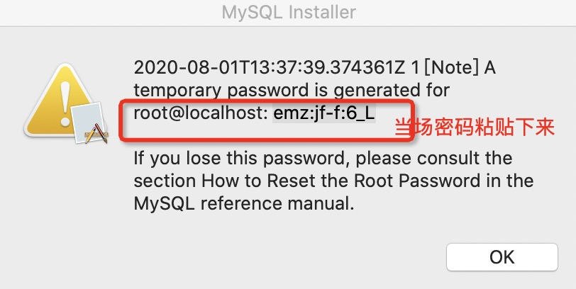

# 常见sql语法
**插入数据：insert into t_user(username, password, nick_name) values('wangxi', '12345', 'xier')**   
```如果直接不写列名的话，就是全列匹配，就无法用到自增与时间戳的默认生成了。```

1、只能在表级别指定存储引擎。create table 时指定。  
2、mysql 的默认数据路径是：/var/lib/mysql/,当然可以使用ps -ef | grep mysql 查看datadir在哪。  

```mysql建索引的目的：大海捞针。```  
```sql的子查询拆分分　多个单个查询，性能更好。sql不要太长。```  

TIMESTAMP的变体

1，TIMESTAMP DEFAULT CURRENT_TIMESTAMP ON UPDATE CURRENT_TIMESTAMP
在创建新记录和修改现有记录的时候都对这个数据列刷新

2，TIMESTAMP DEFAULT CURRENT_TIMESTAMP
在创建新记录的时候把这个字段设置为当前时间，但以后修改时，不再刷新它

3，TIMESTAMP ON UPDATE CURRENT_TIMESTAMP
在创建新记录的时候把这个字段设置为0，以后修改时刷新它

4，TIMESTAMP DEFAULT ‘yyyy-mm-dd hh:mm:ss’ ON UPDATE CURRENT_TIMESTAMP 
在创建新记录的时候把这个字段设置为给定值，以后修改时刷新它

# SQL执行顺序与原理

３、select pid from ta3 where name like 'cc%' order by time group
by groupid;  
>**order by 需要放到sql最后，把所有条件都执行完毕，然后在进行排序。**  

4、sql语句的逻辑执行顺序：  
<image src="mysql1.png"/>  
从这个逻辑执行步骤可以看出：  
select id1 as fid,id2 from
tb1 where fid = 101;  这个　语句是错误的。因为定义别名是在执行where子句后面执行的，所以会报错。**所以应该使用表中原字段进行查询。**  

5、mysql的存储结构如下：**是以page为单位存储(page为16k，因此最好存储16k一下的内容，不要去　存储text,blob类型)，每次取数据都取整行数据，因为mysql是基于行式存储，Hbase好像解决了这个问题，它是基于列式存储，可以在列上建索引，而且还可以建二级索引。**  

# sql问题举例分析

- select count(*) from a2 left join b2 on a2.order_id=b2.order_id;  
>　问题分析：左外连接，以左表为基准，因此此sql可以直接写为```select count(*) from a2```

- select * from a3 left join b3 on a3.id=b3.pid where
a3.lasttime='2017-01-01 12:00:00';  
> 问题分析：发生join操作　之后，对结果进行where操作。

- update a2 set order_id=405 and date='2017-02-17' where id =
700; 正确写法：and用,代替。多列更新利用,分隔开.

- delete from a4 where id  
> 删除所有含有id列的数据.

- insert into city(id,city_name) values(1,'beijing'),(2,'shanghai');  
> 这个批量插入数据比单次insert into效率要高。具体原因可能是单行插入频繁释放锁获取锁的损耗。

- insert into order_info_201512(order_id,ctime)
select (order_id,ctime) from order_info where create_time
between '2015-12-01' and '2015-12-31';  
> 这个语句存在**很大的问题！**,insert语句会锁住行，里面　接一个select查询，就会锁住select查询的行。数据小还没多大问题，数据大就会造成并发多线程阻塞的问题.(update是如此的的)

- ln tb1.ibd tb1.ibd.hdlk ----> drop table tb1; ----> rm tb1.ibd.hdlk  
> 这个操作的应用场景：```当删除的表有几百G时，采用这种办法，可以防止mysql服务的挂起与停止。```首先建立了一个硬链接，然后直接dorp，然后在操作系统级别删掉数据。  

- delete from table_a where status=0;  
> 需要指定一下范围(比如按照时间来截取)，因为status=0的行太多了。  

- update table_a set name='xxx' where id in (select table_a_id from table_b where address='yyy');  
> ```update,insert, delete中的子查询会产生大量的锁表，因此不要使用。把子查询拆开查询。```  

- update table_a set status=1 where id in (1,2,3,4,id,5,6,7,8,9);  
> 会更新所有的id，这种错误一般会发生在sql拼接中。  

- select id,name,address,phone_no,sex,salary,title from table_a where
name='xiaoming' order by id;  
> 前提id为主键。建索引语句：create index idx_name(name).**为什么不建idx(name, id)呢？因为二级索引中包含一级索引。**　　```二级索引(除主键之外的索引),主键称为聚集索引。二级索引包含主键索引```  

- select id,name,adress,phone_no from table_a where status=0 and phone_no='13029837645' and sex='male' order by salary desc  
> 建索引如下：idx_phoneno_status_sex_salary(phone_no,status,sex,salary)  
```注意：and连接的where条件，建索引时是不分先后顺序的，电话的区分度比较高，所以放到前面。```  

- select name,dt from table_a where phone_no='13029837645' order by dt;  
> 建索引：idx_phoneno_address_name(phone_no,dt,name)，```后面的name字段可以实现索引覆盖。```  
- 通过索引找数据：二级索引找到一级索引，然后得到数据。（二级索引包含一级索引）  
<image src="mysql3.png"/>  

- 判断NULL的sql如下：  
select * from bugs where ass_to is NULL;  
select * from bugs where ass_to is not NULL;  

- join连接：
> 作join操作时，on的左右两个字段的类型、编码格式必须一致，否则建的索引无效。(当然这两个字段是要建索引的。) 

- **字段　后的not in ,not exist所有否定的语句都用不了索引。**  

- select id,name from table_a where dt < now();  
> 这条语句如果时间周期比较短，那扫描的行数不多，如果有十几年了，那就需要指定一个时间范围(利用between and)，否则扫描的行数多个，影响性能.  

# 字段类型选择
1、电话号码采用varchar(18)，因为存在区号。比如+86,```注意：１８代表的是字符的个数，而不是　字节的个数```  
2、int(5)，其实就是int类型。  
3、状态值100,101用tinyint   来存，不要使用char(3)来存。前者只占一个字节。  
4、mysql的int的取值如下：  

<image src="mysql2.png"/>  

5、表中设置字段类型,字段记录酒店名称,如何选择?
- A. varchar(25000)
- B. text
- C. char(200)
- D. varchar(100)
问题分析如下：
> - char(200)每次占用200字符空间，浪费资源。  
> - varchar(25000),表示申请内存25000,但是真正存储是占用真正的空间。  
> - varchar(100)最佳。  

6、varchar限制–存储限制:  
开头会占用1到2个字节存储字符串实际长度(当超过255时，会用２个字节来存储长度，否则就用１个字节),
最大长度不超过65535
–编码长度限制:字符类型若为UTF8,每个字符最多占3个字节,最大长度不能超过21845
–行长度限制:MySQL要求一个行的定义长度不能超过65535  
7、
**日期型**
- DATE:占用3字节,只包含日期不包含时间,
'YYYY-MM-DD'格式,范围是'1000-01-01' to '9999-12-31'。如果只记录日期,存储空间、性能都要比varchar(10)要好
- DATETIME:占用8字节,包含日期和时间,'YYYY-MM-DD HH:MM:SS'格式,范围是'1000-01-01 00:00:00' to
'9999-12-31 23:59:59'
- TIMESTAMP:占用4字节,包含日期和时间,格式与DATETIME类似,范围是'1970-01-01 00:00:01' UTC to
'2038-01-19 03:14:07' UTC  
  
# mysql高级命令
1、show create table t01; 可以看到表的构建信息  
2、show create database db01;可以查看数据库信息。  
３、show table status like 't01'\G;可以查看表的信息，比如有多少行等(这些是大概值)。  
４、show index from t01\G;　列出索引。  

# drop、truncate和delete的区别  
-  如果是清空表数据建议直接用truncate，效率上truncate远高于删除，应为truncate不走事务，不会锁表，也不会产生大量日志写入日志文件(DDL)；truncate table table_name后立即立即释放删除磁盘空间，并重置auto_increment的值。
- DELETE语句不释放磁盘空间，但后续插入会覆盖在之前删除的数据上(DML，不可恢复)。DELETE语句执行删除的过程是每次从表中删除一行，并且同时将该行的删除操作作为事务记录在日志中保存以便进行进行回滚操作，并且会产生锁表情况。 
- 当表被TRUNCATE 后，这个表和索引所占用的空间会恢复到初始大小，DELETE操作不会减少表或索引所占用的空间，drop语句将表所占用的空间全释放掉。 
- TRUNCATE 和DELETE只删除数据， DROP则删除整个表（结构和数据)

# Mac下安装mysql5.7
## 安装步骤如下：
- 版本下载 5.7.28 网址： https://downloads.mysql.com/archives/community/  ， 其他版本安装起来会有问题。
- mysql界面安装完毕之后，最后一步会告诉你 临时登录 mysql的密码，**需要记录到文本上**，因为第一次只能使用临时密码登录。必须先记录，否则后续很难找！

  
- mysql环境变量配置：https://www.jianshu.com/p/4d6a171df3d0

- 安装完毕之后，看下设置里mysql是否running状态
- mysql -u root -p 然后输入临时密码
    - 如果输入密码不行展示 权限拒绝，那么重启电脑，然后重复上一步再输入临时密码。
- 登录进入后，设置新密码：SET PASSWORD FOR 'root'@'localhost' = PASSWORD('123456');

- mysql卸载方式命令：
```bash
sudo rm /usr/local/mysql  
sudo rm -rf /usr/local/mysql*  
sudo rm -rf /Library/StartupItems/MySQLCOM  
sudo rm -rf /Library/PreferencePanes/My* 
vim /etc/hostconfig  (and removed the line MYSQLCOM=-YES-)  
rm -rf ~/Library/PreferencePanes/My*  
sudo rm -rf /Library/Receipts/mysql*  
sudo rm -rf /Library/Receipts/MySQL*  
sudo rm -rf /var/db/receipts/com.mysql.* 
```
- 跳过密码权限验证参考：https://www.cnblogs.com/xuyin/p/12113964.html
    - 不一定可行。

## Mac下的mysql:
-  ./mysql -u root -p
- 密码：123456  用户: root
- 查看MySQL默认端口号(需要登录mysql)：show global variables like 'port';

9.Mac下启停mysql服务：
```bash
##启动MySQL服务
sudo /usr/local/MySQL/support-files/mysql.server start

##停止MySQL服务
sudo /usr/local/mysql/support-files/mysql.server stop

##重启MySQL服务
sudo /usr/local/mysql/support-files/mysql.server restart
```

10.查看mysql的表结构和列名：
```bash
# 可以查看列名
desc user_table;
# 查看建表语句
show create table user_table;
```