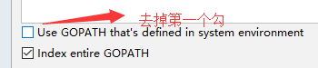

### 此书值得通读！

1.go的所有参数传递都是值传递。（除非带了指针与引用）

2.大写代表public,小写代表private.(方法和变量都适用)。

3.go get 下载包。  
但是会碰到包下不下来。  
利用gopm 下载无法下载的包，首先安装gopm。（注意：切换到GOPath目录，利用git下载）  
```go
go get -v github.com/gpmgo/gopm （-v 详细的输出信息）
```
下载安装完gopm后，然后利用gopm下载其他的包。利用```gopm help get```查看gopm get 的使用  
然后就可以下载包：eg: gopm get -v -g -u url;

4.**包之间的函数相互引用问题：**  
如果定义的报名不存在，那么编译器就会去下面的三个地方去找。  
```所以：在新建项目时，需要新建一个src目录，并把当前项目加入到GOPATH目录,这样在编译时，就会在项目路径下找到引用的包。```  
**去掉使用global gopath的勾，**  

```java
src\tree\treeentry\entry.go:6:2: cannot find package "treefds" in any of:
	C:\Go\src\treefds (from $GOROOT)    // GOROOT,go的安装目录。
	D:\goprojects\demo01\src\treefds (from $GOPATH)   // 项目的gopath路径
	C:\Users\Administrator\go\src\treefds   // 全局gopath路径
```

5.**语法介绍：**
```go
fmt.Printf("%T %V\n", r, r)  // %T ->Type, %V -> Value. 可以打印出对象的类型与值。
```
- 一个目录下，只能有一个包。如果已经定义为main包，那么就不能定义其他的包了。
- go没有继承与多态，因此只有struct，没class.
- go中的Reader与Writer传的参数可以为文件，网络，slice
- ```闭包：```
	- 匿名函数同样被称之为闭包（函数式语言的术语）：它们被允许调用定义在其它环境下的变量。闭包可使得某个函数捕捉到一些外部状态，例如：函数被创建时的状态。另一种表示方式为：一个闭包继承了函数所声明时的作用域。这种状态（作用域内的变量）都被共享到闭包的环境中，因此这些变量可以在闭包中被操作，直到被销毁。闭包经常被用作包装函数：它们会预先定义好 1 个或多个参数以用于包装。另一个不错的应用就是使用闭包来完成更加简洁的错误检查。
	- 所谓闭包是指内层函数引用了外层函数中的变量或称为引用了自由变量的函数，其返回值也是一个函数，了解过的语言中有闭包概念的像 js，python，golang 都类似这样。
	- **官方解释（译文）**：Go 函数可以是一个闭包。闭包是一个函数值，它引用了函数体之外的变量。 这个函数可以对这个引用的变量进行访问和赋值；换句话说这个函数被“绑定”在这个变量上。
- **defer关键字**：https://www.jianshu.com/p/5b0b36f398a2
	- 哪怕函数意外崩溃终止，也能保证关键字 defer 安排调用的函数会被执行。
- **recover:** 仅在defer中调用，可以获取panic的值，如果无法处理，那么可以重新panic.
- **Go中的接口与组合：**
	- 在 Go 语言中，如果一个类型实现了一个接口的所有方法，那么这个类型的实
例就可以存储在这个接口类型的实例中，不需要额外声明。
- **go的变量申明：**
	- 根据经验，如果需要声明初始值为零值
的变量，应该使用 var 关键字声明变量；如果提供确切的非零值初始化变量或者使用函数返回
值创建变量，应该使用简化变量声明运算符(结合make初始化)。
- **空白标识符** 
	- 下划线字符（ _）在 Go 语言里称为空白标识符，有很多用法。这个标识符用来抛弃不
想继续使用的值，如给导入的包赋予一个空名字，或者忽略函数返回的你不感兴趣的值。
- **go install** : 编译指定包或文件，并在bin目录下生成.exe文件.
	- go install project01/ ...  表示编译project01项目的所有包。
- **切片**： 切片是一个很小的对象，对底层数组进行了抽象。切片是一种数据结构，这种数据结构便于使用和管理数据集合。切片是围绕动态数组的概念构建的，可以按需自动增长和缩小。切片的动态增长是通过内置函append来实现的。这个函数可以快速且高效地增长切片。还可以通过对切片再次切片来缩小一个切片的大小。因为切片的
底层内存也是在连续块中分配的，所以切片还能获得索引、迭代以及为垃圾回收优化的好处。
- **关于array,slice,map在函数间传递：** 假如在main中定义，传入到A函数中修改：
	- array: 值传递。在A函数修改，并不影响main中的array的值。除非A函数返回修改后的数组。
	- slice:在 64 位架构的机器上，一个切片需要 24 字节的内存：指针字段需要 8 字节，长度和容量字段分别需要 8 字节。由于与切片关联的数据包含在底层数组里，不属于切片本身，所以将切片复制到任意函数的时候，对底层数组大小都不会有影响。复制时只会复制切片本身，不会涉及底层数组。
	如下图：
	
	- map:在函数间传递映射```并不会```制造出该映射的一个副本。实际上，当传递映射给一个函数，并对
这个映射做了修改时，所有对这个映射的引用都会察觉到这个修改。映射的键可以是任何值。这个值的类型可以是内置的类型，也可以是结构类型，只要这个值可以使用==运算符做比较。切片、函数以及包含切片的结构类型这些类型由于具有引用语义，不能作为映射的键。
- 将切片或者映射传递给函数成本很小，并且不会复制底层的数据结构。
- 

6.**go的特点：**  
Go 语言是一种静态类型的编程语言。这意味着，编译器需要在编译时知晓程序里每个值的
类型。如果提前知道类型信息，编译器就可以确保程序合理地使用值。这有助于减少潜在的内存
异常和 bug，并且使编译器有机会对代码进行一些性能优化，提高执行效率。

7.**应该使用值接收者，还是应该使用指针接收者？**  
```值接收者使用值的副本来调用方法，而指针接受者使用实际值来调用方法```。  
值接收者或指针接收者都既可以使用类型值和类型指针来调，编译器做了优化。(这是没有接口的情况下)  
在利用接口的实现，来初始化接口变量r时，如果接口的实现定义的是指针接收者，那么初始化时，需要取实现的地址。

8.