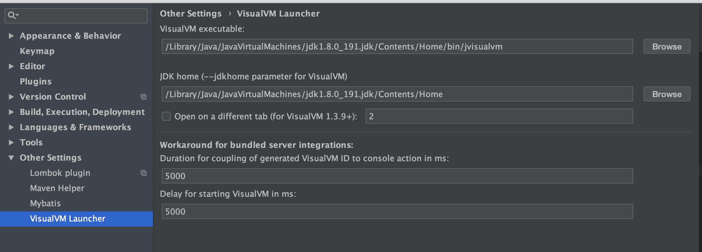
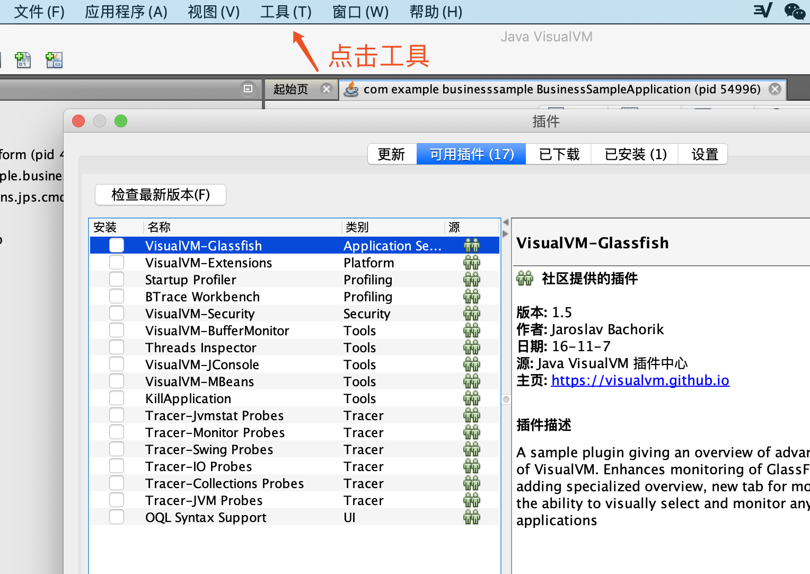
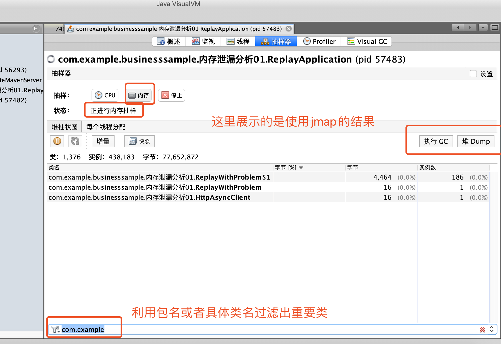
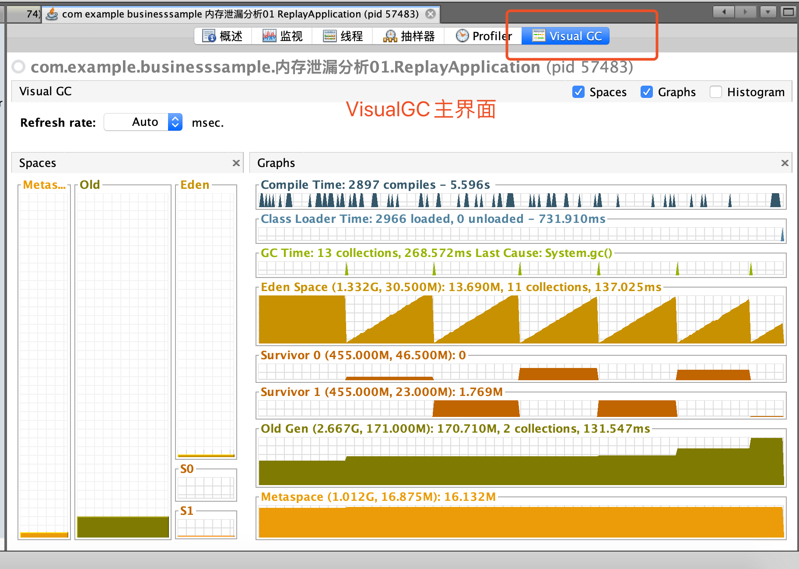

# VisualVM
```bash
jmap -dump:format=b,file=heap.dump `pid of java
```
利用上述命令dump的堆文件，然后可以利用visual GC分析。从服务器上下载了 dump 的 heap.dump 后，我们需要通过工具进行深入的分析。这里推荐的工具有 mat、visualVM。

利用visualVM 进行分析，它除了可以分析离线的 dump 文件，还可以与 IDEA 进行集成，通过 IDEA 启动应用，进行实时的分析应用的CPU、内存以及GC情况（GC情况，需要在visualVM中安装visual GC 插件）。

## VisualVM Launcher插件安装


然后就可以在idea中直接利用这个启动类了。

## 在VisualVM Launcher安装Visual GC

需要先启动VisualVM，在VisualVM界面安装此插件



## 关于VisualVM的重要步骤使用介绍


## Visual GC 插件使用


下面对上图中的各个窗口区域做简单介绍，整个界面分为三个区域，分别为：Spaces、Graphs和Histogram。

### Spaces窗口：
- Metaspace：方法区，如果JDK1.8之前的版本，就是Perm，JDK7和之前的版本都是以永久代(PermGen)来实现方法区的，JDK8之后改用元空间来实现(MetaSpace)。
- Old：老年代
- Eden: 新生代Eden区
- S0和S1：新生代的两个 Survivor 区

### Graphs窗口：
该窗口区域包含8个图标，以时间为横坐标动态展示各个指标的运行状态

下面从上往下对上图中的各个图标表及其状态进行说明:  
**Compile Time：编译情况** 
```24266 compiles - 39.416s``` 表示编译总数为24266，编译总耗时为39.416s。
一个脉冲表示一次JIT编译，脉冲越宽表示编译时间越长。

**Class Loader Time：类加载情况**  
```49052 loaded，39 unloaded - 29.937s```表示已加载的数量为49052，卸载的数量为39，耗时为29.537s。

**GC Time：总的（包含新生代和老年代）gc情况记录**  
```123 collections，859.203ms Last Cause：Allocation Failure```表示一共经历了123次gc(包含Minor GC和Full GC)，总共耗时859.203ms。

**Eden Space：新生代Eden区内存使用情况**  
```(200.00M，34.125M): 31.52M，109 collections，612.827ms```表示Eden区的最大容量为200M，当前容量为34.125M，当前已使用31.52M，从开始监控到现在在该内存区域一共发生了109次gc(Minor GC)，gc总耗时为612.827ms。

**Survivor 0和Survivor 1：新生代的两个Survivor区内存使用情况**  
```(25.000M，4.250M):1.757M```表示该Survivor区的最大容量为25M（默认为Eden区的1/8），当前已用1.757M。

**Old Gen：老年代内存使用情况**  
```(500.000M,255.195M):206.660M,14 collections，246.375ms```表示老年区的最大容量为500M，当前容量为255.195M，当前已用206.660M，从开始监控到现在在该内存区域一共发生了14次gc(Full GC)，gc总耗时为246.375ms，换算下可以看出单次Full GC要比Minor GC耗时长很多。

**Metaspace：方法区内存使用情况**  
```(1.053G,278.250M):262.345M```表示方法区最大容量为1.053G,当前容量为278.250M,当前使用量为262.345MM。

### Histogram窗口：
Histogram窗口是对当前正在被使用的Survivor区内存使用情况的详细描述，如下  

Tenuring Threshold：我们知道Survivor区中的对象有一套晋升机制，就是其中的每个对象都有一个年龄标记，每当对象在一次Minor GC中存活下来，其年龄就会+1，当对象的年龄大于一个阈值时，就会进入老年代，这个阈值就是Tenuring Threshold，要注意这个值不是固定不变的，一般情况下Tenuring Threshold会与Max Tenuring Threshold大小保持一致，可如果某个时刻Servivor区中相同年龄的所有对象的内存总等于Survivor空间的一半，那Tenuring Threshold就会等于该年龄，同时大于或等于该年龄的所有对象将进入老年代。

Max Tenuring Threshold：表示新生代中对象的最大年龄值，这个值在JDK1.8中默认为6，在JDK1.7及之前的版本中默认为15，可以通过参数-XX:MaxTenuringThreshold来指定。

Desired Survivor Size：Survivor空间大小验证阈值(默认是survivor空间的一半)，用于给Tenuring Threshold判断对象是否提前进入老年代。

Current Survivor Size：当前Survivor空间大小，单位为字节（Byte，B）。

Histogram柱状图：表示Survivor中不同年龄段对象分布。


