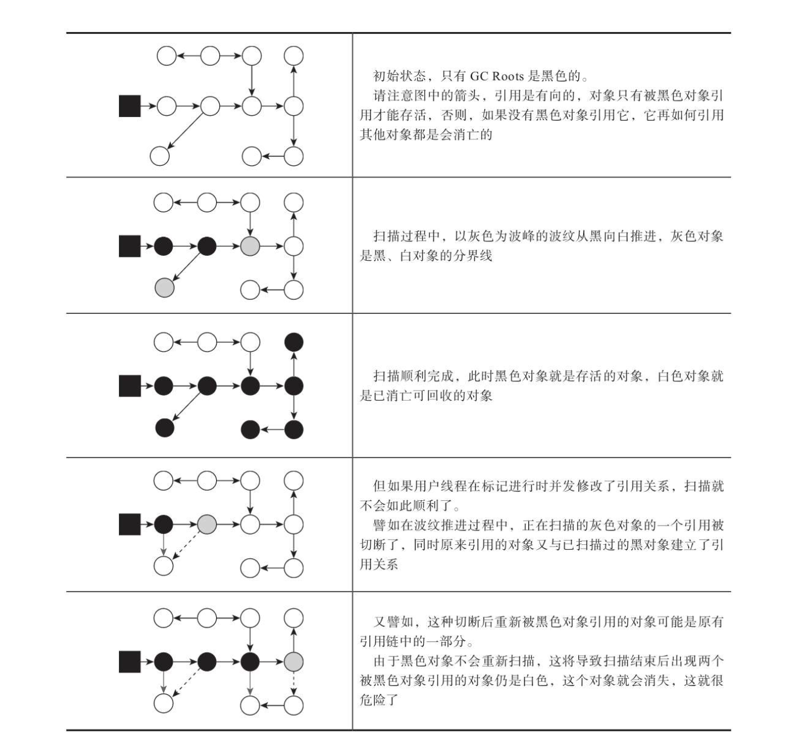

## 知识串联：
垃圾回收步骤：
- 枚举GC Root节点。利用oopmap加快枚举速度。这一步骤必须STW
- 利用GC Root节点，遍历对象图，标记对象是否存活。这一步骤利用并发标记来解决了STW.
    - 使用记忆集来缩小对象图的范围
    - 使用并发标记 来降低系统停顿时间

## oopMap
解决问题：枚举GC roots节点的效率问题。

### oopmap出现背景：
我们以可达性分析算法中从GC Roots集合找引用链这个操作作为介绍虚拟机高效实现的第一个例子。```固定可作为GC Roots的节点主要在全局性的引用（例如常量或类静态属性引用堆中的对象）与执行上下文（例如栈帧中的本地变量表引用堆中的变量）中，尽管目标明确，但查找过程要做到高效并非一件容易的事情```，现在Java应用越做越庞大,栈帧也是非常繁多，光是方法区的大小就常有数百上千兆，里面的类、常量等更是恒河沙数，若要逐个检查以这里为起源的引用肯定得消耗不少时间。

```由于目前主流Java虚拟机使用的都是准确式垃圾收集，所以当用户线程停顿下来之后，其实并不需要一个不漏地检查完所有执行上下文和全局的引用位置，虚拟机应当是有办法直接得到哪些地方存放着对象引用的。```

### 采用oopmap的解决：
在HotSpot中，对象的类型信息里有记录自己的OopMap，记录了在该类型的对象内什么偏移量上是什么类型的数据。所以从对象开始向外的扫描可以是准确的；。一旦类加载动作完成的时候，HotSpot就会把对象内什么偏移量上是什么类型的数据计算出来，在即时编译过程中，也会在特定的位置记录下栈里和寄存器里哪些位置是引用。这样收集器在扫描时(比如扫描栈时)就可以直接得知这些引用信息了，并不需要真正一个不漏地从方法区等GCRoots开始查找。```这是一种空间换时间的做法```

## oopmap的补充
OopMap 记录了栈上本地变量到堆上对象的引用关系。其作用是：垃圾收集时，收集线程会对栈上的内存进行扫描，看看哪些位置存储了 Reference 类型。如果发现某个位置确实存的是 Reference 类型，就意味着它所引用的对象这一次不能被回收。但问题是，栈上的本地变量表里面只有一部分数据是 Reference 类型的（它们是我们所需要的），那些非 Reference 类型的数据对我们而言毫无用处，但我们还是不得不对整个栈全部扫描一遍，这是对时间和资源的一种浪费。

一个很自然的想法是，能不能用空间换时间，在某个时候把栈上代表引用的位置全部记录下来，这样到真正 gc 的时候就可以直接读取，而不用再一点一点的扫描了。事实上，大部分主流的虚拟机也正是这么做的，比如 HotSpot ，它使用一种叫做 OopMap 的数据结构来记录这类信息。

我们知道，一个线程意味着一个栈，一个栈由多个栈帧组成，一个栈帧对应着一个方法，一个方法里面可能有多个安全点。 gc 发生时，程序首先运行到最近的一个安全点停下来，然后更新自己的 OopMap ，记下栈上哪些位置代表着引用。枚举根节点时，递归遍历每个栈帧的 OopMap ，通过栈中记录的被引用对象的内存地址，即可找到这些对象（ GC Roots ）。

通过上面的解释，**我们可以很清楚的看到使用 OopMap 可以避免全栈扫描，加快枚举根节点的速度**。但这并不是它的全部用意。它的另外一个更根本的作用是，可以帮助 HotSpot 实现准确式 GC。
```准确式GC: 给定某个位置上的某块数据，要能知道它的准确类型是什么，这样才可以合理地解读数据的含义；GC所关心的含义就是“这块数据是不是指针”```

### 不采用oopmap:
如果JVM选择不记录任何这种类型的数据，那么它就无法区分内存里某个位置上的数据到底应该解读为引用类型还是整型还是别的什么。这种条件下，实现出来的GC就会是“保守式GC（conservative GC）”。在进行GC的时候，JVM开始从一些已知位置（例如说JVM栈）开始扫描内存，扫描的时候每看到一个数字就看看它“像不像是一个指向GC堆中的指针”。这里会涉及上下边界检查（GC堆的上下界是已知的）、对齐检查（通常分配空间的时候会有对齐要求，假如说是4字节对齐，那么不能被4整除的数字就肯定不是指针），之类的。然后递归的这么扫描出去。（有可能存在数字的值和一个地址的值相同，这样如果这个地址上的对象本来应该被回收，但是由于这个栈的数字巧合的和它的地址值相同，导致这个对象不会被回收).

### 枚举GC root节点必须 STW
迄今为止，所有收集器在根节点枚举这一步骤时都是必须暂停用户线程的，因此毫无疑问根节点枚举与之前提及的整理内存碎片一样会面临相似的“Stop The World”的困扰。现在可达性分析算法耗时最长的查找引用链的过程已经可以做到与用户线程一起并发，但根节点枚举始终还是必须在一个能保障一致性的快照中才得以进行——这里“一致性”的意思是整个枚举期间执行子系统看起来就像被冻结在某个时间点上，不会出现分析过程中，```根节点集合的对象引用关系还在不断变化的情况，若这点不能满足的话，分析结果准确性也就无法保证。这是导致垃圾收集过程必须停顿所有用户线程的其中一个重要原因```，即使是号称停顿时间可控，或者（几乎）不会发生停顿的CMS、G1、ZGC等收集器，枚举根节点时也是必须要停顿的。

## 安全点
### 安全点出现的作用：
> 保证在枚举GC roots时，jvm就如同暂停一般，保证了枚举的准确性。

在OopMap的协助下，HotSpot可以快速准确地完成GC Roots枚举，但一个很现实的问题随之而来：可能导致引用关系变化，或者说导致OopMap内容变化的指令非常多，如果为每一条指令都生成对应的OopMap，那将会需要大量的额外存储空间，这样垃圾收集伴随而来的空间成本就会变得无法忍受的高昂。

实际上HotSpot也的确没有为每条指令都生成OopMap，前面已经提到，只是在“特定的位置”记录了这些信息，这些位置被称为安全点（Safepoint）。有了安全点的设定，也就决定了用户程序执行时并非在代码指令流的任意位置都能够停顿下来开始垃圾收集，而是强制要求必须执行到达安全点后才能够暂停。因此，安全点的选定既不能太少以至于让收集器等待时间过长，也不能太过频繁以至于过分增大运行时的内存负荷。安全点位置的选取基本上是以“是否具有让程序长时间执行的特征”为标准进行选定的，因为每条指令执行的时间都非常短暂，程序不太可能因为指令流长度太长这样的原因而长时间执行，“长时间执行”的最明显特征就是指令序列的复用，例如方法调用、循环跳转、异常跳转等都属于指令序列复用，所以只有具有这些功能的指令才会产生安全点。

对于安全点，另外一个需要考虑的问题是，如何在垃圾收集发生时让所有线程（这里其实不包括执行JNI调用的线程）都跑到最近的安全点，然后停顿下来。这里有两种方案可供选择：抢先式中断（PreemptiveSuspension）和主动式中断（Voluntary Suspension），抢先式中断不需要线程的执行代码主动去配合，在垃圾收集发生时，系统首先把所有用户线程全部中断，如果发现有用户线程中断的地方不在安全点上，就恢复这条线程执行，让它一会再重新中断，直到跑到安全点上。现在几乎没有虚拟机实现采用抢先式中断来暂停线程响应GC事件。而主动式中断的思想是当垃圾收集需要中断线程的时候，不直接对线程操作，仅仅简单地设置一个标志位，各个线程执行过程时会不停地主动去轮询这个标志，一旦发现中断标志为真时就自己在最近的安全点上主动中断挂起。轮询标志的地方和安全点是重合的，另外还要加上所有创建对象和其他需要在Java堆上分配内存的地方，这是为了检查是否即将要发生垃圾收集，避免没有足够内存分配新对象。

## 记忆集
### 出现背景：
> 使用记忆集来缩减GC Roots扫描范围的问题。利用已枚举出来的gc root节点去扫描对应的引用关系，那么可以利用记忆集来缩小扫描的范围。

> 比如说，新生代 gc （它发生得非常频繁）。一般来说， gc 过程是这样的：首先枚举根节点。根节点有可能在新生代中，也有可能在老年代中。这里由于我们只想收集新生代（换句话说，不想收集老年代），所以没有必要对位于老年代的 GC Roots 做全面的可达性分析。但问题是，确实可能存在位于老年代的某个 GC Root，它引用了新生代的某个对象，这个对象你是不能清除的。那怎么办呢？

### 解决办法：
仍然是拿空间换时间的办法。事实上，对于位于不同年代对象之间的引用关系，虚拟机会在程序运行过程中给记录下来。对应上面所举的例子，“老年代对象引用新生代对象”这种关系，会在引用关系发生时，在新生代边上专门开辟一块空间```(新生代的全局数据结构)```记录下来，这就是 RememberedSet 。所以“新生代的 GC Roots ” + “ RememberedSet 存储的内容”，才是新生代收集时真正的 GC Roots 。然后就可以以此为据，在新生代上做可达性分析，进行垃圾回收。

我们知道， G1 收集器使用的是化整为零的思想，把一块大的内存划分成很多个域（ Region ）。但问题是，难免有一个 Region 中的对象引用另一个 Region 中对象的情况。为了达到可以以 Region 为单位进行垃圾回收的目的， G1 收集器也使用了 RememberedSet 这种技术，在各个 Region 上记录自家的对象被外面对象引用的情况。

## 卡表：
> 卡表就是记忆集的一种具体实现，每个记录精确到一块内存区域，该区域内有对象含有跨代指针。
> 记忆集与卡表的关系：可类比 Java 语言中接口与实现类的关系（比如 Map 与 HashMap）。

我们已经解决了如何使用记忆集来缩减GC Roots扫描范围的问题，但还没有解决卡表元素如何维护的问题，例如它们何时变脏、谁来把它们变脏?

卡表元素何时变脏的答案是很明确的——有其他分代区域中对象引用了本区域对象时，其对应的卡表元素就应该变脏，变脏时间点原则上应该发生在引用类型字段赋值的那一刻。但问题是如何变脏，即如何在对象赋值的那一刻去更新维护卡表呢？假如是解释执行的字节码，那相对好处理，虚拟机负责每条字节码指令的执行，有充分的介入空间；但在编译执行的场景中呢？经过即时编译后的代码已经是纯粹的机器指令流了，这就必须找到一个在机器码层面的手段，把维护卡表的动作放到每一个赋值操作之中。

在HotSpot虚拟机里是通过写屏障（Write Barrier）技术维护卡表状态的。先请读者注意将这里提到的“写屏障”，以及后面在低延迟收集器中会提到的“读屏障”与解决并发乱序执行问题中的“内存屏障”区分开来，避免混淆。写屏障可以看作在虚拟机层面对“引用类型字段赋值”这个动作的AOP切面，在引用对象赋值时会产生一个环形（Around）通知，供程序执行额外的动作，也就是说赋值的前后都在写屏障的覆盖范畴内。在赋值前的部分的写屏障叫作写前屏障（Pre-Write Barrier），在赋值后的则叫作写后屏障（Post-Write Barrier）。HotSpot虚拟机的许多收集器中都有使用到写屏障，但直至G1收集器出现之前，其他收集器都只用到了写后屏障。下面这段代码清单是一段更新卡表状态的简化逻辑：
```c
void oop_field_store(oop* field,oop new_value){
   //引用类型字段赋值
   *field = new_value;
   // 写后屏障，更新卡表信息
   post_write_barrier(field,new_value);
}
```

应用写屏障后，虚拟机就会为所有赋值操作生成相应的指令，一旦收集器在写屏障中增加了更新卡表操作，无论更新的是不是老年代对新生代对象的引用，每次只要对引用进行更新，就会产生额外的开销，不过这个开销与Minor GC时扫描整个老年代的代价相比还是低得多的。

## 并发的可达性分析
解决的问题：
> 加快根据枚举出来的GC root节点往下遍历对象图的速度。解决或者降低用户线程的停顿。

曾经提到了当前主流编程语言的垃圾收集器基本上都是依靠可达性分析算法来判定对象是否存活的，可达性分析算法理论上要求全过程都基于一个能保障一致性的快照中才能够进行分析，这意味着必须全程冻结用户线程的运行。在根节点枚举这个步骤中，由于GCRoots相比起整个Java堆中全部的对象毕竟还算是极少数，且在各种优化技巧（如OopMap）的加持下，它带来的停顿已经是非常短暂且相对固定（不随堆容量而增长）的了。

可从GC Roots再继续往下遍历对象图，这一步骤的停顿时间就必定会与Java堆容量直接成正比例关系了：堆越大，存储的对象越多，对象图结构越复杂，要标记更多对象而产生的停顿时间自然就更长，这听起来是理所当然的事情。```要知道包含“标记”阶段是所有追踪式垃圾收集算法的共同特征，如果这个阶段会随着堆变大而等比例增加停顿时间，其影响就会波及几乎所有的垃圾收集器，同理可知，如果能够削减这部分停顿时间的话，那收益也将会是系统性的。(并发可达性出现的背景)```

### 并发标记带来的问题：
> 为什么必须在一个能保障一致性的快照上才能进行对象图的遍历?

>>**请耐心看下去**

为了能解释清楚这个问题，我们引入三色标记（Tri-color Marking）作为工具来辅助推导，把遍历对象图过程中遇到的对象，按照“是否访问过”这个条件标记成以下三种颜色：
- 白色：表示对象尚未被垃圾收集器访问过。显然在可达性分析刚刚开始的阶段，所有的对象都是白色的，若在分析结束的阶段，仍然是白色的对象，即代表不可达。
- 黑色：表示对象已经被垃圾收集器访问过，且这个对象的所有引用都已经扫描过。黑色的对象代表已经扫描过，它是安全存活的，如果有其他对象引用指向了黑色对象，无须重新扫描一遍。黑色对象不可能直接（不经过灰色对象）指向某个白色对象。
- 灰色：表示对象已经被垃圾收集器访问过，但这个对象上至少存在一个引用还没有被扫描过。

关于可达性分析的扫描过程，读者不妨发挥一下想象力，把它看作对象图上一股以灰色为波峰的波纹从黑向白推进的过程，如果用户线程此时是冻结的，只有收集器线程在工作，那不会有任何问题。但如果用户线程与收集器是并发工作呢？收集器在对象图上标记颜色，同时用户线程在修改引用关系——即修改对象图的结构，这样可能出现两种后果。一种是把原本消亡的对象错误标记为存活，这不是好事，但其实是可以容忍的，只不过产生了一点逃过本次收集的浮动垃圾而已，下次收集清理掉就好。另一种是把原本存活的对象错误标记为已消亡，这就是非常致命的后果了，程序肯定会因此发生错误。

下面表演示了这样的致命错误具体是如何产生的。



Wilson于1994年在理论上证明了，当且仅当以下两个条件同时满足时，```会产生“对象消失”的问题，即原本应该是黑色的对象被误标为白色：```
- 赋值器插入了一条或多条从黑色对象到白色对象的新引用；
- 赋值器删除了全部从灰色对象到该白色对象的直接或间接引用。
因此，我们要解决并发扫描时的对象消失问题，只需破坏这两个条件的任意一个即可。

由此分别产生了两种解决方案：增量更新（IncrementalUpdate）和原始快照（Snapshot At The Beginning，SATB）。
- 增量更新要破坏的是第一个条件，当黑色对象插入新的指向白色对象的引用关系时，就将这个新插入的引用记录下来，等并发扫描结束之后，再将这些记录过的引用关系中的黑色对象为根，重新扫描一次。这可以简化理解为，黑色对象一旦新插入了指向白色对象的引用之后，它就变回灰色对象了。
- 原始快照要破坏的是第二个条件，当灰色对象要删除指向白色对象的引用关系时，就将这个要删除的引用记录下来，在并发扫描结束之后，再将这些记录过的引用关系中的灰色对象为根，重新扫描一次(因为此时灰色对象可能再与被删除的引用对象建立的引用)。这也可以简化理解为，无论引用关系删除与否，都会按照刚刚开始扫描那一刻的对象图快照来进行搜索。

以上无论是对引用关系记录的插入还是删除，虚拟机的记录操作都是通过写屏障实现的。在HotSpot虚拟机中，增量更新和原始快照这两种解决方案都有实际应用，譬如，CMS是基于增量更新来做并发标记的，G1、Shenandoah则是用原始快照来实现。

## 至此 遍历GC root、可达性分析原理分析完毕。

参考：
- 《深入理解Java虚拟机 第三版》
- https://www.iteye.com/blog/dsxwjhf-2201685


