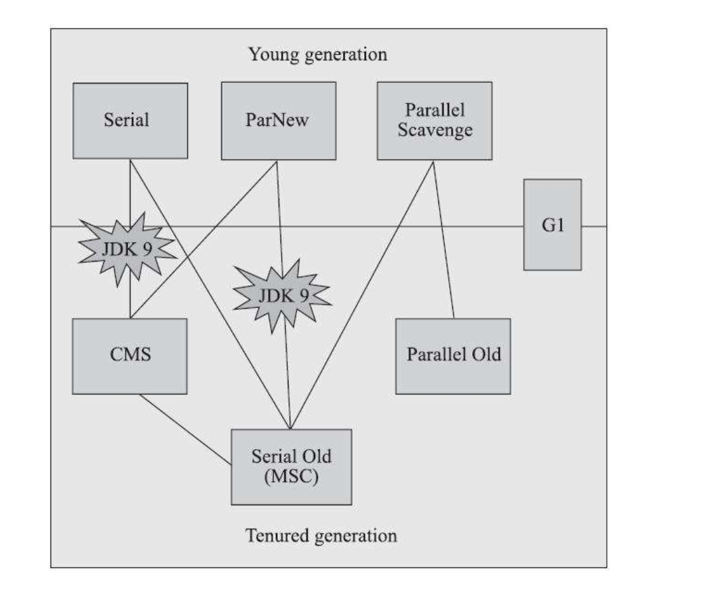

# 经典回收器
## 搭配关系如下：


上图展示了七种作用于不同分代的收集器，如果两个收集器之间存在连线，就说明它们可以搭配使用，图中收集器所处的区域，则表示它是属于新生代收集器抑或是老年代收集器。

如果对JDK 9及以上版本的HotSpot虚拟机使用参数-XX：+UseConcMarkSweepGC来开启CMS收集器的话，用户会收到一个警告信息，提示CMS未来将会被废弃：
```log
Java HotSpot(TM) 64-Bit Server VM warning: Option UseConcMarkSweepGC was deprecated in version 9.0 and will likely be removed in a future release.
```
自 Java 9 以来，G1 GC 已成为默认的 GC 算法。

