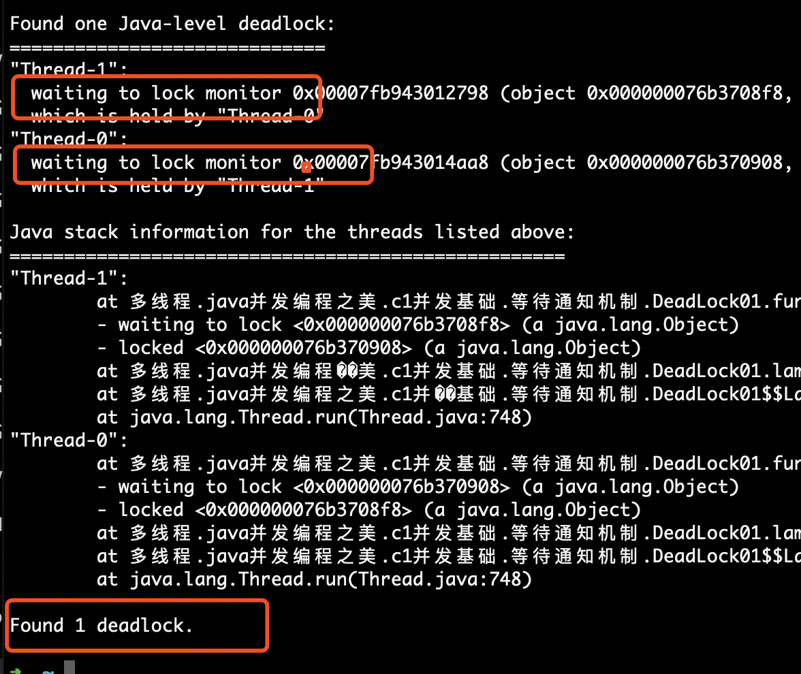
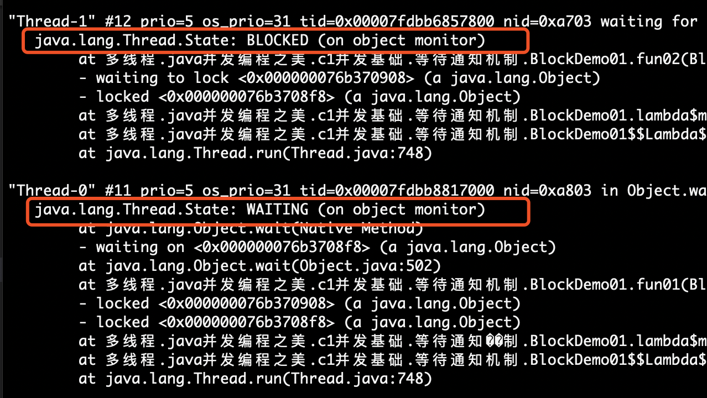

1.**死锁的排查**
jsatck pid 可以查看：如下

  

由图上可知，用户线程全部阻塞掉，并且分析会显示的告知deadlock.

可以使用jconsole，也可以看出。
**与程序永久阻塞的区别：**

  

通过jstack并没有检测出死锁。

2.**频繁GC问题或内存溢出问题**
- 一、使用jps查看线程ID
- 二、使用jstat -gc 3331 250 20 查看gc情况，一般比较关注PERM区的情况，查看GC的增长情况。
- 三、使用jstat -gccause：额外输出上次GC原因
- 四、使用jmap -dump:format=b,file=heapDump 3331生成堆转储文件
- 五、使用jhat或者可视化工具（Eclipse Memory Analyzer 、IBM HeapAnalyzer）分析堆情况。
- 六、结合代码解决内存溢出或泄露问题。

3.**CPU占用高排查**
