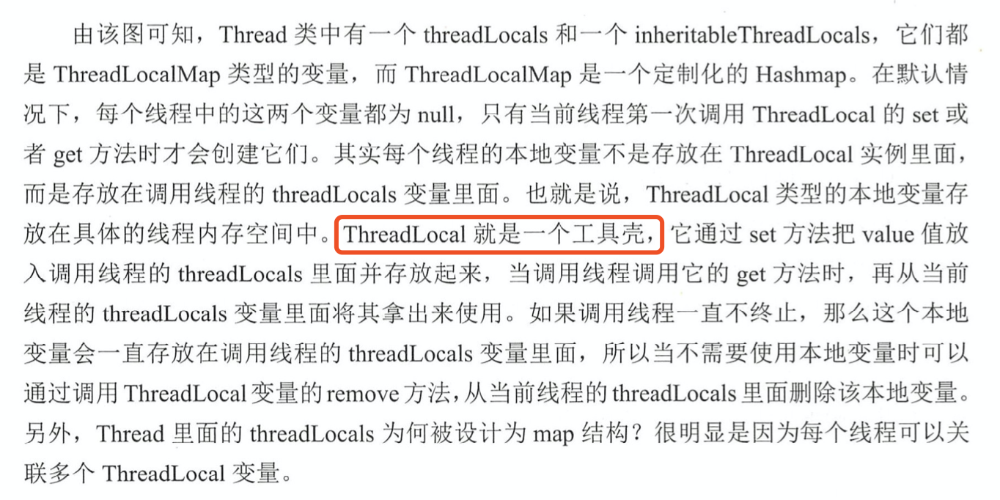

```java
public class ThreadLocalTest01 {

    public static ThreadLocal<String> threadLocal01 = new ThreadLocal<>();
    public static ThreadLocal<String> threadLocal02 = new ThreadLocal<>();

    public static void print() {
        System.out.println(Thread.currentThread().getName() + "--" + threadLocal01.get());
        threadLocal01.remove();
    }

    public static void main(String[] args) {
        /**
         * 一个线程可以关联多个ThreadLocal
         * 所以Thread类的ThreadLocal.ThreadLocalMap threadLocals = null
         * 需要设计成Map类型
         */
        new Thread(() -> {
            threadLocal01.set("aaaa");
            threadLocal02.set("bbbb");
            print();
        }).start();

        new Thread(() -> {
            threadLocal01.set("nnnn");
            threadLocal02.set("vvvvv");
            print();
        }).start();
    }
}
```
## 基本方法分析


```java
// Thread类的成员变量
ThreadLocal.ThreadLocalMap threadLocals = null;
ThreadLocal.ThreadLocalMap inheritableThreadLocals = null;
```

```java
// set方法 java.lang.ThreadLocal#set
public void set(T value) {
    // 获取调用set()当前线程
    Thread t = Thread.currentThread();
    // 获取调用线程的成员变量threadlocals
    ThreadLocalMap map = getMap(t);
    if (map != null)
    // 注意：thread.threadLocals存储的是 ThreadLocal与value的映射。底层是通过Entry存储key-value,类似HashMap
    // 所以，一个线程可以关联多个THreadLocal变量，这也是threadlocals为Map的原因
        map.set(this, value);
    else
        createMap(t, value);
}

// getMap()
ThreadLocalMap getMap(Thread t) {
    return t.threadLocals;
}

// createMap()  java.lang.ThreadLocal#createMap
void createMap(Thread t, T firstValue) {
    // 当前ThreadLocal对象与value的映射
    t.threadLocals = new ThreadLocalMap(this, firstValue);
}
```

```java
// remove()  java.lang.ThreadLocal#remove
public void remove() {
    ThreadLocalMap m = getMap(Thread.currentThread());
    if (m != null)
        // 以当前ThreadLocal对象作为key,删除对应的Entry,并且清除引用
        m.remove(this);
}
// java.lang.ThreadLocal.ThreadLocalMap#remove
private void remove(ThreadLocal<?> key) {
    Entry[] tab = table;
    int len = tab.length;
    int i = key.threadLocalHashCode & (len-1);
    for (Entry e = tab[i];
            e != null;
            e = tab[i = nextIndex(i, len)]) {
        if (e.get() == key) {
            // 清除key(ThreadLocal对象)
            e.clear();
            // 清除value与Entry
            expungeStaleEntry(i);
            return;
        }
    }
}
// 删除key
public void clear() {
    this.referent = null;
}

// expungeStaleEntry
private int expungeStaleEntry(int staleSlot) {
    Entry[] tab = table;
    int len = tab.length;

    // expunge(抹去) entry at staleSlot
    tab[staleSlot].value = null;
    tab[staleSlot] = null;
    size--;

    // Rehash until we encounter null
    Entry e;
    int i;
    for (i = nextIndex(staleSlot, len);
            (e = tab[i]) != null;
            i = nextIndex(i, len)) {
        ThreadLocal<?> k = e.get();
        if (k == null) {
            e.value = null;
            tab[i] = null;
            size--;
        } else {
            // 省略无关代码
        }
```

## 内存泄漏分析：
ThreadLocal操作不当会引发内存泄露，最主要的原因在于它的内部类ThreadLocalMap中的Entry的设计。```Entry继承了WeakReference<ThreadLocal<?>>，即Entry的key是弱引用，所以key'会在垃圾回收的时候被回收掉```， 而key对应的value则不会被回收(因为value是强引用)， 这样会导致一种现象：key为null，value有值。
key为空的话value是无效数据，久而久之，value累加就会导致内存泄漏。
```java
static class ThreadLocalMap {
    // Entry的key为弱引用
    static class Entry extends WeakReference<ThreadLocal<?>> {
        /** The value associated with this ThreadLocal. */
        Object value;

        Entry(ThreadLocal<?> k, Object v) {
            super(k);
            value = v;
        }
    }
```

### 怎么解决内存泄漏问题
- 手工调用ThreadLocal.remove()
- JDK开发者 他们在一些方法中埋了对key=null的value擦除操作。
```java
// 在调用ThreadLocal.get()获取值时，会调用Thread.ThreadLocalMap.getEntry()
private Entry getEntry(ThreadLocal<?> key) {
    int i = key.threadLocalHashCode & (table.length - 1);
    Entry e = table[i];
    // e.get()获取key
    if (e != null && e.get() == key)
        return e;
    else
        // 这里会清除key==null的Entry
        return getEntryAfterMiss(key, i, e);
}
// getEntryAfterMiss
private Entry getEntryAfterMiss(ThreadLocal<?> key, int i, Entry e) {
    Entry[] tab = table;
    int len = tab.length;

    while (e != null) {
        ThreadLocal<?> k = e.get();
        if (k == key)
            return e;
        if (k == null)
            // 如果key为空，那么就清除对应的value与entry
            expungeStaleEntry(i);
        else
            i = nextIndex(i, len);
        e = tab[i];
    }
    return null;
}

// 在调用set方法时，仍然会走到expungeStaleEntry方法

// java.lang.Thread#exit
private void exit() {
    if (group != null) {
        group.threadTerminated(this);
        group = null;
    }
    /* Aggressively null out all reference fields: see bug 4006245 */
    target = null;
    /* Speed the release of some of these resources 清除成员变量*/
    threadLocals = null;
    inheritableThreadLocals = null;
    inheritedAccessControlContext = null;
    blocker = null;
    uncaughtExceptionHandler = null;
}
```

### 弱引用导致内存泄漏，那为什么key不设置为强引用
如果key设置为强引用，如果没有手工调用remove方法，threadLocalMap.Entry强引用threadLocal， 这样会导致threadLocal不能正常被GC回收,而现在都是现成池复用线程，那么就会造成线程无法消亡，导致内存泄漏。
弱引用虽然会引起内存泄漏， 但是也有set、get、remove方法操作对null key进行擦除的补救措施， 方案上略胜一筹。  
```强引用:强引用就是我们最常见的普通对象引用（如new 一个对象），只要还有强引用指向一个对象，就表明此对象还“活着”。在强引用面前，即使JVM内存空间不足，JVM宁愿抛出OutOfMemoryError运行时错误（OOM），让程序异常终止，也不会靠回收强引用对象来解决内存不足的问题。对于一个普通的对象，如果没有其他的引用关系，只要超过了引用的作用域或者显式地将相应（强）引用赋值为null，就意味着此对象可以被垃圾收集了。但要注意的是，并不是赋值为null后就立马被垃圾回收，具体的回收时机还是要看垃圾收集策略的```  
```弱引用：垃圾回收器会扫描它所管辖的内存区域的过程中，只要发现弱引用的对象，不管内存空间是否有空闲，都会立刻回收它。```

## 在Spring中的使用
**spring 如何保证数据库事务在同一个连接下执行的？**  
要想实现jdbc事务， 就必须是在同一个连接对象中操作， 多个连接下事务就会不可控(需要借助分布式事务完)。那spring 如何保证数据库事务在同一个连接下执行的呢？  
DataSourceTransactionManager 是spring的数据源事务管理器， 它会在你调用getConnection()的时候从数据库连接池中获取一个connection， 然后将其与ThreadLocal绑定， 事务完成后解除绑定。这样就保证了事务在同一连接下完成。  
org.springframework.jdbc.datasource.DataSourceTransactionManager#doBegin

## 问题：
既然ThreadLocal的key是弱引用，那么在set方法调用完毕，立马发生GC，此时threadLocal的key为null了，然后再通过get()方法通过当前的threadLocal对象获取value时，就会返回null，此时上层应该怎么处理？  
概括的说：threadLocal.get()会在已经set后，返回null,那么这种上层怎么处理？