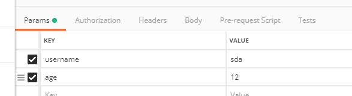

１、autowired与resources的区别：  
autowired注入List时，会把List中的所有bean注入进来（如果bean为接口实现类impl的话，注入后　，在后期又把impl删掉了，启动程序就会报错）。  
 
2、如果一个接口有多个实现类，但是又想创建这些bean,只能采用xml配置，无法采用@注解的方式。  

=========================================================

1.@Repository(value="userDao")注解是告诉Spring，让Spring创建一个名字叫“userDao”的UserDaoImpl实例。  

当Service需要使用Spring创建的名字叫“userDao”的UserDaoImpl实例时，就可以使用@Resource(name = "userDao")注解告诉Spring，Spring把创建好的userDao注入给Service即可。 

2.被@PostConstruct修饰的方法会在服务器加载Servlet的时候运行，并且只会被服务器执行一次.  

3.Timestamp(sql包下) 与 LocalDateTime的相互转换
```java
// jdk:1.8
// 1.Timestamp 转 LocalDateTime 
Timestamp time = Timestamp.from(Instant.now());
LocalDateTime localDateTime = time.toLocalDateTime();
// 2.LocalDateTime  转 Timestamp
Timestamp time = Timestamp.valueOf(LocalDateTime.now());
```
==========================================================  
1.X-Forwarded-For 和 X-Real-IP 的区别  
- X-Forwarded-For是用于记录代理信息的，每经过一级代理X-Forwarded-For是用于记录代理信息的，每经过一级代理(匿名代理除外)，
     代理服务器都会把这次请求的来源IP追加在X-Forwarded-For中
　　来自4.4.4.4的一个请求，header包含这样一行
　　X-Forwarded-For: 1.1.1.1, 2.2.2.2, 3.3.3.3
　　代表 请求由1.1.1.1发出，经过三层代理，第一层是2.2.2.2，第二层是3.3.3.3，而本次请求的来源IP4.4.4.4是第三层代理
- X-Real-IP，一般只记录真实发出请求的客户端IP，上面的例子，如果配置了X-Read-IP，将会是
　　X-Real-IP: 1.1.1.1
　　所以 ，如果只有一层代理，这两个头的值就是一样的

2.日志级别:

error :一般用于try catch 异常里，输出异常内容。

warn: 多用于一些参数或者返回值信息为空，非正常逻辑的日志输出

info：关键环节的参数或者返回值的打印，常用来定位问题

debug：不重要的日志， 一般不用，用的时候要加log.isDebugEnabled()判断一下，当前debug是否是开启状态
当日志级别在DEBUG以下时，log.debug("hello, this is " + name)就不会执行，从而没有字符串拼接的开销。
JIT在运行时会优化if语句，如果isDebugEnabled()返回false, 则JIT会将整个if块全部去掉。 

3.```AOP```:  
**Spring仅支持方法的连接点**
表达式意思:https://blog.csdn.net/loongshawn/article/details/72303040

"execution(* com.test.method.aaaa..*.*(..))"
|标识符|含义|
|--|--|
|第一个"*"符号|表示任意返回值类型|
|com.test.method.aaaa|AOP所切的服务的包名，即，需要进行横切的业务类|
|包名后面的".."|表示当前包或者子包或者子包的子包|
|第二个“*”|表示类名，*即所有类|
|.*(..)|表示任何方法名，括号表示参数，两个点表示任何参数类型|

**几个注解**
- 参考网址:https://zhuanlan.zhihu.com/p/25891989
- Before:在方法之前执行,可以做一些权限的验证
- After:@AfterReturning增强处理只有在目标方法成功完成后才会被织入，但@After不管目标方法怎么被结束，都会被织入.
- @Around: advice的方法第一个形参必须是ProceedingJoinPoint类型，```方法体内调用ProceedingJoinPoint参数的proceed()方法才会执行目标函数```。调用这个方法时，还可以传入一个Object[]对象作为参数，该数组中的值将被传入目标方法作为执行方法的实参。看下面的例子:
```java
@Aspect
public class AroundTest {
@Around("execution(* aaa.*.*(..))")
public Object test(ProceedingJoinPoint joinPoint) throws Throwable {
        System.out.println("=======Around开始=======");
        Object[] args = joinPoint.getArgs();
        System.out.println("=======Around=======ProceedingJoinPoint是 " + joinPoint.toString());
        System.out.println("=======Around=======目标方法的传入参数是 " + args);
        Object rvt = joinPoint.proceed(args); // 执行目标函数,正常返回则跳回这里.
        System.out.println("=======Around结束=======");
        return rvt;
    }
}
执行结果:
=======Around开始=======  
=======Around=======ProceedingJoinPoint是 execution(int aaa.World.getNum())  
=======Around=======目标方法的传入参数是 [Ljava.lang.Object;@1757cd72  
=======执行目标方法==========  
=======Around结束=======
```
通过joinPoint调用的方法:
```java
Object[] getArgs()：//返回执行目标方法时的参数

Signature getSignature()：//返回被增强的方法的相关信息。

Object getTarget()：//返回被织入advice的目标对象

Object getThis()：//返回AOP框架为目标对象生成的代理对象java

```

**执行顺序**:Around，Before，执行，如果正常结束，就是Around，After，AfterReturning；如果抛出异常，就是AfterThrowing，After。 

4.java的System.currentTimeMillis()和System.nanoTime()区别: 

java中System.nanoTime()返回的是纳秒，nanoTime而返回的可能是任意时间，甚至可能是负数.
java中System.currentTimeMillis()返回的毫秒，这个毫秒其实就是自1970年1月1日0时起的毫秒数,```现在的计算机运行速度很快，因而极有可能System.currentTimeMillis()的值相等```. 

5.定义全局异常:  
https://blog.csdn.net/w372426096/article/details/78429141  
如果单使用@ExceptionHandler，只能在当前Controller中处理异常。但当配合@ControllerAdvice一起使用的时候，就可以摆脱那个限制了。

6.**mvn dependency:resolve -Dclassifier=sources.解决idea中无法下载源码的问题**.

7.autowired与resources的区别： 
- @Resource默认按照ByName自动注入，由J2EE提供，需要导入包javax.annotation.Resource。@Resource有两个重要的属性：name和type，而Spring将@Resource注解的name属性解析为bean的名字，而type属性则解析为bean的类型。所以，如果使用name属性，则使用byName的自动注入策略，而使用type属性时则使用byType自动注入策略。如果既不制定name也不制定type属性，这时将通过反射机制使用byName自动注入策略。
- @Autowired注解是按照类型（byType）装配依赖对象，默认情况下它要求依赖对象必须存在，如果允许null值，可以设置它的required属性为false。如果我们想使用按照名称（byName）来装配，可以结合@Qualifier注解一起使用
- autowired注入List时，会把List中的所有bean注入进来（如果bean为接口实现类impl的话，注入后　，在后期又把impl删掉了，启动程序就会报错）。

@Resource装配顺序：

①如果同时指定了name和type，则从Spring上下文中找到唯一匹配的bean进行装配，找不到则抛出异常。

②如果指定了name，则从上下文中查找名称（id）匹配的bean进行装配，找不到则抛出异常。

③如果指定了type，则从上下文中找到类似匹配的唯一bean进行装配，找不到或是找到多个，都会抛出异常。

④如果既没有指定name，又没有指定type，则自动按照byName方式进行装配；如果没有匹配，则回退为一个原始类型进行匹配，如果匹配则自动装配。

@Resource的作用相当于@Autowired，只不过@Autowired按照byType自动注入。

8.SpringMVC注解:
- @RequestBody将RequestBody整体作为json串解析为Model(适用于前端的字段太多,不适合写成k-v)， 只针对POST请求，可参见第10条.
- @RequestMapping的参数:
    - path="/user"--请求路径
    - method 请求方式
    - params: 比如params={"version=2"}
- @RequestParam:绑定具体参数.(name="参数名称", required = false, defaultValue=1)--> 表示参数值默认为1,可有可无.

**10.SpringMVC的参数绑定机制：**

**以下demo是在postman下测试**

一、POST、GET请求都可以自动绑定对象：
```java
@PostMapping("user")
public User addUser(@Valid UserInputDTO userInputDTO, BindingResult bindingResult){
    return null;
}

@GetMapping("user1")
public String baseInfoCompany(@Valid UserInputDTO userInputDTO) {
    return "";
}
```
测试数据如下：注意参数是利用Postnan的param传的    


二、POST/GET请求中```RequestBody```和```RequestParam```的应用场景：  
参考网址：https://www.jianshu.com/p/4981911d5e15 值得细读

1、从content-type方面总结：  
① form-data、x-www-form-urlencoded：不可以用@RequestBody；可以用@RequestParam，url中的?后面参数可以用@RequestParam。见postman的格局，这两种方式的时候没有json字符串部分。  
② application/json：json字符串部分可以用@RequestBody；。见postman的格局

2、从两种注解方式总结：  
详细阅读：https://www.jianshu.com/p/4981911d5e15 

11.**Spring的bean的id、name、别名之间的关系以及getBean()源码分析**   
https://blog.csdn.net/hongxingxiaonan/article/details/49835861

12.


