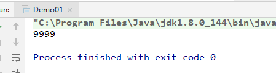

1.**一个对象方法起多个线程访问私有变量：**  
结果：线程不安全。
```java
/**
 * <Description>
 * 同一个对象创建100个线程，去同时访问对象的属性。
 * 结果： 线程不安全。在多次测试下，得到9999
 * @author wangxi
 */
public class Demo01 {
    private int count;

    private void fun() {
        for (int i = 0; i < 10000; i++) {
            Thread thread = new Thread(() -> {
                count++;
            });
            thread.start();
        }
        try {
            Thread.sleep(5000);
        } catch (InterruptedException e) {
            e.printStackTrace();
        }
        System.out.println(count);
    }

    public static void main(String[] args) {
        new Demo01().fun();
    }
}
```


2.