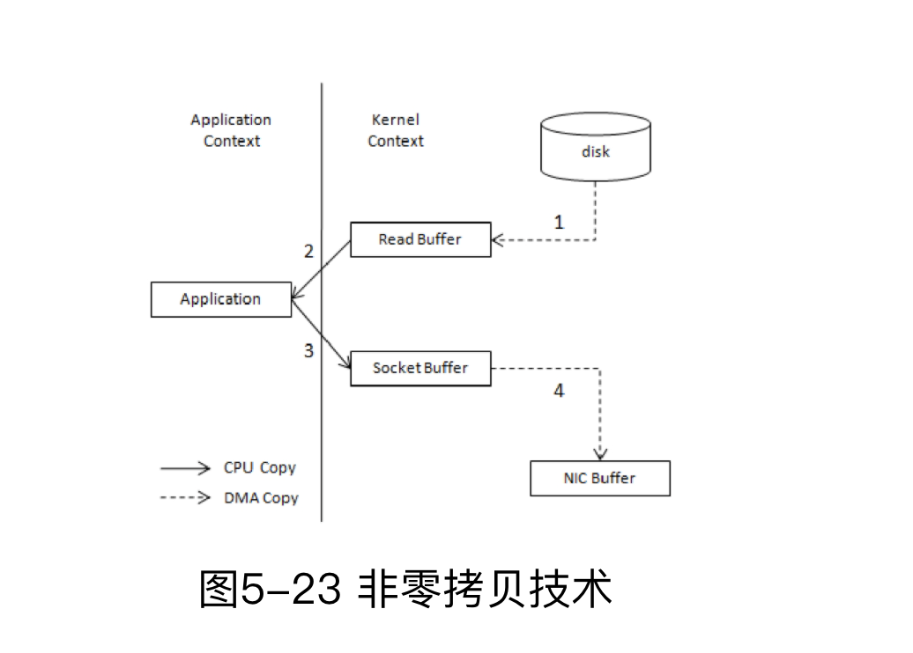
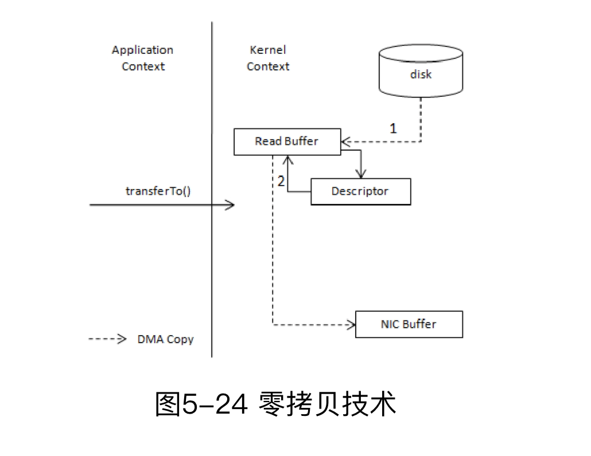

1.**基本概念与原理介绍：**
- producer端发送消息已topic进行归类，构造ProducerRecord时需要指定topic参数，每个topic又有很多分区(可配置)，每个分区本质是可追加的log文件，因此kafka保证消息在单分区的顺序性，但不能保证topic的顺序性。众多分区有一个首领分区，负责读写，其他事follower分区，负责同步首领分区的数据，不对外读写操作。
- kafka是基于pull的方式，consumer端去拉broker端的消息。
- consumer端维护读消息的偏移量，不由broker维护，由zookeeper的元数据维护。
- 一个简单的kafka服务器是一个broker.
- 首领副本  
    - 每个分区都有一个首领副本。为了保证一致性，所有生产者请求和消费者请求都会经过
这个副本。
- 跟随者副本
    - 首领以外的副本都是跟随者副本。跟随者副本不处理来自客户端的请求，它们唯一的任
务就是从首领那里复制消息，保持与首领一致的状态。如果首领发生崩渍，其中的一个
跟随者会被提升为新首领。
- 分区中 的所有副本统称为 AR ( Assigned Replicas ） 。 所有与 leader 副本保持一定程度同步
的副本（包括 leader 副本在内〕组成 ISR On-Sync Replicas ) , ISR 集合是 AR 集合中 的一个子
集 。 消息会先发送到 leader 副本，然后 follower 副本才能从 leader 副本中拉取消息进行同步，
同步期间内 follower 副本相对于 leader 副本而言会有一定程度的滞后 。 前面所说的“一定程度
的同步”是指可忍受的滞后范围，这个范围可以通过参数进行配置 。 与 leader 副本同步滞后过
多的副本（不包括 leader 副本）组成 OSR ( Out-of-Sync Replicas ），由此可见， AR=ISR+OSR 。
在正常情况下， 所有的 follower 副本都应该与 leader 副本保持一定程度 的同步，即 AR=ISR,
OSR 集合为空。

2.**kafka启动,版本为2.1.0，zk版本3.1.14：**
- 先启动自带zk：
    - ./zookeeper-server-start.sh -daemon ../config/zookeeper.properties
- 再启动kafka: 
    - ./kafka-server-start.sh -daemon ../config/server.properties(启动端口为9092,此时broker监听的端口是9092)
- 可以再启动zk-shell： 
    -  ./zookeeper-shell.sh localhost:2181
- 在kafka命令行创建topic: 
    - ./kafka-topics.sh --create --topic java_topic --zookeeper localhost:2181 --partitions 1 --replication-factor 1(副本为一，表示集群只保存一份数据)
- 命令行创建producer客户端:
     -./kafka-console-producer.sh --topic java_topic --broker-list 192.168.1.102:9092
- 命令行创建consumer客户端：
    - ./kafka-console-consumer.sh --topic java_topic --bootstrap-server 192.168.1.102:9092
- 命令行创建consumer客户端： 
     -./kafka-console-consumer.sh --topic java_topic --bootstrap-server 192.168.1.102:9092 --from-beginning 加上--from-beginning可以从头开始pull生产者端的消息。
- 查看有哪些topic:
    - ./kafka-topics.sh --zookeeper localhost:2181 -list
- 查看topic的描述信息：
    - ./kafka-topics.sh --zookeeper localhost:2181 --describe --topic java_topic
- 删除主题：
    - 必须先开启配置：delete.topic.enable=true
    - ./kafka-topics.sh --zookeeper localhost:2181 --delete --topic java_topic
- 


**在虚拟机启动kafka的问题解决：**
- ```注意：```把配置文件中的所有localhost或者默认主机名都换成虚拟机的ip地址，这样可以减少很多windows与虚拟机通信的问题。
- **kafka启动没一会就挂了？**
    - 因为虚拟机是dhcp，所以IP会改变，因此需要去修改server.properties文件的IP相关。
    - 如果上述不行：把kafka的server.properties中zookeeper.connection.timeout.ms=60000设置为60s，同时需要，如果使用的不是kafka自带的zk,而是另自安装的zk,那么需要更改zoo.cfg中的tickTime=20000时间设置为20s，表示zk的服务器心跳时间。
    - 

HDD传统机械硬盘。SSD固态硬盘。

3.**kafka常见配置介绍：**
- log.dirs: 
    - Kafka 把所有消息都保存在磁盘上，存放这些日志片段的目录是通过 log.dirs指定的.
- zk的chroot: 
    - chroot是一个zk的namespace
- **生产端配置：**
    - buffer.memory:
        - RecordAccumulator的缓存大小，producer端批量发送的缓冲区
    - acks:
        - 这个参数用来指定分区中必须要有多少个副本收到这条消息，之后生产者才会认为这条消
息是成功写入的。
    - 
- **消费端配置：**
    - enable.auto.commit:
        - 自动提交偏移量，默认为true. 这个逻辑是在poll()方法完成
    - auto.offset.reset:
        - 在 Kafka 中 每当消费者查找不到所记录的消费位移 时， 默认是latest,表示最近提交的偏移量的下一个开始。还有值为earliest,表示从该分区0开始消费。
        - 在位移越界也会触发参数运行
        - 如果配置为none，那么在发生上述两种情况就会抛出ConfigException
    - 

4.**分析kafka源码知道**：
- 在```ProducerConfig```里面有很多producer端想要的配置信息，比如partitioner,interceptor
- 在```ConsumerConfig```里面有很多consumer端想要的配置信息
- 使用seek()可以指定位移消费。

5.**Java的logback日志配置：**
- https://www.cnblogs.com/sky230/p/6420208.html

6.**kafka的原理：**
- broker 会在它所监听的每一个端口上运行一个 Accepto 「线程，这个钱程会创建一个连接，并把它交给 processor线程去处理。 Processor线程（也被叫作“网络线程”）的数量是可配置的。网络线程负责从客户端获取请求悄息，把它们放进请求队列，然后从晌应队列获取响应消息，把它们发送给客户端。请求消息被放到请求队列后，IO线程会负责处理它们。
- KafkaProducer 是线程安全的，可以在多个线程中共享单个KafkaProducer 实例，也可以将
KafkaProducer 实例进行池化来供其他线程调用。
- **可重试异常与不可重试异常：**
    - KafkaProducer 中一般会发生两种类型的异常： 可重试的异常和不可重试的异常。常见的可
重试异常有： NetworkException 、LeaderNotAvailableException 、UnknownTopicOrPartitionException 、NotEnoughReplicasException 、NotCoordinatorException 等。比如NetworkException 表示网络异常，这个有可能是由于网络瞬时故障而导致的异常，可以通过重试解决；又比如LeaderNotAvailableException 表示分区的leader 副本不可用，这个异常通常发生在leader 副本下
线而新的leader 副本选举完成之前，重试之后可以重新恢复。不可重试的异常，比如1.4 节中
提及的RecordTooLargeException 异常，暗示了所发送的消息太大， KafkaProducer 对此不会进行
任何重试，直接抛出异常。
- **kafka的偏移量：**
    - 为了防止broker重启，因此consumer提交的偏移量不能保存在内存中，需要持久化到磁盘.偏移量存储在kafka内部主题的_consumer_offset中。
    - 消费者需要提交的offset值为这次消费的最大offset + 1.

7.**kafka server.properties介绍**
```shell
# broker 的编号，如果集群中有多个broker ，则每个broker 的编号需要设置的不同
broker.id=0
# broker 对外提供的服务入口地址
listeners= PLAINTEXT://localhost:9092
# 存放消息日志文件的地址
log.dirs=/tmp/kafka-logs
# Kafka 所需的ZooKeeper 集群地址，为了方便演示，我们假设Kafka 和ZooKeeper 都安装在本机
zookeeper.connect=localhost:2181/kafka
```

8.**重要的原理与概念:**
- 对于偏移量这种非常重要的东西，kafka的处理是持久化，而不是放到内存中，否则的机器一重启就没了。
- 消费者位移保存在内部主题_consumer_offsets中。客户端提交的位移值，是下一次消费的值。假如这一次消费的X，那么偏移量的提交为X+1.
- 在再均衡期间，消费者是不会读取消息的，也就是说对外不可用。
- KatkaProducer 是线程安全 的，然而 KafkaConsumer 却是非线程安全 的 。 KafkaConsumer 中
定义了 一个 acquire（）方法，用来检测当前是否只有一个线程在操作，若有其他线程正在操作则
会抛出 ConcurrentModifcationException 异常。

9.**顺序读写与随机读写的性能差异：**  
顺序读写和随机读写对于机械硬盘来说为什么性能差异巨大？
顺序读写=读取一个大文件  
随机读写=读取多个小文件  
顺序读写比随机读写快的原因  
（1）随机读写的磁头寻道时间大大增加，因为磁头需要不停的移动，而顺序读写就不用频繁的移动。  
（2）顺序读写，磁盘会预读，预读即在读取的起始地址连续读取多个页面  
（现在不需要的页面也读取了，这样以后用时就不用再读取，当一个页面用到时，大多数情况下，它周围的页面也会被用到）    
而随机读写，因为数据没有在一起，将预读浪费掉了。  
（3）另一个原因是文件系统的overhead。  
读写一个文件之前，得一层层目录找到这个文件，以及做一堆属性、权限之类的检查。  
写新文件时还要加上寻找磁盘可用空间的耗时。  
对于小文件，这些时间消耗的占比就非常大了。    
（4）**参照文章：https://tech.meituan.com/2017/05/19/about-desk-io.html**

# kafka的日志存储
## 日志文件
- 每个日志分段包含3个文件，后缀分别为：.log , .index, .timeindex文件
- .index结尾的文件为偏移量索引文件，每个索引项占用8个字节，分为两个部分。
    - （1）relativeOffset：相对偏移量，表示消息相对于baseOffset的偏移量，占用4 个字节，当前索引文件的文件名即为baseOffset的值。
    - （2）position：物理地址，也就是消息在日志分段文件(.log结尾的文件)中对应的物理位置，占用4个字节。
    - 从Log对象利用跳表存储logSegment，每个logSegment里的relativeOffset单调递增，因此查找offset时，先查跳表，再二分。
- 时间戳索引项占用12个字节，分为两个部分
    - timestamp：当前日志分段最大的时间戳。
    - relativeOffset：时间戳所对应的消息的相对偏移量。
- 时间戳索引文件中包含若干时间戳索引项，每个追加的时间戳索引项中的 timestamp 必须大于之前追加的索引项的timestamp，否则不予追加。
- Kafka 将消息存储在磁盘中，为了控制磁盘占用空间的不断增加就需要对消息做一定的清理操作。Kafka 中每一个分区副本都对应一个 Log，而 Log 又可以分为多个日志分段，这样也便于日志的清理操作。Kafka提供了两种日志清理策略：
    - （1）日志删除（Log Retention）：按照一定的保留策略直接删除不符合条件的日志分段
        - 
    - （2）日志压缩（Log Compaction）：针对每个消息的key进行整合，对于有相同key的不同value值，只保留最后一个版本(类似于redis aof重写机制)。
## kafka日志存储：
## 顺序追加：
- 有关测试结果表明，一个由6块7200r/min的RAID-5阵列组成的磁盘簇的线性（顺序）写入速度可以达到600MB/s，而随机写入速度只有100KB/s，两者性能相差6000倍。操作系统可以针对线性读写做深层次的优化，比如预读（read-ahead，提前将一个比较大的磁盘块读入内存）和后写（write-behind，将很多小的逻辑写操作合并起来组成一个大的物理写操作）技术。顺序写盘的速度不仅比随机写盘的速度快，而且也比随机写内存的速度快。
- Kafka 在设计时采用了文件追加的方式来写入消息，即只能在日志文件的尾部追加新的消息，并且也不允许修改已写入的消息，这种方式属于典型的顺序写盘的操作，所以就算 Kafka使用磁盘作为存储介质，它所能承载的吞吐量也不容小觑。
## 页缓存 
- Kafka 中大量使用了<a href="../../book-notes/OS.md">页缓存</a>，这是 Kafka 实现高吞吐的重要因素之一。虽然消息都是先被写入页缓存，然后由操作系统负责具体的刷盘任务的，但在Kafka中同样提供了同步刷盘及间断性强制刷盘（fsync）的功能，这些功能可以通过log.flush.interval.messages、log.flush.interval.ms 等参数来控制。同步刷盘可以提高消息的可靠性，防止由于机器掉电等异常造成处于页缓存而没有及时写入磁盘的消息丢失。不过笔者并不建议这么做，刷盘任务就应交由操作系统去调配，消息的可靠性应该由多副本机制来保障，而不是由同步刷盘这种严重影响性能的行为来保障。
- Linux系统会使用磁盘的一部分作为swap分区，这样可以进行进程的调度：把当前非活跃的进程调入 swap 分区，以此把内存空出来让给活跃的进程。对大量使用系统页缓存的 Kafka而言，应当尽量避免这种内存的交换，否则会对它各方面的性能产生很大的负面影响。我们可以通过修改vm.swappiness参数（Linux系统参数）来进行调节。vm.swappiness参数的上限为100，它表示积极地使用 swap 分区，并把内存上的数据及时地搬运到 swap 分区中；vm.swappiness 参数的下限为 0，表示在任何情况下都不要发生交换（vm.swappiness=0的含义在不同版本的 Linux 内核中不太相同，这里采用的是变更后的最新解释），这样一来，当内存耗尽时会根据一定的规则突然中止某些进程。笔者建议将这个参数的值设置为 1，这样保留了swap的机制而又最大限度地限制了它对Kafka性能的影响。

## 零拷贝
- Kafka还使用零拷贝（Zero-Copy）技术来进一步提升性能。所谓的零拷贝是指将数据直接从磁盘文件复制到网卡设备中，而不需要经由应用程序之手。零拷贝大大提高了应用程序的性能，减少了内核和用户模式之间的上下文切换。对 Linux操作系统而言，零拷贝技术依赖于底层的 sendfile（）方法实现。对应于 Java 语言，FileChannal.transferTo（）方法的底层实现就是sendfile（）方法。

## 传统IO描述
你需要将静态内容（类似图片、文件）展示给用户  
在这个过程中，文件A经历了4次复制的过程：
- （1）调用read（）时，文件A中的内容被复制到了内核模式下的Read Buffer中。
- （2）CPU控制将内核模式数据复制到用户模式下。
- （3）调用write（）时，将用户模式下的内容复制到内核模式下的Socket Buffer中。
- （4）将内核模式下的Socket Buffer的数据复制到网卡设备中传送。  



从上面的过程可以看出，数据平白无故地从内核模式到用户模式“走了一圈”，浪费了 2次复制过程：第一次是从内核模式复制到用户模式；第二次是从用户模式再复制回内核模式，即上面4次过程中的第2步和第3步。而且在上面的过程中，内核和用户模式的上下文的切换也是4次。

## 零拷贝
- 零拷贝技术通过DMA（Direct Memory Access）技术将文件内容复制到内核模式下的Read Buffer 中。不过没有数据被复制到Socket Buffer，相反只有包含数据的位置和长度的信息的文件描述符被加到Socket Buffer中。DMA引擎直接将数据从内核模式中传递到网卡设备（协议引擎）。这里数据只经历了2次复制就从磁盘中传送出去了，并且上下文切换也变成了2次。零拷贝是针对内核模式而言的，数据在内核模式下实现了零拷贝。 


