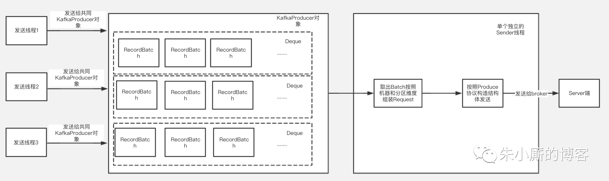
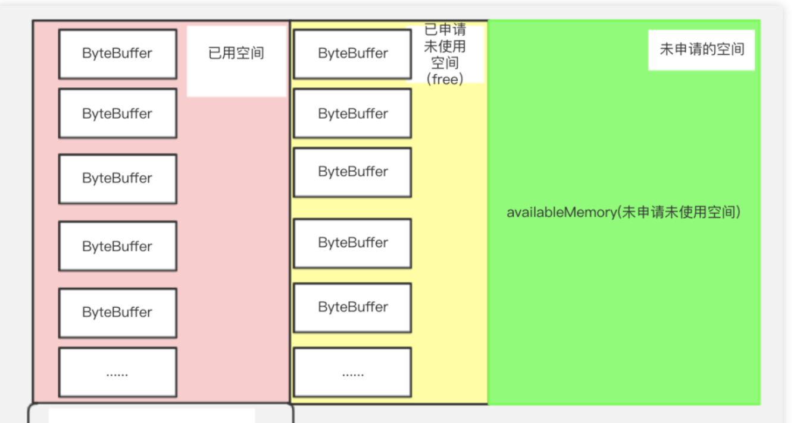
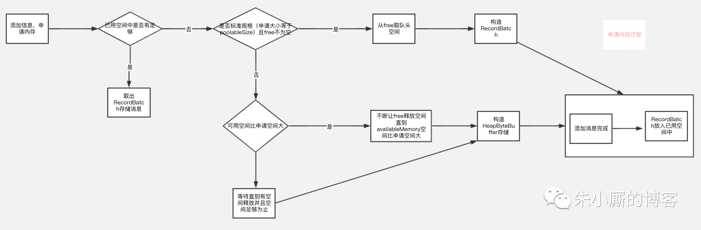
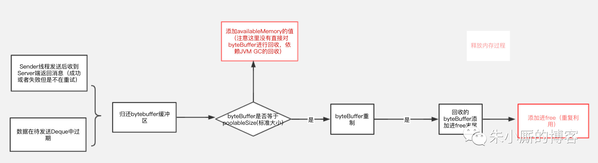
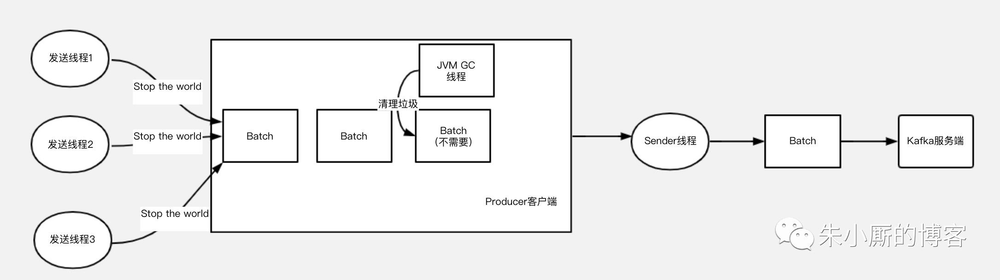
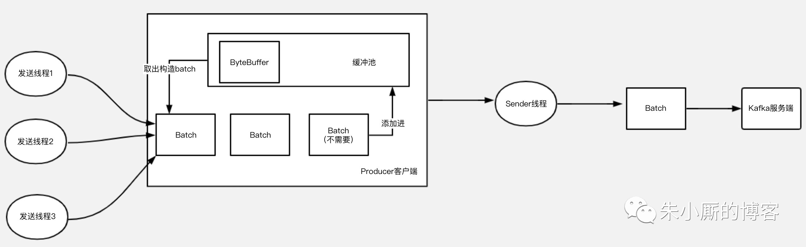

# Broker端
- 顺序追加
- 页缓存
- 0拷贝
- <a href="../Kafka.md">日志存储机制</a>

# Producer端的优化
其实在Producer端的优化大部分消息系统采取的方式都比较单一，无非也就化零为整、同步变异步这么几种。  

Kafka系统默认支持MessageSet，把多条Message自动地打成一个Group后发送出去，均摊后拉低了每次通信的RTT。而且在组织MessageSet的同时，还可以把数据重新排序，从爆发流式的随机写入优化成较为平稳的线性写入。

此外，还要着重介绍的一点是，Producer支持End-to-End的压缩。数据在本地压缩后放到网络上传输，在Broker一般不解压(除非指定要Deep-Iteration)，直至消息被Consume之后在客户端解压。

不过Kafka采用MessageSet也导致在可用性上一定程度的妥协。每次发送数据时，Producer都是send()之后就认为已经发送出去了，但其实大多数情况下消息还在内存的MessageSet当中，尚未发送到网络，这时候如果Producer挂掉，那就会出现丢数据的情况。

为了解决这个问题，Kafka在0.8版本的设计借鉴了网络当中的ack机制。如果对性能要求较高，又能在一定程度上允许Message的丢失，那就可以设置request.required.acks=0 来关闭ack，以全速发送。如果需要对发送的消息进行确认，就需要设置request.required.acks为1或-1，那么1和-1又有什么区别呢？这里又要提到前面聊的有关Replica数量问题。如果配置为1，表示消息只需要被Leader接收并确认即可，其他的Replica可以进行异步拉取无需立即进行确认，在保证可靠性的同时又不会把效率拉得很低。```如果设置为-1，表示消息要Commit到该Partition的ISR集合中的所有Replica后，才可以返回ack，```消息的发送会更安全，而整个过程的延迟会随着Replica的数量正比增长，这里就需要根据不同的需求做相应的优化。

# Partition
Partition是Kafka可以很好的横向扩展和提供高并发处理以及实现Replication的基础。  
扩展性方面。首先，Kafka允许Partition在集群内的Broker之间任意移动，以此来均衡可能存在的数据倾斜问题。其次，Partition支持自定义的分区算法，例如可以将同一个Key的所有消息都路由到同一个Partition上去。同时Leader也可以在In-Sync的Replica中迁移。由于针对某一个Partition的所有读写请求都是只由Leader来处理，所以Kafka会尽量把Leader均匀的分散到集群的各个节点上，以免造成网络流量过于集中。  
并发方面。任意Partition在某一个时刻只能被一个Consumer Group内的一个Consumer消费(反过来一个Consumer则可以同时消费多个Partition)，Kafka非常简洁的Offset机制最小化了Broker和Consumer之间的交互，这使Kafka并不会像同类其他消息队列一样，随着下游Consumer数目的增加而成比例的降低性能。此外，如果多个Consumer恰巧都是消费时间序上很相近的数据，可以达到很高的PageCache命中率，因而Kafka可以非常高效的支持高并发读操作，实践中基本可以达到单机网卡上限。

不过，Partition的数量并不是越多越好，Partition的数量越多，平均到每一个Broker上的数量也就越多。考虑到Broker宕机(Network Failure, Full GC)的情况下，需要由Controller来为所有宕机的Broker上的所有Partition重新选举Leader，假设每个Partition的选举消耗10ms，如果Broker上有500个Partition，那么在进行选举的5s的时间里，对上述Partition的读写操作都会触发LeaderNotAvailableException。

# Kafka的内存池
内容参考：https://mp.weixin.qq.com/s/apx8_i3whgVOp5ZkwUZXLA

## 那么Kafka如何做到能支持能同时发送大量消息的呢？
答案是Kafka通过批量压缩和发送做到的。  
我们知道消息肯定是放在内存中的，大数据场景消息的不断发送，内存中不断存在大量的消息，很容易引起GC。频繁的GC特别是full gc是会造成“stop the world”，也就是其他线程停止工作等待垃圾回收线程执行，继而进一步影响发送的速度影响吞吐量，那么Kafka是如何做到优化JVM的GC问题的呢？看完本篇文章你会get到。  
下面介绍下Kafka客户端发送的大致过程，如下图：


Kafka的kafkaProducer对象是线程安全的，每个发送线程在发送消息时候共用一个kafkaProducer对象来调用发送方法，最后发送的数据根据Topic和分区的不同被组装进某一个RecordBatch中。
发送的数据放入RecordBatch后会被发送线程批量取出组装成ProduceRequest对象发送给Kafka服务端。
可以看到发送数据线程和取数据线程都要跟内存中的RecordBatch打交道，RecordBatch是存储数据的对象，那么RecordBatch是怎么分配的呢？
下面我们看下Kafka的缓冲池结构，如下图所示：


> 缓冲池：BufferPool（缓冲池）对象，整个KafkaProducer实例中只有一个BufferPool对象。内存池总大小，它是已使用空间和可使用空间的总和，用totalMemory表示(由buffer.memory配置，默认32M)。

可使用的空间：它包含包括两个部分，绿色部分代表未申请未使用的部分，用availableMemory表示
黄色部分代表已经申请但没有使用的部分，用一个ByteBuffer双端队列(Deque)表示，在BufferPool中这个队列叫free，队列中的每个ByteBuffer的大小用poolableSize表示(由batch.size配置，默认16k)，因为每次free申请内存都是以poolableSize为单位申请的，申请poolableSize大小的bytebuffer后用RecordBatch来包装起来。  

已使用空间：代表缓冲池中已经装了数据的部分。

根据以上介绍，我们可以知道，总的BufferPool大小=已使用空间+可使用空间；free的大小=free.size * poolableSize（poolsize就是单位batch的size）。  

数据的分配过程: 
总的来说是判断需要存储的数据的大小是否free里有合适的recordBatch装得下
如果装得下则用recordBatch来存储数据，如果free里没有空间但是availableMemory+free的大小比需要存储的数据大（也就是说可使用空间比实际需要申请的空间大），说明可使用空间大小足够，则会用让free一直释放byteBuffer空间直到有空间装得下要存储的数据位置，如果需要申请的空间比实际可使用空间大，则内存申请会阻塞直到申请到足够的内存为止。
整个申请过程如下图：


回收过程：


再来看段申请空间代码：
```java
//判断需要申请空间大小，如果需要申请空间大小比batchSize小，那么申请大小就是batchsize，如果比batchSize大，那么大小以实际申请大小为准
int size = Math.max(this.batchSize, Records.LOG_OVERHEAD + Record.recordSize(key, value));
log.trace("Allocating a new {} byte message buffer for topic {} partition {}", size, tp.topic(), tp.partition());
//这个过程可以参考图3
ByteBuffer buffer = free.allocate(size, maxTimeToBlock);
```

再来段回收的核心代码：
```java
public void deallocate(ByteBuffer buffer, int size) {
    lock.lock();
    try {
        //只有标准规格（bytebuffer空间大小和poolableSize大小一致的才放入free）
        if (size == this.poolableSize && size == buffer.capacity()) {
            //注意这里的buffer是直接reset了，重新reset后可以重复利用，没有gc问题
            buffer.clear();
            //添加进free循环利用
            this.free.add(buffer);
        } else {
            //规格不是poolableSize大小的那么没有进行重制，但是会把availableMemory增加，代表整个可用内存空间增加了，这个时候buffer的回收依赖jvm的gc
            this.availableMemory += size;
        }
        //唤醒排在前面的等待线程
        Condition moreMem = this.waiters.peekFirst();
        if (moreMem != null)
            moreMem.signal();
    } finally {
        lock.unlock();
    }
}
```

通过申请和释放过程流程图以及释放空间代码，我们可以得到一个结论
就是如果用户申请的数据（发送的消息）大小都是在poolableSize（由batch.size配置，默认16k）以内，并且申请时候free里有空间，那么用户申请的空间是可以循环利用的空间，可以减少gc，但是其他情况也可能存在直接用堆内存申请空间的情况，存在gc的情况。
如何尽量避免呢，如果批量消息里面单个消息都是超过16k，可以考虑调整batchSize大小。
如果没有使用缓冲池，那么用户发送的模型是下图，由于GC特别是Full GC的存在，如果大量发送，就可能会发生频繁的垃圾回收，导致的工作线程的停顿，会对整个发送性能，吞吐量延迟等都有影响。
### 


### 使用缓冲池后，整个使用过程可以缩略为下图：


Kafka通过使用内存缓冲池的设计，让整个发送过程中的存储空间循环利用，有效减少JVM GC造成的影响，从而提高发送性能，提升吞吐量。