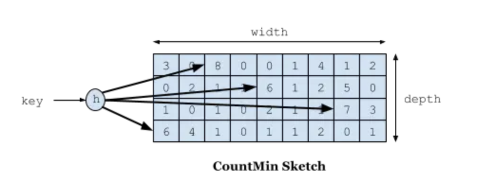
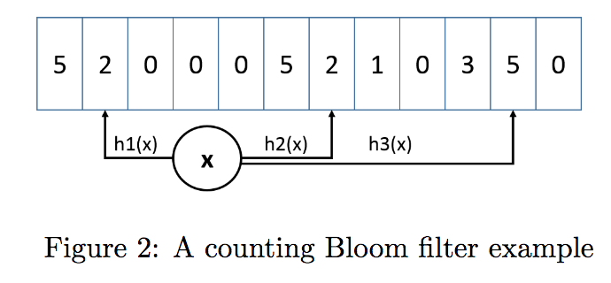
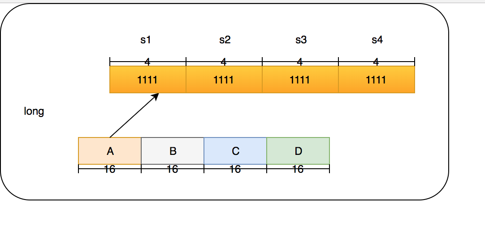
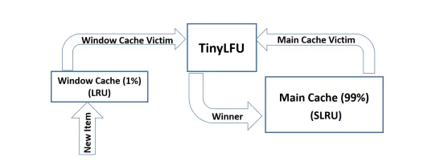

缓存和 Map 之间的一个根本区别在于缓存可以回收存储的 item。

回收策略为在指定时间删除哪些对象。此策略直接影响缓存的命中率 — 缓存库的一个重要特征。

Caffeine 因使用 Window TinyLfu 回收策略，提供了一个近乎最佳的命中率,主要是基于LFU设计。
# LRU、LFU、W-TinyLFU：
## LFU:
- 优点：
    - 当数据的访问模式不随时间变化的时候，LFU的策略能够带来最佳的缓存命中率。
- 缺点：
    - 首先，它需要给每个记录项维护频率信息，每次访问都需要更新，这是个巨大的开销
    - 其次，如果数据访问模式随时间有变，LFU的频率信息无法随之变化，因此早先频繁访问的记录可能会占据缓存，而后期访问较多的记录则无法被命中
## LRU:
- 优点：
    - LRU并不需要维护昂贵的缓存记录元信息，同时也能够反应随时间变化的数据访问模式，可以很好的应对突发流量。
    - LRU（Least Recently Used）算法认为最近访问过的数据将来被访问的几率也更高。
- 缺点：
    - LRU通常使用map+链表来实现，如果数据添加或者被访问到则把数据移动到链表的头部，链表的头部为热数据，链表的尾部如冷数据，当数据满时，淘汰尾部的数据。其实现比较简单，但是存在一些问题，如：当存在数据遍历时，会导致LRU命中率急剧下降(存在hash冲突时)。
## W-TinyLFU：
> Caffeine采用了一种结合LRU、LFU优点的算法：W-TinyLFU，其特点：高命中率、低内存占用。

### 要解决的问题：
- 一个是如何避免维护频率信息的高开销
- 如何反应随时间变化的访问模式

### TinyLFU
TinyLFU是一种为了解决传统LFU算法空间存储比较大的问题LFU算法，它可以在较大访问量的场景下近似的替代LFU的数据统计部分，它的原理有些类似BloomFilter。首先回顾一下BloomFilter原理：在BloomFilter中，使用一个大的bit数组用于存储所有key，每一个key通过多次不同的hash计算来映射数组的不同bit位，如果key存在将对应的bit位设置为1，这样就可以通过少量的存储空间进行大量的数据过滤。在TinyLFU中，把多个bit位看做一个整体，用于统计一个key的使用频率，TinyFLU中的key也是通过多次不同的hash计算来映射多个不同的bit组。在读取时，取映射的所有值中的最小的值作为key的使用频率，TinyLFU算法如下图所示：



在Count-Min Sketch中，我这里直接说caffeine中的实现吧(在FrequencySketch这个类中),如果你的缓存大小是100，他会生成一个long数组大小是和100最接近的2的幂的数，也就是128。而这个数组将会记录我们的访问频率。在caffeine中规定频率最大为15，15的二进制位1111，总共是4位，而Long型是64位。所以每个Long型可以放16种算法，但是caffeine并没有这么做，只用了四种hash算法，每个Long型被分为四段，每段里面保存的是四个算法的频率。这样做的好处是可以进一步减少Hash冲突，原先128大小的hash，就变成了128X4。





我们的4个段分为A,B,C,D，在后面我也会这么叫它们。而每个段里面的四个算法我叫他s1,s2,s3,s4。下面举个例子如果要添加一个访问50的数字频率应该怎么做？我们这里用size=100来举例。

首先确定50这个hash是在哪个段里面，通过hash & 3(3的二进制是11)必定能获得小于4的数字，假设hash & 3=0，那就在A段。
对50的hash再用其他hash算法再做一次hash，得到long数组的位置，也就是在长度128数组中的位置。假设用s1算法得到1，s2算法得到3，s3算法得到4，s4算法得到0。
因为S1算法得到的是1，所以在long[1]的A段里面的s1位置进行+1,简称1As1加1，然后在3As2加1，在4As3加1，在0As4加1。

### TinyLFU解决问题如下：
- 不存储所有的不同的元素，只存储它们Sketch的计数。相对于HashMap做计数来说，少了元素key的存储
- 利用多hash函数，解决了hashMap冲突很高时，查询的性能问题。

### CountMinSketch算法评估：
- 只会估算偏大，永远不会偏小；
- 只需要固定大小的内存和计算时间，和需要统计的元素多少无关；
- 对于低频的元素，估算值相对的错误可能会很大。

### TinyLFU缺点
TinyLFU有一个缺点，在应对突发流量的时候，可能由于没有及时构建足够的频率数据来保证自己驻留在缓存中，从而导致缓存的命中率下降，为了解决这个问题，产生了W-TinyLFU算法

## W-TinyLFU
W-TinyLFU由两部分组成，主缓存使用SLRU回收策略和TinyLFU回收策略，而窗口缓存使用没有任何回收策略的LRU回收策略，增加的窗口缓存用于应对突发流量的问题，如下图所示



窗口缓存占用总大小的1%左右，主缓存占用99%。Caffeine可以根据工作负载特性动态调整窗口和主空间的大小，如果新增数据频率比较高，大窗口更受欢迎;如果新增数据频率偏小，小窗口更受欢迎。主缓存内部包含两个部分，一部分为Protected，用于存比较热的数据，它占用主缓存80%空间；另一部分是Probation，用于存相对比较冷的数据，占用主缓存20%空间，数据可以在这两部分空间里面互相转移。

缓存淘汰的过程：新添加的数据首先放入窗口缓存中，如果窗口缓存满了，则把窗口缓存淘汰的数据转移到主缓存Probation区域中。如果这时主缓存也满了，则从主缓存的Probation区域淘汰数据，把这条数据称为受害者，从窗口缓存淘汰的数据称为候选人。接下来候选人和受害者进行一次pk，来决定去留。pk的方式是通过TinyFLU记录的访问频率来进行判断，具体过程如下：
1. 首先获取候选人和受害者的频率
2. 如果候选人大于受害者，则淘汰受害者
3. 如果候选人频率小于等于5，则淘汰候选人
4. 其余情况随机处理。

Caffeine中的pk代码：
```java
// com.github.benmanes.caffeine.cache.BoundedLocalCache#admit
@GuardedBy("evictionLock")
boolean admit(K candidateKey, K victimKey) {
    int victimFreq = frequencySketch().frequency(victimKey);
    int candidateFreq = frequencySketch().frequency(candidateKey);
    if (candidateFreq > victimFreq) {
        return true;
    } else if (candidateFreq <= 5) {
        // The maximum frequency is 15 and halved to 7 after a reset to age the history. An attack
        // exploits that a hot candidate is rejected in favor of a hot victim. The threshold of a warm
        // candidate reduces the number of random acceptances to minimize the impact on the hit rate.
        return false;
    }
    int random = ThreadLocalRandom.current().nextInt();
    return ((random & 127) == 0);
}
```


## 参考链接：
- https://blog.csdn.net/pipisorry/article/details/64126199
- https://www.jianshu.com/p/1ceaed0289b7
- https://juejin.im/post/5b8df63c6fb9a019e04ebaf4#heading-5
- https://juejin.im/post/5ce11d436fb9a07ec63ae4bc#heading-0


