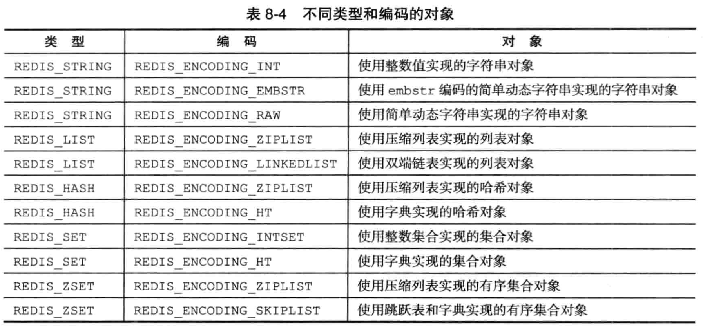

## redis：

参考网址：  
http://www.runoob.com/redis/redis-keys.html 这个上面介绍的命令链接可以点击获取详细操作演示。

- 官方中文文档：http://redisdoc.com/hash/index.html

1.**常用命令：**
- **string**:
    - set name wangxi  
        - key为name,value为wangxi
    - get name 
        - 获取name的值
- **hash**
    -  hmset wxi01 name wangxi sex 男 age 23  
        - 批量设置key-value。wxi01代表Map在缓存的名字
    - hgetall wxi01 
        - 列出所有key-value对。在redis中age的value="23"
    - hset wxi01 age 24  
        - 设置单个字段的值
    - hget wxi01 age    
        - 获取单个字段的值
    - 与HashMap一样，插入相同的key，值就会被覆盖，除非内部的hash冲突，才会有value为list的情况，自己插入的时候是得不到value为list的，在Java的Map<String, List<String>>取出来，在list.add()可以，在redis中没有。
- **list**
    - lpush wxi01 1 2 3 aa 
        - 相当于栈结构,此时lindex wxi01 0 => aa  (lindex通过索引获取列表中的值)
    - rpush wxi02 1 2 3
        - 相当于队列,此时lindex wxi02 0 => 1  
    - llen wxi01 
        - 获取列表的长度
    - lrange wxi01 0 -1
         - 获取列表中所有的元素
- **set**
    - Redis 的 Set 是 String 类型的无序集合。集合成员是唯一的，这就意味着集合中不能出现重复的数据。Redis 中集合是通过哈希表实现的，所以添加，删除，查找的复杂度都是 O(1)。
    - sadd wxi01 aa bb aa
        - 添加元素
    - 
- **sorted set**
    - Redis 有序集合和集合一样也是string类型元素的集合,且不允许重复的成员。不同的是每个元素都会关联一个double类型的分数。redis正是通过分数来为集合中的成员进行从小到大的排序。有序集合的成员是唯一的,但分数(score)却可以重复。集合是通过哈希表实现的，所以添加，删除，查找的复杂度都是O(1)
2.**redis的5种数据结构的应用场景：**
- http://www.cleey.com/blog/single/id/808.html

3.**分布式锁的思考：**
- 由于redis是网络调用，存在一定开销，尤其是在高并发场景下，对同一个key的抢占只会有一个线程成功，其他线程很可能会获取锁失败，为了降低高并发场景下对redis的访问压力，可以在获取redis锁之前先尝试获取jvm内部锁，jvm内部锁获取成功了再去尝试获取redis锁，确保每个jvm只会有一个线程去获取锁。（如果并发量很高，更好的办法是使用zookeeper来获取分布式锁，zookeeper支持注册监听，当key变化的时候获取到通知，这样可以避免频繁的网络调用。）
- **方案决断：**
    - 如果是为了效率而使用分布式锁，允许锁的偶尔失效，那么使用单Redis节点的锁方案就足够了，简单而且效率高。Redlock则是个过重的实现。
    - 如果是为了正确性在很严肃的场合使用分布式锁，那么不要使用Redlock。它不是建立在异步模型上的一个足够强的算法，它对于系统模型的假设中包含很多危险的成分(例如对于系统时钟)。而且，它没有一个机制能够提供fencing token。应该使用支持事务的数据库等方案。

4.**redis的命令：**
- info ： 可以查看集群的信息
- config get * : 可以查看redis的配置信息(在命令行查看和设置)，比如config get "maxmemory"
- type + key : 查看数据库键对应值的类型
- object encoding + key:可以查看key对象的底层数据结构类型
- flushdb:清空当前db的的所有key-value
- select 0 : 可以选择db
- expire 设置key过期时间 单位为s
- ttl + key: 可以查看key还剩多长时间过期
- persist + key:可以删掉key的过期时间，变为永久不过期
- 

5.**redis的回收策略：**
- 首先redis有个最大内存配置，当到达一定容量时(快接近maxmemory时)，就会触发内存淘汰策略.
- allkeys-lru：从所有key中使用LRU算法进行淘汰
    - LRU(Least recently Uesd) : Redis使用的是近似LRU算法，它跟常规的LRU算法还不太一样。近似LRU算法通过随机采样法淘汰数据，每次随机出5（默认）个key，从里面淘汰掉最近最少使用的key。
    - Redis3.0对近似LRU算法进行了一些优化。新算法会维护一个候选池（大小为16），池中的数据根据访问时间进行排序，第一次随机选取的key都会放入池中，随后每次随机选取的key只有在访问时间小于池中最小的时间才会放入池中，直到候选池被放满。当放满后，如果有新的key需要放入，则将池中最后访问时间最大（最近被访问）的移除。当需要淘汰的时候，则直接从池中选取最近访问时间最小（最久没被访问）的key淘汰掉就行。
- volatile-lru：从设置了过期时间的key中使用LRU算法进行淘汰
- allkeys-random：从所有key中随机淘汰数据
- volatile-random：从设置了过期时间的key中随机淘汰
- volatile-ttl：在设置了过期时间的key中，根据key的过期时间进行淘汰，越早过期的越优先被淘汰
- volatile-lfu：在设置了过期时间的key中使用LFU算法淘汰key
    - LFU : LFU算法是Redis4.0里面新加的一种淘汰策略。它的全称是Least Frequently Used，它的核心思想是根据key的最近被访问的频率进行淘汰，很少被访问的优先被淘汰，被访问的多的则被留下来。LFU算法能更好的表示一个key被访问的热度。假如你使用的是LRU算法，一个key很久没有被访问到，只刚刚是偶尔被访问了一次，那么它就被认为是热点数据，不会被淘汰，而有些key将来是很有可能被访问到的则被淘汰了。如果使用LFU算法则不会出现这种情况，因为使用一次并不会使一个key成为热点数据。
- allkeys-lfu：在所有的key中使用LFU算法淘汰数据

6.**redisson的简单使用**
- https://github.com/redisson/redisson/wiki/%E7%9B%AE%E5%BD%95

7.**redis本身是一个key-value数据库，那么key为string对象，value可以为string对象、list、hash、set、zset这五种对象,所以，redis本身就是大的hashtable**

8.**redis持久化操作**
- RDB持久化：保存db的key-value键值对
    - save会阻塞服务器进程，直到rdb文件创建完毕为止,载入rdb文件也是如此。
    - bgsave:会fork一个子进程去生成rdb文件。
    - save 900 1  : 表示在900s内对数据库修改了一次,bgsave命令就会执行。 
- AOF: 通过保存redis服务器所执行的命令来记录数据库的状态。
    - 如果系统开启了AOF，那么redis启动时，先加载AOF文件，因为AOF更新频率通常比RDB高。
    - 每一次事件循环结束，都会调用flushAppendOnlyFile()方法，把aof缓冲区的内容写入和保存到AOF文件中。过程利用如下伪代码表示：
    ```
    def eventLoop:
        while True : 
            // 处理文件事件
            // 处理文件事件中，可能会有新的命令会写入到AOF缓冲区中
            processFileEvent()
            // 处理时间事件
            processTimeEvent()
            // 考虑是否把aof缓冲区数据写入文件
            flushAppendOnlyFile()
    ```
    - AOF持久化的频率配置： 利用选项值appendfsync。everysec表示每秒同步一次缓冲区数据到文件，no表示由操作系统决定同步的时机。```默认是everysec```

9.**关于redis主从复制**
- 

10.**redis的事件循环(Loop)**
- redis服务器进程就是一个事件循环，这个循环中文件事件负责接受客户端的命令请求，以及想客户端发送命令回复，循环中的时间事件负责执行定时的任务。
- 

**redis数据类型底层结构**
