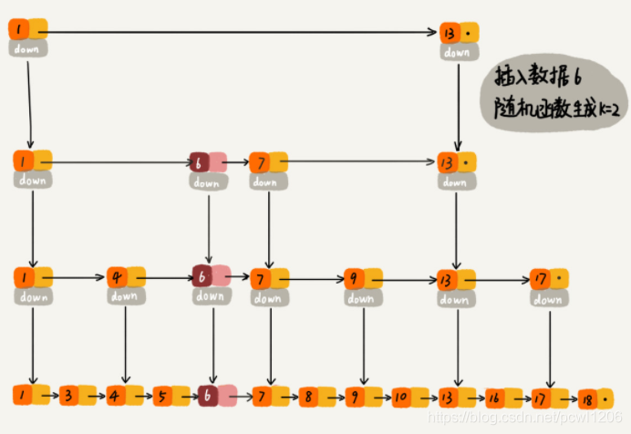
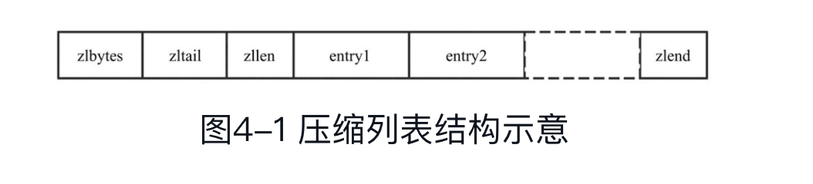

# 字符串SDS：
```c
/**sdshdr5结构,flags占1个字节，其低3位（bit）表示type，高5位（bit）表示长度，能表示的长度区间为0～31（25-1），此结构不支持扩容，容量不足会转化为sdshdr8，分配更多内存*/
struct __attribute__ ((__packed__)) sdshdr5 {
    unsigned char flags; /* 3 lsb of type, and 5 msb of string length */
    char buf[];
};
struct __attribute__ ((__packed__)) sdshdr8 {
    uint8_t len; /* used */
    uint8_t alloc; /* excluding the header and null terminator */
    unsigned char flags; /* 3 lsb of type, 5 unused bits */
    char buf[];
};
struct __attribute__ ((__packed__)) sdshdr16 {
    uint16_t len; /* used */
    uint16_t alloc; /* excluding the header and null terminator */
    unsigned char flags; /* 3 lsb of type, 5 unused bits */
    char buf[];
};
struct __attribute__ ((__packed__)) sdshdr32 {
    uint32_t len; /* used */
    uint32_t alloc; /* excluding the header and null terminator */
    unsigned char flags; /* 3 lsb of type, 5 unused bits */
    char buf[];
};
struct __attribute__ ((__packed__)) sdshdr64 {
    uint64_t len; /* used */
    uint64_t alloc; /* excluding the header and null terminator */
    unsigned char flags; /* 3 lsb of type, 5 unused bits */
    char buf[];
};
```
## 结构体中4个字段的具体含义分别如下
- 1）len：表示buf中已占用字节数。
- 2）alloc：表示buf中已分配字节数，不同于free，记录的是为buf分配的总长度。
- 3）flags：标识当前结构体的类型，低3位用作标识位，高5位预留。
- 4）buf：柔性数组，真正存储字符串的数据空间。
## 创建字符串
Redis通过sdsnewlen函数创建SDS。在函数中会根据字符串长度选择合适的类型，初始化完相应的统计值后，返回指向字符串内容的指针。
##  释放字符串
为了优化性能（减少申请内存的开销）, SDS提供了不直接释放内存，而是通过重置统计值达到清空目的的方法——sdsclear。该方法仅将SDS的len归零，此处已存在的buf并没有真正被清除，新的数据可以覆盖写，而不用重新申请内存。
```c
/* Modify an sds string in-place to make it empty (zero length).
 * However all the existing buffer is not discarded but set as free space
 * so that next append operations will not require allocations up to the
 * number of bytes previously available. */
void sdsclear(sds s) {
    sdssetlen(s, 0);   // len归0
    s[0] = '\0';  // 清空buf
}
```

# 跳跃表
## 结构：
```c
/* ZSETs use a specialized version of Skiplists */
typedef struct zskiplistNode {
    // 成员对象(存储数据)
    robj *obj;
    // 根据分值排序形成有序列表
    double score;
    struct zskiplistNode *backward;
    // 层
    struct zskiplistLevel {
        // 前进指针
        struct zskiplistNode *forward;
        // 跨度
        unsigned int span;
    } level[];
} zskiplistNode;
```
## 背景：
有序集合(zset)在生活中较常见，如根据成绩对学生进行排名、根据得分对游戏玩家进行排名等。对于有序集合的底层实现，我们可以使用数组、链表、平衡树等结构。数组不便于元素的插入和删除；链表的查询效率低，需要遍历所有元素；平衡树或者红黑树等结构虽然效率高但实现复杂。Redis采用了一种新型的数据结构——跳跃表。跳跃表的效率堪比红黑树，然而其实现却远比红黑树简单。

## 查找：
通过将有序集合的部分节点分层，由最上层开始依次向后查找，如果本层的next节点大于要查找的值或next节点为NULL，则从本节点开始，降低一层继续向后查找，依次类推，如果找到则返回节点；否则返回NULL。采用该原理查找节点，在节点数量比较多时，可以跳过一些节点，查询效率大大提升，这就是跳跃表的基本思想。

## 插入：
如果你了解红黑树、AVL树这样的平衡二叉树，你就会知道它们是通过左右旋的方式保持左右子树的大小平衡，而**跳表是通过随机函数来维护“平衡性”**，如果随机函数不随机，那么跳表就会退化为O(n)的链表。在插入前，会log(n) search元素是否存在，保证zset元素唯一。

当我们往跳表中插入数据的时候，我们可以通过一个随机函数，来决定这个结点插入到哪几级索引层中，比如随机函数生成了值K，那我们就将这个结点添加到第一级到第K级这个K级索引中。如下图中要插入数据为6，K=2的例子：




参考：https://blog.csdn.net/pcwl1206/article/details/83512600

```java
/**
* 随机函数实现：
*
* 丢硬币决定 K
* 插入元素的时候，元素所占有的层数完全是随机的。
* 相当与做一次丢硬币的实验，如果遇到正面，继续丢，遇到反面，则停止，
* 用实验中丢硬币的次数 K 作为元素占有的层数。
*/
private int randomLevel(){
    int level = 1;
    for(int i = 1; i < MAX_LEVEL; ++i){
        if((random.nextInt() & 1) == 1){
            level++;
        }
    }

    return level;
}
```
## 应用：
在Redis中，跳跃表主要应用于有序集合的底层实现（有序集合的另一种实现方式为压缩列表）。Redis的配置文件中关于有序集合底层实现的两个配置。
- 1）zset-max-ziplist-entries 128:zset采用压缩列表时，元素个数最大值。默认值为128。
- 2）zset-max-ziplist-value 64:zset采用压缩列表时，每个元素的字符串长度最大值。默认值为64。

**值得注意的是，zset在转为跳跃表之后，即使元素被逐渐删除，也不会重新转为压缩列表。**

# 压缩列表
Redis使用```字节数组```表示一个压缩列表，压缩列表结构示意如图


图4-1中各字段的含义如下。

- 1）zlbytes：压缩列表的字节长度，占4个字节，因此压缩列表最多有232-1个字节。
- 2）zltail：压缩列表尾元素相对于压缩列表起始地址的偏移量，占4个字节。
- 3）zllen：压缩列表的元素个数，占2个字节。zllen无法存储元素个数超过65535（216-1）的压缩列表，必须遍历整个压缩列表才能获取到元素个数。
- 4）entryX：压缩列表存储的元素，可以是字节数组或者整数，长度不限。entry的编码结构将在后面详细介绍。
- 5）zlend：压缩列表的结尾，占1个字节，恒为0xFF。假设char * zl指向压缩列表首地址，Redis可通过以下宏定义实现压缩列表各个字段的存取操作。


previous_entry_length字段表示前一个元素的字节长度，占1个或者5个字节，当前一个元素的长度小于254字节时，用1个字节表示；当前一个元素的长度大于或等于254字节时，用5个字节来表示。而此时previous_entry_length字段的第1个字节是固定的0xFE，后面4个字节才真正表示前一个元素的长度。假设已知当前元素的首地址为p，那么p-previous_entry_length就是前一个元素的首地址，从而实现压缩列表从尾到头的遍历。ziplist本身采用字节数组存储，因此采用内存offset来遍历查找元素。

## 最佳实践(极客时间)
- 不管是使用Hash还是Sorted Set，当采用ziplist方式存储时，虽然可以节省内存空间，但是在查询指定元素时，都要遍历整个ziplist，找到指定的元素。所以使用ziplist方式存储时，虽然可以利用CPU高速缓存(连续的内存空间存储)，但也不适合存储过多的数据（hash-max-ziplist-entries和zset-max-ziplist-entries不宜设置过大），否则查询性能就会下降比较厉害。整体来说，这样的方案就是时间换空间，我们需要权衡使用。
- 当使用ziplist存储时，我们尽量存储int数据，ziplist在设计时每个entry都进行了优化，针对要存储的数据，会尽量选择占用内存小的方式存储（整数比字符串在存储时占用内存更小），这也有利于我们节省Redis的内存。还有，因为ziplist是每个元素紧凑排列，而且每个元素存储了上一个元素的长度，所以当修改其中一个元素超过一定大小时，会引发多个元素的级联调整（前面一个元素发生大的变动，后面的元素都要重新排列位置，重新分配内存），这也会引发性能问题，需要注意。
- 另外，使用Hash和Sorted Set存储时，虽然节省了内存空间，但是设置过期变得困难（无法控制每个元素的过期，只能整个key设置过期，或者业务层单独维护每个元素过期删除的逻辑，但比较复杂）。而使用String虽然占用内存多，但是每个key都可以单独设置过期时间，还可以设置maxmemory和淘汰策略，以这种方式控制整个实例的内存上限。
- 所以在选用Hash和Sorted Set存储时，意味着把Redis当做数据库使用，这样就需要务必保证Redis的可靠性（做好备份、主从副本），防止实例宕机引发数据丢失的风险。而采用String存储时，可以把Redis当做缓存使用，每个key设置过期时间，同时设置maxmemory和淘汰策略，控制整个实例的内存上限，这种方案需要在数据库层（例如MySQL）也存储一份映射关系，当Redis中的缓存过期或被淘汰时，需要从数据库中重新查询重建缓存，同时需要保证数据库和缓存的一致性，这些逻辑也需要编写业务代码实现。


# 字典(dict)
- hash冲突采用拉链法
- 扩容采用渐进式rehash
```c
// dict
typedef struct dictht {
    // 哈希表数组
    dictEntry **table;
    // 哈希表大小
    unsigned long size;
    // 哈希表大小掩码，用于计算索引值
    // 总是等于 size-1
    unsigned long sizemask;
    // 该哈希表已有节点的数量
    unsigned long used;
} dictht;

// dictEntry
typedef struct dictEntry {
    //
    void *key;
    // 值
    union {
        void *val;
        uint64_t u64;
        int64_t s64;
        double d;
    } v;
    // 只想下个哈希表节点，形成链表
    struct dictEntry *next;
} dictEntry;
```

# 整数集合(intset)
整数集合在Redis中可以保存int16_t、int32_t、int64_t类型的整型数据，并且可以保证集合中不会出现重复数据(先search，再insert)。每个整数集合使用一个intset类型的数据结构表示。intset结构体（见图6-1）表示如下：


```c
typedef struct intset {
    // 编码方式
    uint32_t encoding;
    // 集合包含的元素数量
    uint32_t length;
    // 保存元素的数组
    int8_t contents[];
} intset;
```
## 查询元素：
查询元素的入口函数是intsetFind，该函数首先进行一些防御性判断，如果没有通过判断则直接返回。intset是按从小到大有序排列的，所以通过防御性判断之后使用二分法进行元素的查找。
```c
static uint8_t intsetSearch(intset *is, int64_t value, uint32_t *pos) {
    int min = 0, max = intrev32ifbe(is->length)-1, mid = -1;
    int64_t cur = -1;

    .....

    // 二分
    while(max >= min) {
        mid = ((unsigned int)min + (unsigned int)max) >> 1;
        cur = _intsetGet(is,mid);
        if (value > cur) {
            min = mid+1;
        } else if (value < cur) {
            max = mid-1;
        } else {
            break;
        }
    }

    if (value == cur) {
        // 元素存在
        if (pos) *pos = mid;
        return 1;
    } else {
        // 元素不存在，记录应该插入的位置，为插入做准备
        if (pos) *pos = min;
        return 0;
    }
}
```
## 插入元素：
先二分查找，看是否存在，如果不存在则插入。


# quicklist
## 背景
quicklist是Redis底层最重要的数据结构之一，它是Redis对外提供的6种基本数据结构中List的底层实现，在Redis 3.2版本中引入。在引入quicklist之前，Redis采用压缩链表（ziplist）以及双向链表（adlist）作为List的底层实现。当元素个数比较少并且元素长度比较小时，Redis采用ziplist作为其底层存储；当任意一个条件不满足时，Redis采用adlist作为底层存储结构。这么做的主要原因是，当元素长度较小时，采用ziplist可以有效节省存储空间，但ziplist的存储空间是连续的，当元素个数比较多时，修改元素时，必须重新分配存储空间，这无疑会影响Redis的执行效率，故而采用一般的双向链表。quicklist是综合考虑了时间效率与空间效率引入的新型数据结构。  
## quicklist结构
quicklist是Redis 3.2中新引入的数据结构，能够在时间效率和空间效率间实现较好的折中。Redis中对quciklist的注释为Adoubly linked list of ziplists。顾名思义，quicklist是一个双向链表，链表中的每个节点是一个ziplist结构。quicklist可以看成是用双向链表将若干小型的ziplist连接到一起组成的一种数据结构。当ziplist节点个数过多，quicklist退化为双向链表，一个极端的情况就是每个ziplist节点只包含一个entry，即只有一个元素。当ziplist元素个数过少时，quicklist可退化为ziplist，一种极端的情况就是quicklist中只有一个ziplist节点。

# 散列表 hash
- ziplist
- hashtable

# 列表 list
- ziplist(元素较少，有配置项)
- quicklist

# 集合 set
- intset(整数集合)
- hashtable

# 有序集合 zset
- ziplist(压缩列表)
- 跳表

# redis底层实现对应关系：
