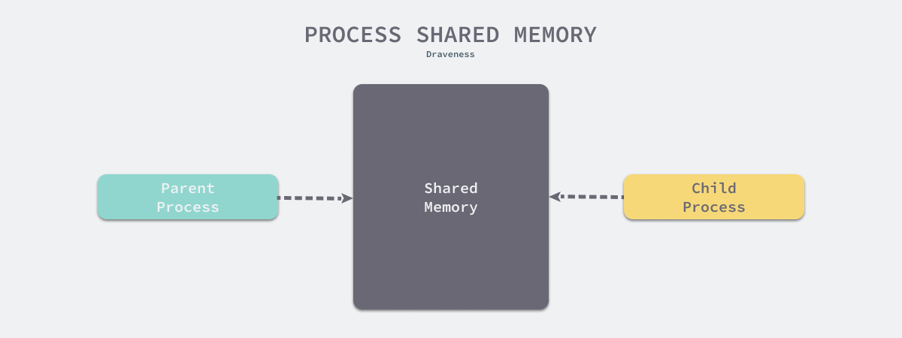
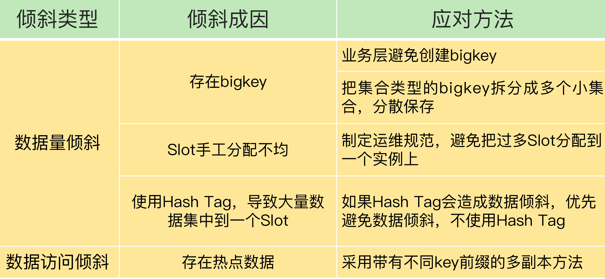

# redis rdb 与AOF重写 fork子进程问题
## 触发时机
### RDB触发时机配置
save 900 1的含义是：当时间到900秒时，如果Redis数据发生了至少1次变化，则执行bgsave；  
save 300 10和save 60 10000同理。

当三个save条件满足任意一个时，都会引起bgsave的调用。

### AOF触发时机配置
- Always，同步写回：每个写命令执行完，立马同步地将日志写回磁盘；
- Everysec，每秒写回：每个写命令执行完，只是先把日志写到 AOF 文件的内存缓冲区，每隔一秒把缓冲区中的内容写入磁盘；
- No，操作系统控制的写回：每个写命令执行完，只是先把日志写到 AOF 文件的内存缓冲区，由操作系统决定何时将缓冲区内容写回磁盘。

### aof重写触发时机配置
为了减小aof文件的体量，可以手动发送“bgrewriteaof”指令，通过子进程生成更小体积的aof，然后替换掉旧的、大体量的aof文件。
也可以配置自动触发：  
　　1）auto-aof-rewrite-percentage 100  
　　2）auto-aof-rewrite-min-size 64mb  
　　这两个配置项的意思是，在aof文件体量超过64mb，且比上次重写后的体量增加了100%时自动触发重写。我们可以修改这些参数达到自己的实际要求  

## fork子进程说明
### fork场景
- Redis采用fork子进程重写AOF文件，命令 bgrewriteaof
    - 子进程就会利用内存的数据，进行记录命令。比如：lpush key1 1 2 4 5
- Redis进程执行fork操作创建子进程，RDB持久化过程由子进程负责。 命令：bgsave

## fork阻塞主进程问题分析
使用 fork 的目的最终一定是为了不阻塞主进程来提升 Redis 服务的可用性，但是到了这里我们其实能够发现两个问题：
- 为什么 fork 之后的子进程能够获取父进程内存中的数据？
- fork 函数是否会带来额外的性能开销，这些开销我们怎么样才可以避免？

解决：
- 通过 fork 生成的父子进程会共享包括内存空间在内的资源；
- fork 函数并不会带来明显的性能开销，尤其是对内存进行大量的拷贝，它能通过写时拷贝将拷贝内存这一工作推迟到真正需要的时候；

直接fork内存拷贝带来的问题：
- 内存中存储大量的数据，fork 时拷贝内存空间会消耗大量的时间和资源，会导致程序一段时间的不可用；
- Redis 占用了 10G 的内存，而物理机或者虚拟机的资源上限只有 16G，在这时我们就无法对 Redis 中的数据进行持久化，也就是说 Redis 对机器上内存资源的最大利用率不能超过 50%；

如果无法解决上面的两个问题，使用 fork 来生成内存镜像的方式也无法真正落地，不是一个工程中真正可以使用的方法。

cow作用：  
fork之后主线程进行写操作时，会把对应物理内存复制一份进行修改，子进程还是使用原来的物理内存页，子进程rdb快照的是fork那一瞬间的内存快照，后续修改其实和rdb的内容没关系了，因为是复制一份出来修改。这就是cow. 所以redis的实例不要开2M大页，物理内存页越大，写时复制越慢。

写时拷贝的主要作用就是将拷贝推迟到写操作真正发生时，这也就避免了大量无意义的拷贝操作。在一些早期的 unix 系统上，系统调用 fork 确实会立刻对父进程的内存空间进行复制，但是在今天的多数系统中，fork 并不会立刻触发这一过程：



在 Redis 服务中，子进程只会读取共享内存中的数据，它并不会执行任何写操作，只有父进程会在写入时才会触发共享的内存以页为单位进行拷贝，在拷贝的页基础上进行修改，而对于大多数的 Redis 服务或者数据库，写请求往往都是远小于读请求的。

```在执行fork的时候操作系统（类Unix操作系统）会使用写时复制（copy-on-write）策略，即fork函数发生的一刻父子进程共享同一内存数据，当父进程要更改其中某片数据时（如执行一个写命令 ），操作系统会将该片数据复制一份以保证子进程的数据不受影响，所以新的RDB文件存储的是执行fork那一刻的内存数据。```

子进程复制了主进程的页表，所以通过页表映射，能读到主线程的原始数据，而当有新数据写入或数据修改时，主线程会把新数据或修改后的数据写到一个新的物理内存地址上，并修改主线程自己的页表映射。所以，子进程读到的类似于原始数据的一个副本，而主线程也可以正常进行修改。

```Redis在进行快照的过程中不会修改RDB文件，只有快照结束后才会将旧的文件替换成新的，也就是说任何时候RDB文件都是完整的。这使得我们可以通过定时备份RDB文件来实 现Redis数据库备份。RDB文件是经过压缩（可以配置rdbcompression参数以禁用压缩节省CPU占用）的二进制格式，所以占用的空间会小于内存中的数据大小，更加利于传输。```

## 那么rdb时内存到底会不会double ?  
极端情况会，在内存中的key-value全部被修改，父进程此时就会全量cow进行修改，此时会发生double内存情况。  

```如果写读比例为8:2，此时做RDB持久化，产生的风险如下：```  
- 内存资源风险：Redis fork子进程做RDB持久化，由于写的比例为80%，那么在持久化过程中，“写时复制”会重新分配整个实例80%的内存副本，大约需要重新分配1.6GB内存空间，这样整个系统的内存使用接近饱和，如果此时父进程又有大量新key写入，很快机器内存就会被吃光，如果机器开启了Swap机制，那么Redis会有一部分数据被换到磁盘上，当Redis访问这部分在磁盘上的数据时，性能会急剧下降，已经达不到高性能的标准（可以理解为武功被废）。如果机器没有开启Swap，会直接触发OOM，父子进程会面临被系统kill掉的风险。
- CPU资源风险：虽然子进程在做RDB持久化，但生成RDB快照过程会消耗大量的CPU资源，虽然Redis处理处理请求是单线程的，但Redis Server还有其他线程在后台工作，例如AOF每秒刷盘、异步关闭文件描述符这些操作。由于机器只有2核CPU，这也就意味着父进程占用了超过一半的CPU资源，此时子进程做RDB持久化，可能会产生CPU竞争，导致的结果就是父进程处理请求延迟增大，子进程生成RDB快照的时间也会变长，整个Redis Server性能下降。


参考：  
- https://draveness.me/whys-the-design-redis-bgsave-fork/
- https://www.cnblogs.com/xiaolovewei/p/9038220.html

## fork对主进程阻塞分析2
a、fork子进程，fork这个瞬间一定是会阻塞主线程的（注意，fork时并不会一次性拷贝所有内存数据给子进程，老师文章写的是拷贝所有内存数据给子进程，我个人认为是有歧义的），fork采用操作系统提供的写实复制(Copy On Write)机制，就是为了避免一次性拷贝大量内存数据给子进程造成的长时间阻塞问题，但fork子进程需要拷贝进程必要的数据结构，其中有一项就是```拷贝内存页表（虚拟内存和物理内存的映射索引表）```，这个拷贝过程会消耗大量CPU资源，拷贝完成之前整个进程是会阻塞的，阻塞时间取决于整个实例的内存大小，实例越大，内存页表越大，fork阻塞时间越久。拷贝内存页表完成后，子进程与父进程指向相同的内存地址空间，也就是说此时虽然产生了子进程，但是并没有申请与父进程相同的内存大小。那什么时候父子进程才会真正内存分离呢？“写实复制”顾名思义，就是在写发生时，才真正拷贝内存真正的数据，这个过程中，父进程也可能会产生阻塞的风险，就是下面介绍的场景。

b、fork出的子进程指向与父进程相同的内存地址空间，此时子进程就可以执行AOF重写，把内存中的所有数据写入到AOF文件中。但是此时父进程依旧是会有流量写入的，如果父进程操作的是一个已经存在的key，```那么这个时候 父进程 就会真正拷贝这个key对应的内存数据，申请新的物理内存空间，这样逐渐地，父子进程内存数据开始分离，父子进程逐渐拥有各自独立的内存空间```。因为内存分配是以页为单位进行分配的，默认4k，如果父进程此时操作的是一个bigkey，重新申请大块内存耗时会变长，而且父进程写入新的物理内存时间也会变长，可能会产阻塞风险。另外，如果操作系统开启了内存大页机制(Huge Page，页面大小2M)，那么父进程申请内存时阻塞的概率将会大大提高，所以在Redis机器上需要关闭Huge Page机制。Redis每次fork生成RDB或AOF重写完成后，都可以在Redis log中看到父进程重新申请了多大的内存空间。

参考：https://time.geekbang.org/column/article/271754?utm_campaign=guanwang&utm_source=baidu-ad&utm_medium=ppzq-pc&utm_content=title&utm_term=baidu-ad-ppzq-title

<a href="../../../book-notes/OS.md">Huge Page概念</a>


## 为什么要fork子进程而不是用子线程去做
如果子线程去做备份的时候没法保证数据的一致性，因为子线程会共享内存，在发生数据修改时，就会反映到共享内存中，如果需要单独的内存需要重新copy一份内存这样对于性能而言是非常不适合的。  

而用fork的话，子进程虽然会和父进程共享内存空间的页帧，但是fork的时候会把共享的页帧设置为只可读的状态，当任意一方尝试去写这个内存的时候，就产生一个异常，这时内核就把这个页复制到一个新的页帧中并标记为可写。这就是我们所说的copy on write.另外子进程退出的时候也会释放掉只属于子进程的内存空间，这样就创建了一个完美的snapshot。

这样也能解释为什么要在fork完子进程的时候，要把redis的键值空间设置为禁止rehash，因为redis是采用的渐进式hash的方式，如果处于rehash 无论set 或者get方式都会对旧的空间进行更改，这样就会不断的触发页帧写的异常，而需要分配更多的内存空间，这样对于性能还是受比较多的影响，但是rdb触发并没有判断是否处于rehash状态，所以rdb的方案是在必须执行的条件下，在rdb过程中尽量减少对页帧的修改而不是完全禁止。

参考：https://bbs.huaweicloud.com/blogs/220919

## 为什么AOF重写不复用AOF本身的日志？
一个原因是父子进程写同一个文件必然会产生竞争问题，控制竞争就意味着会影响父进程的性能。二是如果AOF重写过程中失败了，那么原本的AOF文件相当于被污染了，无法做恢复使用。所以Redis AOF重写一个新文件，重写失败的话，直接删除这个文件就好了，不会对原先的AOF文件产生影响。等重写完成之后，直接替换旧文件即可。

## 进程与线程的区别：
内存分配：同一进程的线程共享本进程的地址空间和资源，而进程之间的地址空间和资源是相互独立的。

# 为什么出现两种情况的备份？
用 AOF 方法进行故障恢复的时候，需要逐一把操作日志都执行一遍。如果操作日志非常多，Redis 就会恢复得很缓慢，影响到正常使用。这当然不是理想的结果。那么，还有没有既可以保证可靠性，还能在宕机时实现快速恢复的其他方法呢？此时rdb就出来了。

# redis数据倾斜&热点数据问题


## bigKey的处理
- string类型的k-v结构，value是大json，那么可以采用base64压缩解压缩即可。
- 集合类型的大key，就是把 bigkey 拆分成很多个小的集合类型数据，分散保存在不同的实例上。

## 访问热点数据的处理
- 热点数据以服务读操作为主，在这种情况下，我们可以采用热点数据多副本的方法来应对。
- 这个方法的具体做法是，我们把热点数据复制多份，在每一个数据副本的 key 中增加一个随机前缀，让它和其它副本数据不会被映射到同一个 Slot 中。这样一来，热点数据既有多个副本可以同时服务请求，同时，这些副本数据的 key 又不一样，会被映射到不同的 Slot 中。在给这些 Slot 分配实例时，我们也要注意把它们分配到不同的实例上，那么，热点数据的访问压力就被分散到不同的实例上了。
- 这里，有个地方需要注意下，热点数据多副本方法只能针对只读的热点数据。如果热点数据是有读有写的话，就不适合采用多副本方法了，因为要保证多副本间的数据一致性，会带来额外的开销。对于有读有写的热点数据，我们就要给实例本身增加资源了，例如使用配置更高的机器，来应对大量的访问压力。

## 通用热点数据处理办法
Redis 的很多性能问题，例如导致 Redis 阻塞的场景：bigkey、集中过期、大实例 RDB 等等，这些场景都与数据倾斜类似，都是因为数据集中、处理逻辑集中导致的耗时变长。其解决思路也类似，都是把集中变分散，例如 bigkey 拆分为小 key、单个大实例拆分为切片集群等。

```从软件架构演进过程来看，从单机到分布式，再到后来出现的消息队列、负载均衡等技术，也都是为了将请求压力分散开，避免数据集中、请求集中的问题，这样既可以让系统承载更大的请求量，同时还保证了系统的稳定性。```

# 


