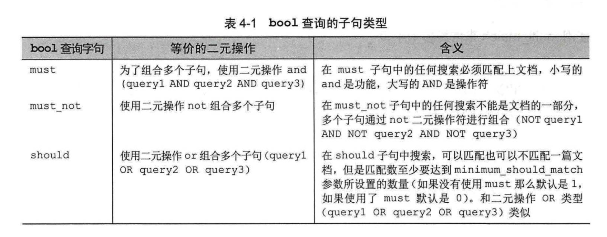
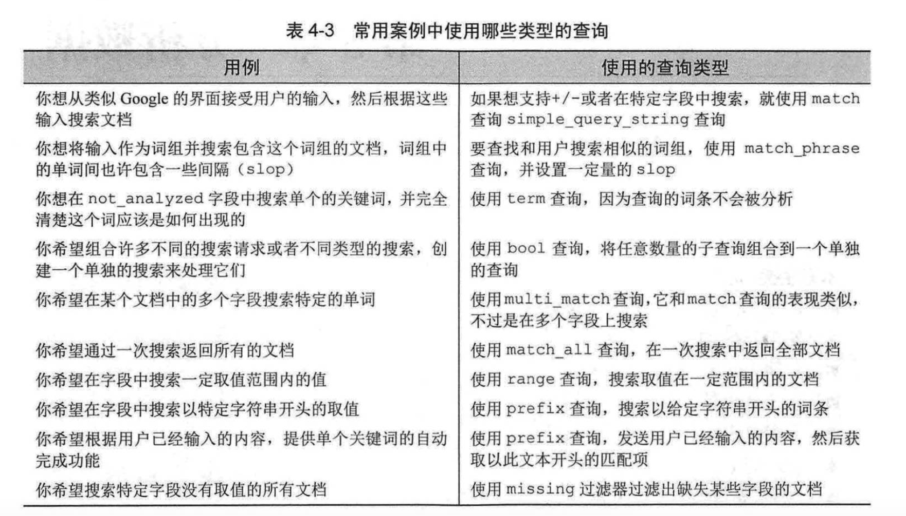

# 关于es查询与查询性能相关：

## 性能相关：
1.利用term过滤器，可以加速查询效率。因为会缓存过滤结果，并且只会在已经过滤出来的docs做其他操作。

2.**match query VS match_phrase query**：  
注意其差别：  
match query：会对查询语句进行分词，分词后查询语句中的```任何一个词```项被匹配，文档就会被搜索到。如果想查询匹配所有关键词的文档，可以用and操作符连接；  
match_phrase query：满足下面两个条件才会被搜索到
- （1）分词后所有词项都要出现在该字段中
- （2）字段中的词项顺序要一致


## es的与或非运算  


## es查询案例
