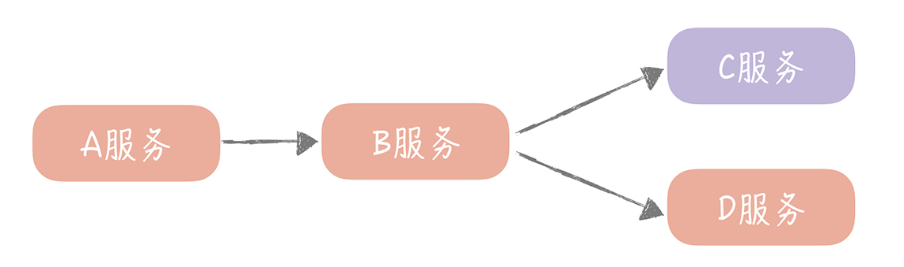

# 出现的问题
## 服务雪崩是如何发生的
局部故障最终导致全局故障，这种情况有一个专业的名词儿，叫做“雪崩”。那么，为什么会发生雪崩呢？我们知道，系统在运行的时候是需要消耗一些资源的，包括 CPU、内存等系统资源，也包括执行业务逻辑的时候，需要的线程资源。

举个例子，一般在业务执行的容器内，都会定义一些线程池来分配执行任务的线程，比如在 Tomcat 这种 Web 容器的内部，定义了线程池来处理 HTTP 请求；RPC 框架也给 RPC 服务端初始化了线程池来处理 RPC 请求。这些线程池中的线程资源是有限的，如果这些线程资源被耗尽，那么服务自然也就无法处理新的请求，服务提供方也就宕机了。

比如，你的垂直电商系统有四个服务 A、B、C、D，A 调用 B，B 调用 C 和 D。其中，A、B、D 服务是系统的核心服务（像是电商系统中的订单服务、支付服务等等），C 是非核心服务（像反垃圾服务、审核服务）。所以，一旦作为入口的 A 流量增加，你可能会考虑把 A、B 和 D 服务扩容，忽略 C。那么 C 就有可能因为无法承担这么大的流量，导致请求处理缓慢，进一步会让 B 在调用 C 的时候，B 中的请求被阻塞，等待 C 返回响应结果。这样一来，B 服务中被占用的线程资源就不能释放。久而久之，B 就会因为线程资源被占满，无法处理后续的请求。那么从 A 发往 B 的请求，就会被放入 B 服务线程池的队列中，然后 A 调用 B 响应时间变长，进而拖垮 A 服务。你看，仅仅因为非核心服务 C 的响应时间变长，就可以导致整体服务宕机，这就是我们经常遇到的一种服务雪崩情况。

## 问题总结
因为服务调用方等待服务提供方的响应时间过长，它的资源被耗尽，才引发了级联反应，发生雪崩。所以在分布式环境下，系统最怕的反而不是某一个服务或者组件宕机，而是最怕它响应缓慢，因为，某一个服务或者组件宕机也许只会影响系统的部分功能，但它响应一慢，就会出现雪崩拖垮整个系统。


## 问题解决方案总结
而我们在部门内部讨论方案的时候，会格外注意这个问题，解决的思路就是在```检测到某一个服务的响应时间出现异常时，切断调用它的服务与它之间的联系，让服务的调用快速返回失败，从而释放这次请求持有的资源```。这个思路也就是我们经常提到的```降级和熔断机制```。

# 熔断机制是如何做的
服务调用方为每一个调用的服务维护一个有限状态机，在这个状态机中会有三种状态：关闭（调用远程服务）、半打开（尝试调用远程服务）和打开（返回错误）。这三种状态之间切换的过程是下面这个样子。
- 当调用失败的次数累积到一定的阈值时，熔断状态从关闭态切换到打开态。一般在实现时，如果调用成功一次，就会重置调用失败次数。
- 当熔断处于打开状态时，我们会启动一个超时计时器，当计时器超时后，状态切换到半打开态。你也可以通过设置一个定时器，定期地探测服务是否恢复。
- 在熔断处于半打开状态时，请求可以达到后端服务，如果累计一定的成功次数后，状态切换到关闭态；如果出现调用失败的情况，则切换到打开态。

## 实际例子
其实，不仅仅微服务之间调用需要熔断的机制，我们在调用 Redis、Memcached 等资源的时候也可以引入这套机制。在我的团队自己封装的 Redis 客户端中，就实现了一套简单的熔断机制。首先，在系统初始化的时候，我们定义了一个定时器，当熔断器处于 Open 状态时，定期地检测 Redis 组件是否可用
```java

new Timer("RedisPort-Recover", true).scheduleAtFixedRate(new TimerTask() {
    @Override
    public void run() {
        if (breaker.isOpen()) {
            Jedis jedis = null;
            try {
                jedis = connPool.getResource();
                jedis.ping(); //验证redis是否可用
                successCount.set(0); //重置连续成功的计数
                breaker.setHalfOpen(); //设置为半打开态
            } catch (Exception ignored) {
            } finally {
                if (jedis != null) {
                    jedis.close();
                }
            }
        }
    }
}, 0, recoverInterval); //初始化定时器定期检测redis是否可用
```
在通过 Redis 客户端操作 Redis 中的数据时，我们会在其中加入熔断器的逻辑。比如，当节点处于熔断状态时，直接返回空值以及熔断器三种状态之间的转换，具体的示例代码像下面这样：
```java

if (breaker.isOpen()) { 
    return null;  // 断路器打开则直接返回空值
}

K value = null;
Jedis jedis = null;

try {
     jedis = connPool.getResource();
     value = callback.call(jedis);
     if(breaker.isHalfOpen()) { //如果是半打开状态
          if(successCount.incrementAndGet() >= SUCCESS_THRESHOLD) {//成功次数超过阈值
                failCount.set(0);  //清空失败数
                breaker.setClose(); //设置为关闭态
          }
     }
     return value;
} catch (JedisException je) {
     if(breaker.isClose()){  //如果是关闭态
         if(failCount.incrementAndGet() >= FAILS_THRESHOLD){ //失败次数超过阈值
            breaker.setOpen();  //设置为打开态
         }
     } else if(breaker.isHalfOpen()) {  //如果是半打开态
         breaker.setOpen();    //直接设置为打开态
     }
     throw  je;
} finally {
     if (jedis != null) {
           jedis.close();
     }
}
```
这样，当某一个 Redis 节点出现问题，Redis 客户端中的熔断器就会实时监测到，并且不再请求有问题的 Redis 节点，避免单个节点的故障导致整体系统的雪崩。

# 降级机制要如何做
相比熔断来说，降级是一个更大的概念。因为它是站在整体系统负载的角度上，放弃部分非核心功能或者服务，保证整体的可用性的方法，是一种有损的系统容错方式。这样看来，熔断也是降级的一种，除此之外还有限流降级、开关降级等等。

## 开关降级
开关降级指的是在代码中预先埋设一些“开关”，用来控制服务调用的返回值。比方说，开关关闭的时候正常调用远程服务，开关打开时则执行降级的策略。这些开关的值可以存储在配置中心中，当系统出现问题需要降级时，只需要通过配置中心动态更改开关的值，就可以实现不重启服务快速地降级远程服务了。

## 降级通用方案
当然了，我们在设计开关降级预案的时候，首先要区分哪些是核心服务，哪些是非核心服务。因为我们只能针对非核心服务来做降级处理，然后就可以针对具体的业务，制定不同的降级策略了。我给你列举一些常见场景下的降级策略，你在实际的工作中可以参考借鉴。
- 针对读取数据的场景，我们一般采用的策略是直接返回降级数据。比如，如果数据库的压力比较大，我们在降级的时候，可以考虑只读取缓存的数据，而不再读取数据库中的数据；如果非核心接口出现问题，可以直接返回服务繁忙或者返回固定的降级数据。
- 对于一些轮询查询数据的场景，比如每隔 30 秒轮询获取未读数，可以降低获取数据的频率（将获取频率下降到 10 分钟一次）。
- 而对于写数据的场景，一般会考虑把同步写转换成异步写，这样可以牺牲一些数据一致性保证系统的可用性。

# 总结
- 在分布式环境下最怕的是服务或者组件慢，因为这样会导致调用者持有的资源无法释放，最终拖垮整体服务。
- 服务熔断的实现是一个有限状态机，关键是三种状态之间的转换过程。
- 开关降级的实现策略主要有返回降级数据、降频和异步三种方案
