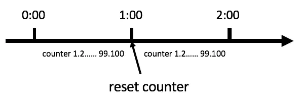
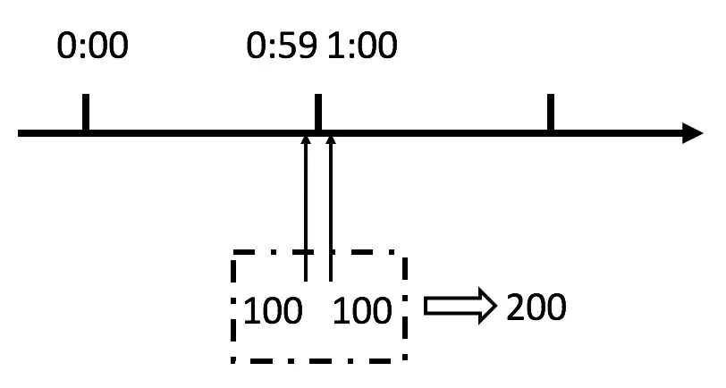
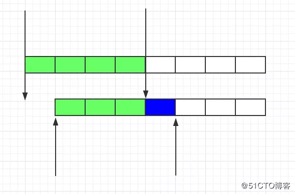
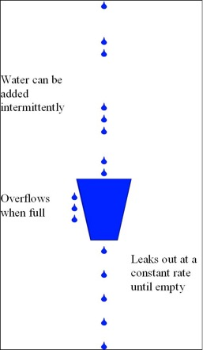
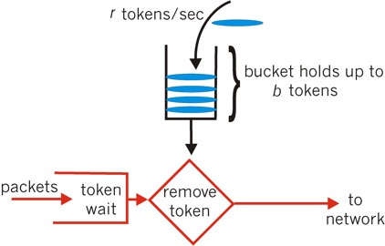

# 限流算法介绍

## 计数器法(固定窗口限流)
### 算法描述：
计数器法是限流算法里最简单也是最容易实现的一种算法。比如我们规定，对于A接口来说，我们1分钟的访问次数不能超过100个。那么我们可以这么做：在一开始的时候，我们可以设置一个计数器counter，每当一个请求过来的时候，counter就加1，如果counter的值大于100并且该请求与第一个请求的间隔时间还在1分钟之内，那么说明请求数过多；如果该请求与第一个请求的间隔时间大于1分钟，且counter的值还在限流范围内，那么就重置counter，具体算法的示意图如下：



### 算法代码如下：
Radssion有开源的实现，较易实现分布式限流
Dubbo的限流Filter代码如下：
```java
public boolean isAllowable() {
    long now = System.currentTimeMillis();
    if (now > lastResetTime + interval) {
        // 重置token
        token = buildLongAdder(rate);
        lastResetTime = now;
    }

    if (token.sum() < 0) {
        return false;
    }
    token.decrement();
    return true;
}
```
### 算法存在的问题：
从上图中我们可以看到，假设有一个恶意用户，他在0:59时，瞬间发送了100个请求，并且1:00又瞬间发送了100个请求，那么其实这个用户在1秒里面，瞬间发送了200个请求。我们刚才规定的是1分钟最多100个请求，也就是每秒钟最多1.7个请求，用户通过在时间窗口的重置节点处突发请求，可以瞬间超过我们的速率限制。用户有可能通过算法的这个漏洞，瞬间压垮我们的应用。



刚才的问题其实是因为我们统计的精度太低。那么如何很好地处理这个问题呢？或者说，如何将临界问题的影响降低呢？我们可以看下面的滑动窗口算法。

## 滑动计数限流算法：
### 算法描述：
固定窗口就像是滑动窗口的一个特例。滑动窗口将固定窗口再等分为多个小的窗口，每一次对一个小的窗口进行流量控制。这种方法可以很好的解决之前的临界问题



这里找的网上一个图，假设我们将1s划分为4个窗口，则每个窗口对应250ms。假设恶意用户还是在上一秒的最后一刻和下一秒的第一刻冲击服务，按照滑动窗口的原理，此时统计上一秒的最后750毫秒和下一秒的前250毫秒，这种方式能够判断出用户的访问依旧超过了1s的访问数量，因此依然会阻拦用户的访问。  

### 周期切换问题
```滑动窗口针对周期进行了细分，不存在周期到后计数直接重置为0的情况，故不会出现跨周期的流量限制问题。```  

**注意：滑动窗口主要解决的问题时，时间周期到了流量重置问题。从图上可以看到整个窗口随着每一小格的时间滑动一次，但是在1s末2s初，窗口内的流量值不会重置为0，因此可以避免跨周期的流量限制问题。**

```滑动窗口的实现源码可以参考：snetinel流控```

### 算法代码：
j2se/常用的工具类/ratelimit/SlidingWindowRateLimiter.java

## 漏斗算法
### 算法描述：
从图中我们可以看到，整个算法其实十分简单。首先，我们有一个固定容量的桶，有水流进来，也有水流出去。对于流进来的水来说，我们无法预计一共有多少水会流进来，也无法预计水流的速度(无法预计外来的qps)。但是对于流出去的水来说，这个桶可以固定水流出的速率。而且，当桶满了之后，多余的水将会溢出。



我们将算法中的水换成实际应用中的请求，我们可以看到漏桶算法天生就限制了请求的速度（以一定的速率处理外界请求）。当使用了漏桶算法，我们可以保证接口会以一个常速速率来处理请求。所以漏桶算法天生不会出现临界问题。具体的伪代码实现如下：
```java
public class LeakyDemo {
    public long timeStamp = getNowTime();
    public int capacity; // 桶的容量
    public int rate; // 水漏出的速度
    public int water; // 当前水量(当前累积请求数)
    public boolean grant() {
        long now = getNowTime();
        // 以一定的速率处理请求，计算桶中剩余水量
        water = max(0, water - (now - timeStamp) * rate); // 先执行漏水，计算剩余水量
        timeStamp = now;
        if ((water + 1) < capacity) {
            // 尝试加水,并且桶还未满
            water += 1;
            return true;
        }
        else {
            // 水满，拒绝加水
            return false;
        }
    }
}
```

## 令牌桶算法：
### 算法描述
令牌桶算法，又称token bucket。为了理解该算法，我们再来看一下维基百科上对该算法的示意图：



从图中我们可以看到，令牌桶算法比漏桶算法稍显复杂。首先，我们有一个固定容量的桶，桶里存放着令牌（token）。桶一开始是空的，```token以一个固定的速率r往桶里填充，直到达到桶的容量```，多余的令牌将会被丢弃。每当一个请求过来时，就会尝试从桶里移除一个令牌，如果没有令牌的话，请求无法通过。
### 伪代码如下：  
guava的限流是基于令牌桶的限流方式。
```java
public class TokenBucketDemo {
    public long timeStamp = getNowTime();
    public int capacity; // 桶的容量
    public int rate; // 令牌放入速度
    public int tokens; // 当前令牌数量
    public boolean grant() {
        long now = getNowTime();
        // 先添加令牌(以一定的速率添加令牌)
        tokens = min(capacity, tokens + (now - timeStamp) * rate); 
        timeStamp = now;
        if (tokens < 1) {
            // 若不到1个令牌,则拒绝
            return false;
        }
        else {
            // 还有令牌，领取令牌
            tokens -= 1;
            return true;
        }
    }
    }
```
### 算法评估：
#### 临界问题：
我们再来考虑一下临界问题的场景。在0:59秒的时候，由于桶内积满了100个token，所以这100个请求可以瞬间通过。```但是由于token是以较低的速率填充的，所以在1:00的时候，桶内的token数量不可能达到100个，那么此时不可能再有100个请求通过。所以令牌桶算法可以很好地解决临界问题```。下图比较了计数器（左）和令牌桶算法（右）在临界点的速率变化。我们可以看到虽然令牌桶算法允许突发速率，但是下一个突发速率必须要等桶内有足够的token后才能发生：


上图可以看出，利用计数限流算法，在流量突增时，在第一波流量到来的时候，消耗完所有qps，第二波来临时，只能看着，啥也干不了。

## 算法比较：
### 计数器 VS 滑动窗口
计数器算法是最简单的算法，可以看成是滑动窗口的低精度实现。滑动窗口由于需要存储多份的计数器（每一个格子存一份），所以滑动窗口在实现上需要更多的存储空间。也就是说，如果滑动窗口的精度越高，需要的存储空间就越大。这俩都可以应对流量突增的情况。

### 漏桶算法 VS 令牌桶算法
漏桶算法和令牌桶算法最明显的区别是```令牌桶算法可以累积令牌，因此允许流量一定程度的突发```，而漏桶以固定的速率流出，无法应对突发情况。因为默认的令牌桶算法，取走token是不需要耗费时间的，也就是说，假设桶内有100个token时，那么可以瞬间允许100个请求通过。

令牌桶算法由于实现简单，且允许某些流量的突发，对用户友好，所以被业界采用地较多。当然我们需要具体情况具体分析，只有最合适的算法，没有最优的算法。


# 总结
<table><thead><tr><th>算法名称</th><th>需要确定参数</th><th>实现简介</th><th>空间复杂度</th><th>说明</th></tr>
</thead><tbody><tr><td>固定窗口计数</td><td>计数周期T<br>周期内最大访问数N</td><td>使用计数器在周期内累加访问次数，达到最大次数后出发限流策略</td><td>O(1)，仅需要记录周期内访问次数及周期开始时间</td><td>周期切换时可能出现访问次数超过限定值</td></tr><tr><td>滑动窗口计数</td><td>计数周期T<br>周期内最大访问数N<br>滑动窗口数M</td><td>将时间周期分为M个小周期，分别记录每个小周期内访问次数，并且根据时间滑动删除过期的小周期</td><td>O(M)，需要记录每个小周期中的访问数量</td><td>解决固定窗口算法周期切换时的访问突发问题</td></tr><tr><td>漏桶算法</td><td>漏桶流出速度r<br>漏桶容量N<br></td><td>服务到达时直接放入漏桶，如当前容量达到N，则触发限流侧率，程序以r的速度在漏桶中获取访问请求，知道漏桶为空</td><td>O(1)，仅需要记录当前漏桶中容量</td><td>平滑流量，保证服务请求到达服务方的速度恒定</td></tr><tr><td>令牌桶算法</td><td>令牌产生速度r<br>令牌桶容量N<br></td><td>程序以r的速度向令牌桶中增加令牌，直到令牌桶满，请求到达时向令牌桶请求令牌，如有满足需求的令牌则通过请求，否则触发限流策略</td><td>O(1)，仅需要记录当前令牌桶中令牌数</td><td>能够在限流的基础上，处理一定量的突发请求</td></tr></tbody></table>