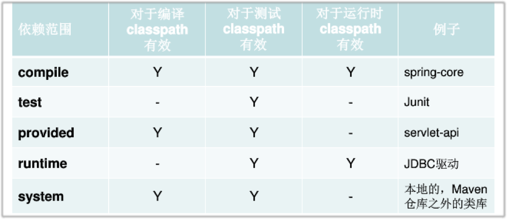

１、maven scope：
- compile: 适用于所有阶段,会随着项目一起发布(如果不写，默认是这个)。
- runtime: 只在运行时使用,如JDBC驱动，在编译的时候并不要，只要拿到接口即可，只有这个打包package时有。
- provided: 期望JDK、容器或使用者会提供这个依赖。如servlet.jar
- test:只在测试时使用,用于编译和运行测试代码。不会随项目发布, 比如junit
- import: 用来导入依赖, 比如tcdev  
  
2、Maven 自身调节冲突的设计:(查看jar依赖图)
- 最短路径优先（第一级大于第二级声明。）
- 第一声明优先(之前声明大于之后声明) 
> 强制显式处理依赖冲突.  
3、MAVEN 依赖冲突：
- jar包版本冲突
    - 尽量使用更高的版本
    - 尽量使用已知最稳定的版本
    - 不要exclude,除非理由充分
- Duplicated classes
    - 一般解法就是exclude掉某个jar包
    - hadoop 生态里面的jar包(hadoop的jar里面包含了很多自己需要的类库，为了优化计算), 可以申请检查的白名单。 

4、mvn package　：打包项目　　
5、mvn clean :  
6、mvn compile :编译项目

　　
maven生命周期：https://juvenshun.iteye.com/blog/213959  
maven常用命令:https://uule.iteye.com/blog/2083999
## 优化自己的依赖
使用命令来查看当前项目的已解析依赖：

mvn dependency:list　　**注意：命令冒号之间没有空格**

经过Maven解析之后，就会构成一个依赖树

也可以使用命令查看当前项目的依赖树：

mvn dependency:tree

使用命令分析当前当前项目的依赖：

mvn dependency:analyze

该命令执行结果的两个重要部分：

Used undeclared dependencies: 表示项目中使用到的，但是没有显示声明的依赖

Unused declared dependencies: 表示项目中未使用的，但显示声明的依赖

PS：**dependency : analyze只会分析编译主代码和测试代码需要用到的依赖，一些执行测试和运行时需要的依赖它无法发现。**

**mvn dependency:resolve -Dclassifier=sources.解决idea中无法下载源码的问题**
