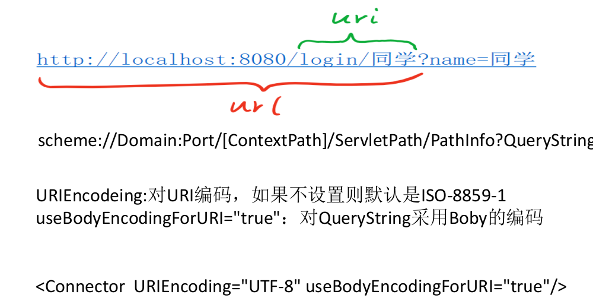

1、UTF-16编码与UTF-8的区别：
- 都是采用unicode编码.
- UTF-16适用于在内存中进行字节与字符的快速转换,不适合网络传输，网络传输容易出现丢包的，UTF-16是采用顺序编码。
- UTF-8适合网络传输，对字符单字节存储，对汉字３字节存储。单个字符损坏，并不影响后续字符的编码。  

２、URL的编解码

================================12.12================  
１、courseId=53 maven瘦身，升级版本，jar太多，会有冲突。  
２、主流框架简化了servlet的繁琐的配置。  
3、观察者模式：监听你的操作。  
４、加载顺序：Listener > filter。（Listener只是监听fiter,并不会影响filter的执行。）  
5、分页信息放在header中，不是放在body中。  
6、PUT如果有就更新，没有就新增。
７、415:不支持的类型。比如json格式不对。  
8、
