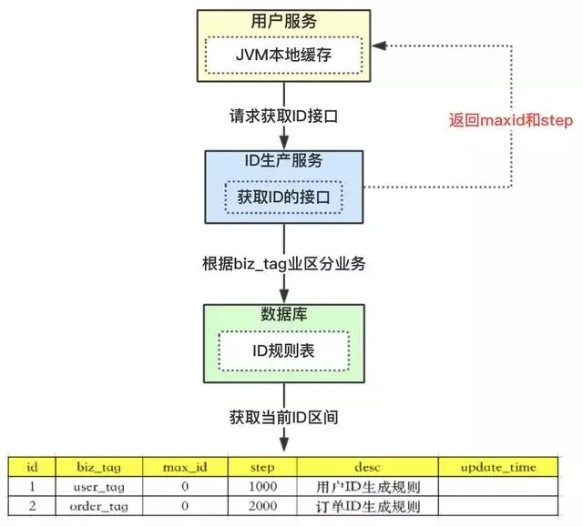
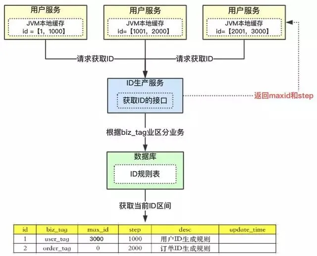
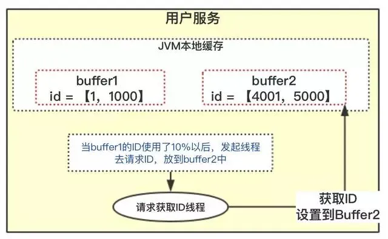
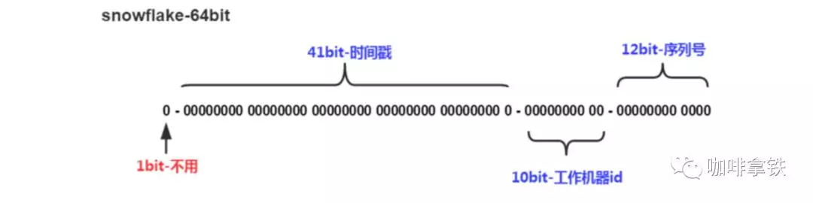

# 解决的问题
解决分库分表ID唯一性问题

# 解决方案介绍
## UUID
--- 
### 优点:
- 性能非常高：本地生成，没有网络消耗。
- 无序，无法预测他的生成顺序。(当然这个也是他的缺点之一)
### 缺点:
- 128位二进制一般转换成36位的16进制，太长了只能用String存储，空间占用较多。
- 不能生成递增有序的数字
### 适用场景
UUID的适用场景可以为不担心过多的空间占用，以及不需要生成有递增趋势的数字。在Log4j里面他在UuidPatternConverter中加入了UUID来标识每一条日志。

## 数据库主键自增
这个方案就是利用了MySQL的主键自增auto_increment，默认每次ID加1。
### 优点:
- 简单方便，有序递增，方便排序和分页
### 缺点:
- 存在单点问题，如果mysql挂了，就没法生成iD了
- 并发性能不高，受限于数据库的性能（因为每次更新需要update新的值）。
- 简单递增容易被其他人猜测利用，比如你有一个用户服务用的递增，那么其他人可以根据分析注册的用户ID来得到当天你的服务有多少人注册，从而就能猜测出你这个服务当前的一个大概状况。
- 数据库宕机服务不可用。
### 适用场景
根据上面可以总结出来，当数据量不多，并发性能不高的时候这个很适合，比如一些to B的业务，商家注册这些，商家注册和用户注册不是一个数量级的，所以可以数据库主键递增。如果对顺序递增强依赖，那么也可以使用数据库主键自增。

## Redis
---
利用redis的incr原子性操作自增，一般算法为：  
年份 + 当天距当年第多少天 + 天数 + 小时 + redis自增。  
当然可以从1开始自增，保持线性增长
### 优点:
- 性能比数据库好，能满足有序递增。
### 缺点:
- 由于redis是内存的KV数据库，即使有AOF和RDB，但是依然会存在数据丢失，有可能会造成ID重复。
- 依赖于redis，redis要是不稳定，会影响ID生成。
- ID持续递增容易被黑客探知id的生成规则
### 适用场景
由于其性能比数据库好，但是有可能会出现ID重复和不稳定，这一块如果可以接受那么就可以使用。

### 性能测试
```
需求：同时10万个请求获取ID
1、并发执行完耗时：9s左右
2、单任务平均耗时：74ms
3、单线程最小耗时：不到1ms
4、单线程最大耗时：4.1s
```

## 改造数据库主键自增
--- 
### 方案介绍
上述我们介绍了利用数据库的自增主键的特性，可以实现分布式ID；这个ID比较简短明了，适合做userId，正好符合如何永不迁移数据和避免热点? 根据服务器指标分配数据量(揭秘篇)文章中的ID的需求。但这个方案有严重的问题：
- 一旦步长定下来，不容易扩容
- 数据库压力山大

小伙伴们看看怎么优化这个方案。先看数据库压力大，为什么压力大？是因为我们每次获取ID的时候，都要去数据库请求一次。那我们可以不可以不要每次去取？

思路我们可以请求数据库得到ID的时候，可设计成获得的ID是一个ID区间段。



```
1、id表示为主键，无业务含义。

2、biz_tag为了表示业务，因为整体系统中会有很多业务需要生成ID，这样可以共用一张表维护

3、max_id表示现在整体系统中已经分配的最大ID

4、desc描述

5、update_time表示每次取的ID时间
```

主流程如下：
```
1、【用户服务】在注册一个用户时，需要一个用户ID；会请求【生成ID服务(是独立的应用)】的接口

2、【生成ID服务】会去查询数据库，找到user_tag的id，现在的max_id为0，step=1000

3、【生成ID服务】把max_id和step返回给【用户服务】；并且把max_id更新为max_id = max_id + step，即更新为1000

4、【用户服务】获得max_id=0，step=1000；

5、 这个用户服务可以用ID=【max_id + 1，max_id+step】区间的ID，即为【1，1000】

6、【用户服务】会把这个区间保存到jvm中

7、【用户服务】需要用到ID的时候，在区间【1，1000】中依次获取id，可采用AtomicLong中的getAndIncrement方法。

8、如果把区间的值用完了，再去请求【生产ID服务】接口，获取到max_id为1000，即可以用【max_id + 1，max_id+step】区间的ID，即为【1001，2000】
```

### 优点:
这个方案就非常完美的解决了数据库自增的问题，而且可以自行定义max_id的起点，和step步长，非常方便扩容。

而且也解决了数据库压力的问题，因为在一段区间内，是在jvm内存中获取的，而不需要每次请求数据库。即使数据库宕机了，系统也不受影响，ID还能维持一段时间。
### 竞争问题:
以上方案中，如果是多个用户服务，同时获取ID，同时去请求【ID服务】，在获取max_id的时候会存在并发问题。

如用户服务A，取到的max_id=1000 ;用户服务B取到的也是max_id=1000，那就出现了问题，Id重复了。那怎么解决？

### 解决办法
加分布式锁，保证同一时刻只有一个用户服务获取max_id。当然也可以用数据库自身的锁去解决。
```sql
Begin
UPDATE table SET max_id=max_id+step WHERE biz_tag=xxx
SELECT tag, max_id, step FROM table WHERE biz_tag=xxx
Commit
```
利用事务方式加行锁，上面的语句，在没有执行完之前，是不允许第二个用户服务请求过来的，第二个请求只能阻塞。

### 突发阻塞问题



上图中，多个用户服务获取到了各自的ID区间，在高并发场景下，ID用的很快，如果3个用户服务在某一时刻都用完了，同时去请求【ID服务】。因为上面提到的竞争问题，所有只有一个用户服务去操作数据库，其他二个会被阻塞。

出现的现象就是一会儿突然系统耗时变长，一会儿好了，就是这个原因导致的，怎么去解决？

## 双buffer方案
---

```在一般的系统设计中，双buffer会经常看到，怎么去解决上面的问题也可以采用双buffer方案。```



```
1、当前获取ID在buffer1中，每次获取ID在buffer1中获取

2、当buffer1中的Id已经使用到了100，也就是达到区间的10%

3、达到了10%，先判断buffer2中有没有去获取过，如果没有就立即发起请求获取ID线程，此线程把获取到的ID，设置到buffer2中。

4、如果buffer1用完了，会自动切换到buffer2

5、buffer2用到10%了，也会启动线程再次获取，设置到buffer1中

6、依次往返
```
双buffer的方案，小伙伴们有没有感觉很酷，这样就达到了业务场景用的ID，都是在jvm内存中获得的，从此不需要到数据库中获取了。允许数据库宕机时间更长了。

因为会有一个线程，会观察什么时候去自动获取。两个buffer之间自行切换使用。就解决了突发阻塞的问题。

## 雪花算法


- 1bit:一般是符号位，不做处理
- 41bit:用来记录时间戳，这里可以记录69年，如果设置好起始时间比如今年是2018年，那么可以用到2089年，到时候怎么办？要是这个系统能用69年，我相信这个系统早都重构了好多次了。
- 10bit:10bit用来记录机器ID，总共可以记录1024台机器，一般用前5位代表数据中心，后面5位是某个数据中心的机器ID
- 12bit:循环位，用来对同一个毫秒之内产生不同的ID，12位可以最多记录4095个，也就是在同一个机器同一毫秒最多记录4095个，多余的需要进行等待下毫秒。```也可以使用10位循环位，2位扩展位```

### 防止时钟回拨
因为机器的原因会发生时间回拨，我们的雪花算法是强依赖我们的时间的，如果时间发生回拨，有可能会生成重复的ID，在我们上面的nextId中我们用当前时间和上一次的时间进行判断，如果当前时间小于上一次的时间那么肯定是发生了回拨，普通的算法会直接抛出异常,这里我们可以对其进行优化,一般分为两个情况:
- 如果时间回拨时间较短，比如配置5ms以内，那么可以直接等待一定的时间，让机器的时间追上来。
- 如果时间的回拨时间较长，我们不能接受这么长的阻塞等待，那么又有两个策略:
    - 直接拒绝，抛出异常，打日志，通知RD时钟回滚。
    - 利用扩展位，上面我们讨论过不同业务场景位数可能用不到那么多，那么我们可以把扩展位数利用起来了，比如当这个时间回拨比较长的时候，我们可以不需要等待，直接在扩展位加1。2位的扩展位允许我们有3次大的时钟回拨，一般来说就够了，如果其超过三次我们还是选择抛出异常，打日志。
```java
// 时钟回拨
if (timestamp < lastTimestamp) {
    long offset = lastTimestamp - timestamp;
    if (offset <= 5) {
        try {
            // 休眠10ms
            wait(offset << 1);
            timestamp = timeGen();
            if (timestamp < lastTimestamp) {
                return new Result(-1, Status.EXCEPTION);
            }
        } catch (InterruptedException e) {
            LOGGER.error("wait interrupted");
            return new Result(-2, Status.EXCEPTION);
        }
    } else {
        return new Result(-3, Status.EXCEPTION);
    }
}
```


## 参考
- https://mp.weixin.qq.com/s/7RQhCazoLJ-qO7CglZ6b2Q
- https://tech.meituan.com/2017/04/21/mt-leaf.html
