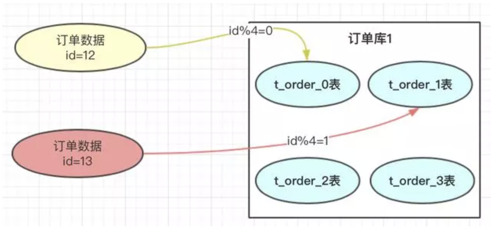
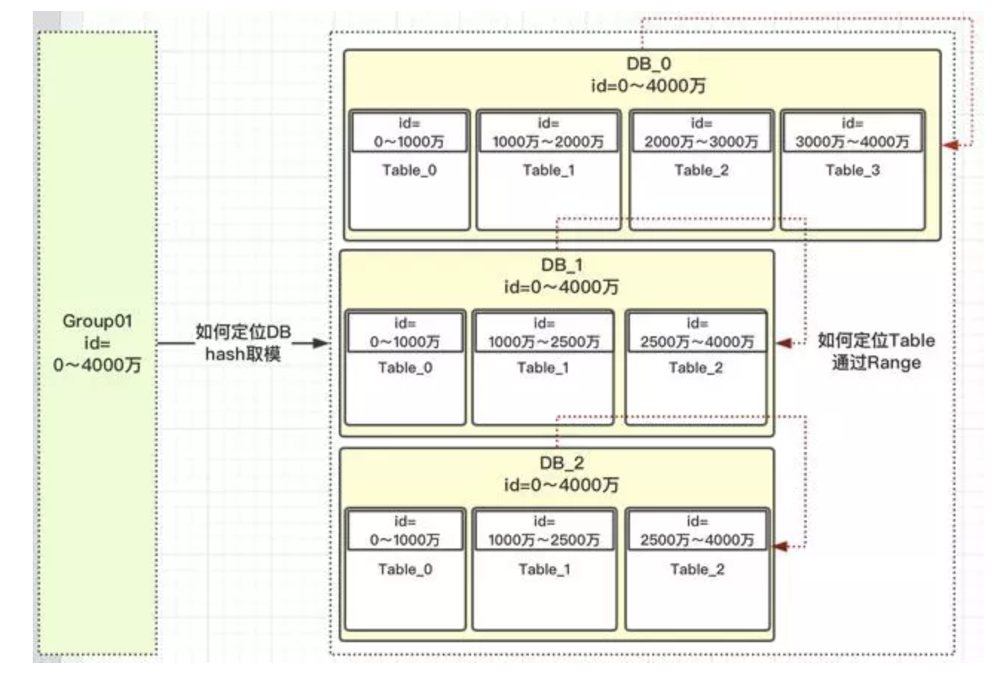
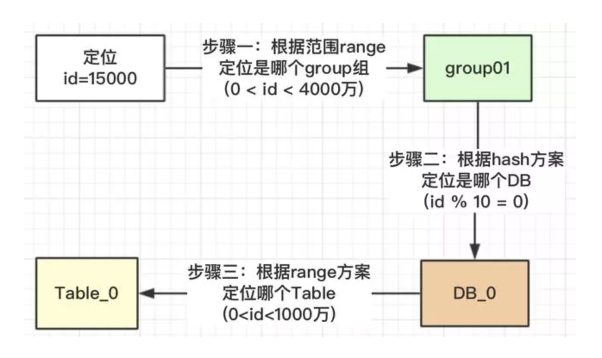
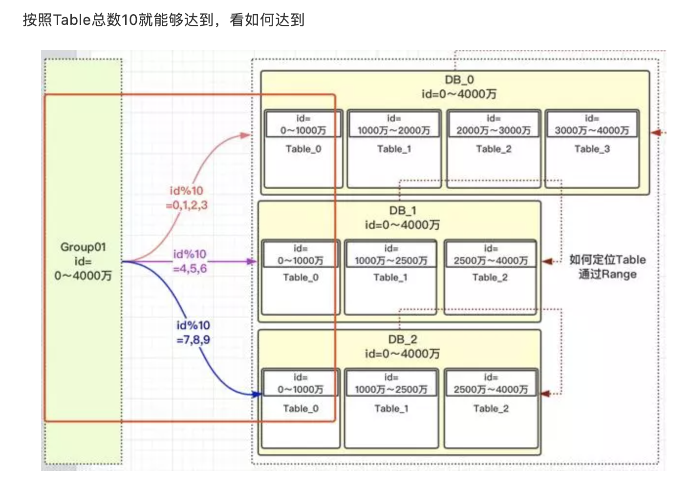
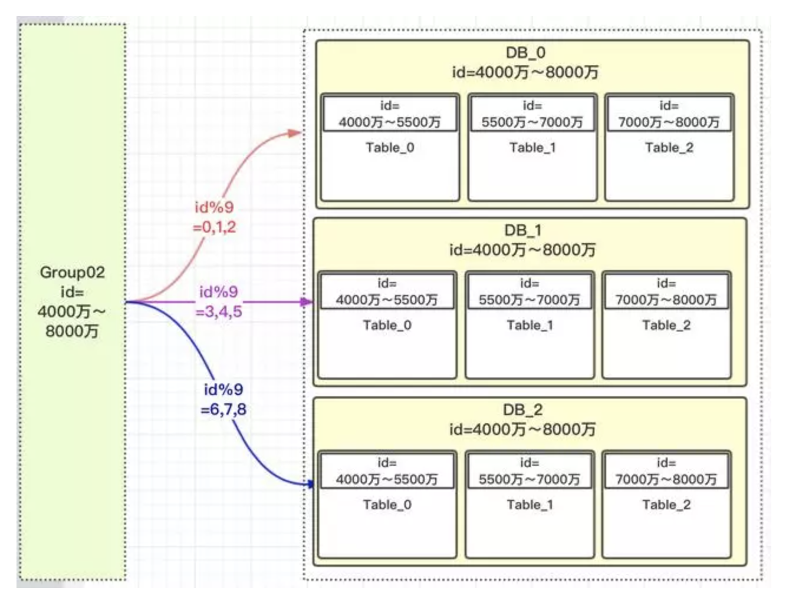
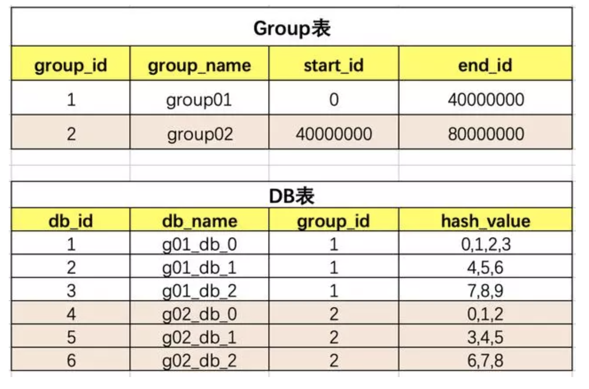
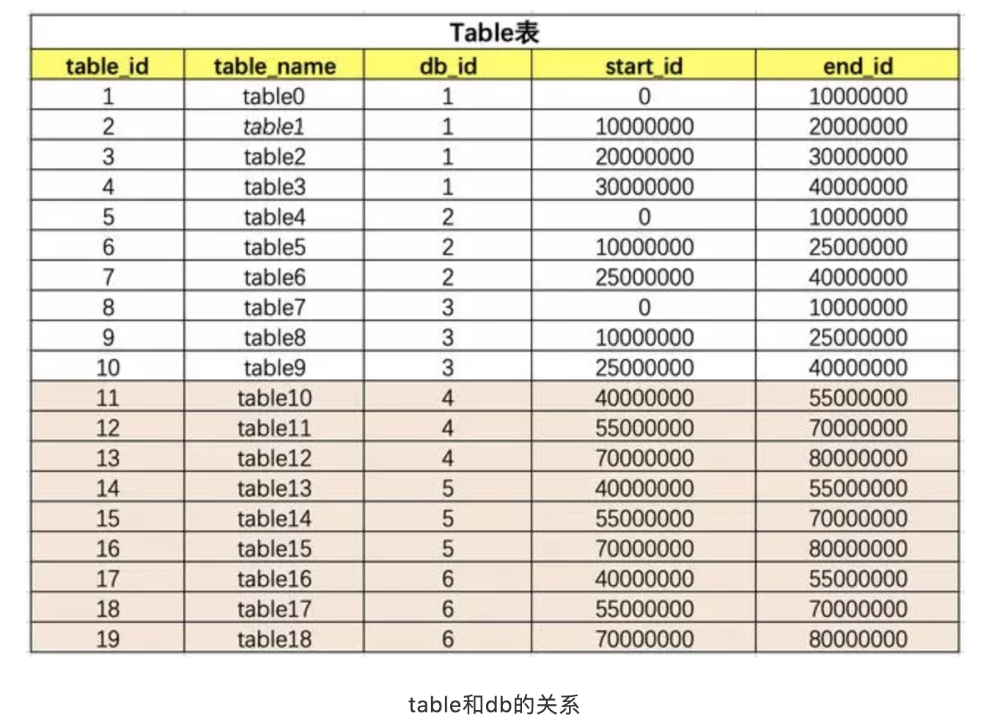

# 垂直拆分
垂直拆分的原则一般是按照业务类型来拆分，核心思想是专库专用，将业务耦合度比较高的表拆分到单独的库中。把不同的业务的数据分拆到不同的数据库节点上，这样一旦数据库发生故障时只会影响到某一个模块的功能，不会影响到整体功能，从而实现了数据层面的故障隔离。比如 用户表拆分到用户库等。

# 水平拆分
和垂直拆分的关注点不同，垂直拆分的关注点在于业务相关性，而水平拆分指的是将单一数据表按照某一种规则拆分到多个数据库和多个数据表中，关注点在数据的特点。

## 拆分规则
- 按照某一个字段的哈希值做拆分，这种拆分规则比较适用于实体表，比如说用户表，内容表，我们一般按照这些实体表的 ID 字段来拆分。比如说我们想把用户表拆分成 16 个库，每个库是 64 张表，那么可以先对用户 ID 做哈希，哈希的目的是将 ID 尽量打散，然后再对 16 取余，这样就得到了分库后的索引值；对 64 取余，就得到了分表后的索引值。
- 另一种比较常用的是按照某一个字段的区间来拆分，比较常用的是时间字段（或者是ID范围）。你知道在内容表里面有“创建时间”的字段，而我们也是按照时间来查看一个人发布的内容。我们可能会要看昨天的内容，也可能会看一个月前发布的内容，这时就可以按照创建时间的区间来分库分表，比如说可以把一个月的数据放入一张表中，这样在查询时就可以根据创建时间先定位数据存储在哪个表里面，再按照查询条件来查询。

# 解决分库分表引入的问题
- 引入了分库分表键，也叫做分区键，也就是我们对数据库做分库分表所依据的字段。
    - 可以引入唯一ID生成系统
- 多表操作
    - 可以使用分布式事务
- 多表聚合查询，比如统计多表count总数
    - 核心是引入第三张表来记录每张表的聚合数据。可以将每张表的计数的数据单独存储在一张表中或者记录在 Redis 里面。

# 详述分库分表带来问题的解决办法
## 背景
我们以订单数据为例，订单数据达到了4000万，我们也知道mysql单表存储量推荐是百万级，如果不进行处理，mysql单表数据太大，会导致性能变慢。使用方案可以参考数据进行水平拆分。把4000万数据拆分4张表或者更多。当然也可以分库，再分表；把压力从数据库层级分开。

## 方案
分库分表方案中有常用的方案，hash取模和range范围方案；分库分表方案最主要就是路由算法，把路由的key按照指定的算法进行路由存放。下边来介绍一下两个方案的特点。

## hash取模方案


hash的方案就是对指定的路由key（如：id）对分表总数进行取模。
### 优点
订单数据可以均匀的放到那4张表中，这样此订单进行操作时，就不会有热点问题。
> 热点的含义：热点的意思就是对订单进行操作集中到1个表中，其他表的操作很少。
订单有个特点就是时间属性，一般用户操作订单数据，都会集中到这段时间产生的订单。如果这段时间产生的订单 都在同一张订单表中，那就会形成热点，那张表的压力会比较大。
### 缺点
将来的数据迁移和扩容，会很难。解决办法：把之前的4000万数据，重新做一个hash方案，放到新的规划分表中。也就是我们要做数据迁移。

## range范围方案


range方案也就是以范围进行拆分数据。range方案比较简单，就是把一定范围内的订单，存放到一个表中；如上图id=12放到0表中，id=1300万的放到1表中。设计这个方案时就是前期把表的范围设计好。通过id进行路由存放。

### 优点
有利于将来的扩容，不需要做数据迁移。即时再增加4张表，之前的4张表的范围不需要改变，id=12的还是在0表，id=1300万的还是在1表，新增的4张表他们的范围肯定是 大于 4000万之后的范围划分的。

### 缺点
有热点问题，我们想一下，因为id的值会一直递增变大，那这段时间的订单是不是会一直在某一张表中，如id=1000万 ～ id=2000万之间，这段时间产生的订单是不是都会集中到此张表中，这个就导致1表过热，压力过大，而其他的表没有什么压力。

## 两种方案总结
- hash取模方案：没有热点问题，但扩容迁移数据痛苦
- range方案：不需要迁移数据，但有热点问题。

# 最终解决
```hash是可以解决数据均匀的问题，range可以解决数据迁移问题，那可以将两者结合，利用两者的特性。```
## 开始
我们先定义一个group组概念，这组里面包含了一些分库以及分表，如下图:



核心主流程：



按照上面的流程，我们就可以根据此规则，定位一个id，我们看看有没有避免热点问题。

我们看一下，id在【0，1000万】范围内的，根据上面的流程设计，1000万以内的id都均匀的分配到DB_0,DB_1,DB_2三个数据库中的Table_0表中，为什么可以均匀，因为我们用了hash的方案，对10进行取模。

> 上面我们也提了疑问，为什么对表的总数10取模，而不是DB的总数3进行取模？我们看一下为什么DB_0是4张表，其他两个DB_1是3张表？

在我们安排服务器时，有些服务器的性能高，存储高，就可以安排多存放些数据，有些性能低的就少放点数据。如果我们取模是按照DB总数3，进行取模，那就代表着【0，4000万】的数据是平均分配到3个DB中的，那就不能够实现按照服务器能力适当分配了。

按照Table总数10就能够达到，看如何达到



上图中我们对10进行取模，如果值为【0，1，2，3】就路由到DB_0，【4，5，6】路由到DB_1，【7，8，9】路由到DB_2。现在小伙伴们有没有理解，这样的设计就可以把多一点的数据放到DB_0中，其他2个DB数据量就可以少一点。DB_0承担了4/10的数据量，DB_1承担了3/10的数据量，DB_2也承担了3/10的数据量。整个Group01承担了【0，4000万】的数据量。

> 注意：小伙伴千万不要被DB_1或DB_2中table的范围也是0～4000万疑惑了，这个是范围区间，也就是id在哪些范围内，落地到哪个表而已。

如上：解决了热点的问题，以及可以按照服务器指标，设计数据量的分配。


## 如何扩容
其实上面设计思路理解了，扩容就已经出来了；那就是扩容的时候再设计一个group02组，定义好此group的数据范围就ok了。


因为是新增的一个group01组，所以就没有什么数据迁移概念，完全是新增的group组，而且这个group组照样就防止了热点，也就是【4000万，5500万】的数据，都均匀分配到三个DB的table_0表中，【5500万～7000万】数据均匀分配到table_1表中。

## 系统实现
思路确定了，设计是比较简单的，就3张表，把group，DB，table之间建立好关联关系就行了。





# 总结
到此为止，整体的方案介绍结束。

> 这边隐含了一个关键点，那就是路由key（如：id）的值是非常关键的，要求一定是有序的，自增的，这个就涉及到分布式唯一id的方案。