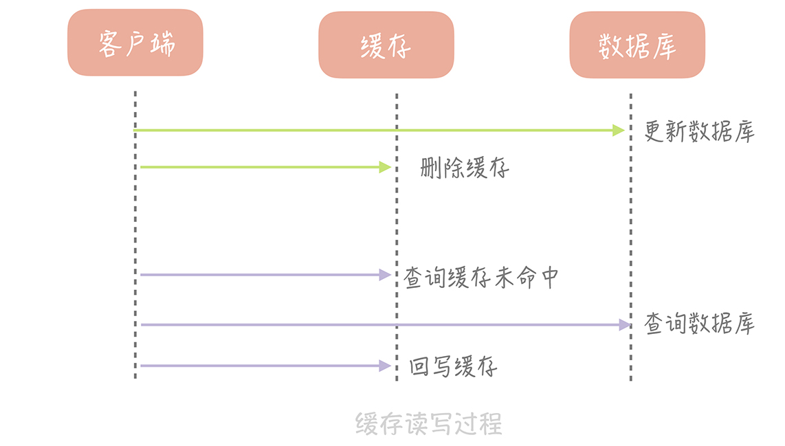

# 缓存一致性问题解决方案
缓存一定会引入不一致的，所以解决的办法需要权衡一致性和性能。

缓存应用的场景：读多写少。

# Cache Aside（旁路缓存）策略
这个策略数据以数据库中的数据为准，缓存中的数据是按需加载的

其中读策略的步骤是：
- 从缓存中读取数据；
- 如果缓存命中，则直接返回数据；
- 如果缓存不命中，则从数据库中查询数据；
- 查询到数据后，将数据写入到缓存中，并且返回给用户。

写策略的步骤是：
- 更新数据库中的记录；
- 删除缓存记录。
## 场景
我们来考虑一种最简单的业务场景，比方说在你的电商系统中有一个用户表，表中只有 ID 和年龄两个字段，缓存中我们以 ID 为 Key 存储用户的年龄信息。那么当我们要把 ID 为 1 的用户的年龄从 19 变更为 20，要如何做呢？

你可能会产生这样的思路：先更新数据库中 ID 为 1 的记录，再更新缓存中 Key 为 1 的数据。

这个思路会造成缓存和数据库中的数据不一致。比如，A 请求将数据库中 ID 为 1 的用户年龄从 19 变更为 20，与此同时，请求 B 也开始更新 ID 为 1 的用户数据，它把数据库中记录的年龄变更为 21，然后变更缓存中的用户年龄为 21。紧接着，A 请求开始更新缓存数据，它会把缓存中的年龄变更为 20。此时，数据库中用户年龄是 21，而缓存中的用户年龄却是 20。


## 问题分析
为什么产生这个问题呢？因为变更数据库和变更缓存是两个独立的操作，而我们并没有对操作做任何的并发控制。那么当两个线程并发更新它们的时候，就会因为写入顺序的不同造成数据的不一致。会严重产生错误的数据，因此不可采纳。

另外，直接更新缓存还存在另外一个问题就是丢失更新。还是以我们的电商系统为例，假如电商系统中的账户表有三个字段：ID、户名和金额，这个时候缓存中存储的就不只是金额信息，而是完整的账户信息了。```当更新缓存中账户金额时，你需要从缓存中查询完整的账户数据，把金额变更后再写入到缓存中。这个过程中也会有并发的问题，比如说原有金额是 20，A 请求从缓存中读到数据，并且把金额加 1，变更成 21，在未写入缓存之前又有请求 B 也读到缓存的数据后把金额也加 1，也变更成 21，两个请求同时把金额写回缓存，这时缓存里面的金额是 21，但是我们实际上预期是金额数加 2，这也是一个比较大的问题。``` 引起此问题的原因：查询金额与更新金额并非原子操作，可以使用lua脚本解决这个问题。

## 解决方案1
在更新数据时不更新缓存，而是删除缓存中的数据，在读取数据时，发现缓存中没了数据之后，再从数据库中读取数据，更新到缓存中。



能否先删除缓存，后更新数据库呢？答案是不行的。看下图：


## 此方案缺陷1
那么像 Cache Aside 策略这样先更新数据库，后删除缓存就没有问题了吗？其实在理论上还是有缺陷的。假如某个用户数据在缓存中不存在，请求 A 读取数据时从数据库中查询到年龄为 20，在未写入缓存中时另一个请求 B 更新数据。它更新数据库中的年龄为 21，并且清空缓存。这时请求 A 把从数据库中读到的年龄为 20 的数据写入到缓存中，造成缓存和数据库数据不一致。


不过这种问题出现的几率并不高，原因是缓存的写入通常远远快于数据库的写入，所以在实际中很难出现请求 B 已经更新了数据库并且清空了缓存，请求 A 才更新完缓存的情况

## 此方案的缺陷2
Cache Aside 存在的最大的问题是当写入比较频繁时，缓存中的数据会被频繁地清理，这样会对缓存的命中率有一些影响。如果你的业务对缓存命中率有严格的要求，那么可以考虑下面解决方案：
- 在更新数据时更新缓存，只是给缓存加一个较短的过期时间，这样即使出现缓存不一致的情况，缓存的数据也会很快过期，对业务的影响也是可以接受。

频繁更新的数据，此时是否可以考虑不适合利用缓存。

## 此方案的缺陷3（可能是比较大的缺陷）
Cache Aside（旁路缓存）策略，对于读多写少场景，当一个写操作更新db后同时删除缓存。然后多个读就会回源，会造成db压力。

## 解决方案2
多个客户端更新缓存和数据库之间是无序的、并发的操作，这样必然导致数据不一致的问题，因此可以采用了监听binlog的方式，把Binlog扔到消息队列中（这里需要考虑消息的顺序性，或者用zset保证顺序并去重），由一个leader来消费，负责更新缓存，保证了写缓存操作之间的顺序性，保证了缓存的准确性，避免了频繁读库。

此时不能给缓存设置过期时间，读请求来了仍然是读缓存的数据，此方案很好的解决了缺陷3。

### 如果缓存删除失败怎样解决？&方案2的流程图
> 通用解决方案：解决方案就是再加上一个重试机制，保证删除缓存成功。利用MQ重试


```
流程如下图所示：
（1）更新数据库数据
（2）数据库会将操作信息写入binlog日志当中
（3）订阅程序提取出所需要的数据以及key
（4）另起一段非业务代码，获得该信息
（5）尝试删除缓存操作，发现删除失败
（6）将这些信息发送至消息队列
（7）重新从消息队列中获得该数据，重试操作。
```
**上图可以很好的解决 缓存删除失败进行重试的情况，也是对方案2的补充。**  


## 解决方案3
由后台线程来更新缓存，而不是由业务线程来更新缓存，缓存本身的有效期设置为永久，后台线程定时更新缓存。 此时只能保证最终一致性。

## 总结
所以，如果你想实现基础的缓存数据库双写一致的逻辑，那么在大多数情况下，```在不想做过多设计，增加太大工作量的情况下，请先更新数据库，再删缓存!```

# Read/Write Through（读穿 / 写穿）策略
这个策略的核心原则是用户只与缓存打交道，由缓存和数据库通信，写入或者读取数据。

Write Through 的策略是这样的：先查询要写入的数据在缓存中是否已经存在，如果已经存在，则更新缓存中的数据，并且由缓存组件```同步```更新到数据库中，如果缓存中数据不存在，我们把这种情况叫做“Write Miss（写失效）”。

此方案虽然可以解决缓存一致性问题，但是性能存在很大的缺陷，不适用在商业业务中。


# 缓存一致性的trade off
对于一个不能保证事务性的操作，一定涉及“哪个任务先做，哪个任务后做”的问题，解决这个问题的方向是：如果出现不一致，谁先做对业务的影响较小，就谁先执行。

## 我非要数据库和缓存数据强一致怎么办
```
结论：
缓存系统适用的场景就是非强一致性的场景，没有办法做到绝对的一致性，这是由CAP理论决定的，缓存系统适用的场景就是非强一致性的场景，所以它属于CAP中的AP,必须保证缓存的高可用性。
所以，我们得委曲求全，可以去做到BASE理论中说的最终一致性。

```