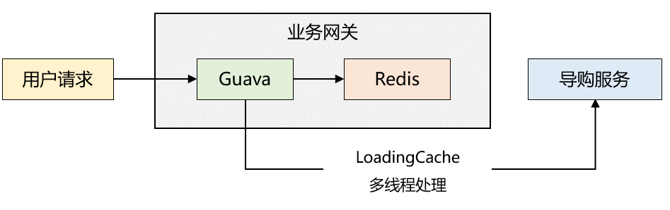

# 哪类数据适合缓存
缓存量大但又不常变化的数据，比如详情，评论等。对于那些经常变化的数据，其实并不适合缓存，一方面会增加系统的复杂性（缓存的更新，缓存脏数据），另一方面也给系统带来一定的不稳定性（缓存系统的维护）。

但一些极端情况下，你需要将一些会变动的数据进行缓存，比如想要页面显示准实时的库存数，或者其他一些特殊业务场景。这时候你需要保证缓存不能（一直）有脏数据，这就需要再深入讨论一下。

# 缓存的利与弊
我们到底该不该上缓存的，这其实也是个trade-off（权衡）的问题。  
上缓存的优点：
- 能够缩短服务的响应时间，给用户带来更好的体验。
- 能够增大系统的吞吐量，依然能够提升用户体验。
- 减轻数据库的压力，防止高峰期数据库被压垮，导致整个线上服务BOOM！

上了缓存，也会引入很多额外的问题：
- 缓存有多种选型，是内存缓存，memcached还是redis，你是否都熟悉，如果不熟悉，无疑增加了维护的难度（本来是个纯洁的数据库系统）。
- 缓存系统也要考虑分布式，比如redis的分布式缓存还会有很多坑，无疑增加了系统的复杂性。

# 多级缓存
首先要明确为什么要使用多级缓存？  
本地缓存速度极快，但是容量有限，而且无法共享内存。分布式缓存容量可扩展，但在高并发场景下，如果所有数据都必须从远程缓存种获取，很容易导致带宽跑满，吞吐量下降。

有句话说得好，缓存离用户越近越高效！

使用多级缓存的好处在于：高并发场景下, 能提升整个系统的吞吐量，减少分布式缓存的压力。

## 业务实例
2018年，我服务的一家电商公司需要进行 app 首页接口的性能优化。我花了大概两天的时间完成了整个方案，采取的是两级缓存模式，同时利用了 guava 的惰性加载机制，整体架构如下图所示：



缓存读取流程如下：

1、业务网关刚启动时，本地缓存没有数据，读取 Redis 缓存，如果 Redis 缓存也没数据，则通过 RPC 调用导购服务读取数据，然后再将数据写入本地缓存和 Redis 中；若 Redis 缓存不为空，则将缓存数据写入本地缓存中。

2、由于步骤1已经对本地缓存预热，后续请求直接读取本地缓存，返回给用户端。

3、Guava 配置了 refresh 机制，每隔一段时间会调用自定义 LoadingCache 线程池（5个最大线程，5个核心线程）去导购服务同步数据到本地缓存和 Redis 中。

优化后，性能表现很好，平均耗时在 5ms 左右。最开始我以为出现问题的几率很小，可是有一天晚上，突然发现 app 端首页显示的数据时而相同，时而不同。

也就是说： 虽然 LoadingCache 线程一直在调用接口更新缓存信息，但是各个服务器本地缓存中的数据并非完成一致。说明了两个很重要的点：   

1、惰性加载仍然可能造成多台机器的数据不一致

2、 LoadingCache 线程池数量配置的不太合理,  导致了线程堆积

```最终，我们的解决方案是：```  
1、惰性加载结合消息机制来更新缓存数据，也就是：当导购服务的配置发生变化时，通知业务网关重新拉取数据，更新缓存。   
2、适当调大 LoadigCache 的线程池参数，并在线程池埋点，监控线程池的使用情况，当线程繁忙时能发出告警，然后动态修改线程池参数。