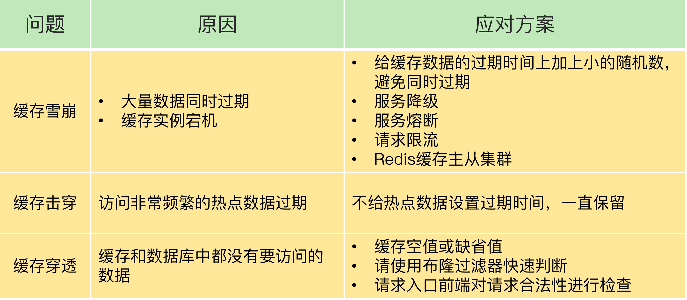

# 方案设计
缓存方案不要设计的过分复杂，否则数据不一致的问题突出，会带来很大的问题。

# 主从延迟
- 更换为强一致性架构
- 读主库
mysql的主从延迟也是类似的解决方案。

# 缓存击穿
缓存击穿是指，针对某个访问非常频繁的热点数据的请求(```针对的是热点数据```)，无法在缓存中进行处理，紧接着，访问该数据的大量请求，一下子都发送到了后端数据库，导致了数据库压力激增，会影响数据库处理其他请求。

## 解决方案
- 缓存预热，缓存异步更新，不设置过期时间。
- 为了避免缓存击穿给数据库带来的激增压力，我们的解决方法也比较直接，对于访问特别频繁的热点数据，我们就不设置过期时间了。

# 缓存雪崩
缓存雪崩是指大量的应用请求无法在 Redis 缓存中进行处理，紧接着，应用将大量请求发送到数据库层，导致数据库层的压力激增。一般会有两个原因导致：
- 缓存中有大量数据同时过期，导致大量请求无法得到处理。
- Redis 缓存实例发生故障宕机了，无法处理请求，这就会导致大量请求一下子积压到数据库层，从而发生缓存雪崩。

## 针对原因一的解决办法
首先，我们可以避免给大量的数据设置相同的过期时间。如果业务层的确要求有些数据同时失效，你可以在用 EXPIRE 命令给每个数据设置过期时间时，给这些数据的过期时间增加一个较小的随机数（例如，随机增加 1~3 分钟），这样一来，不同数据的过期时间有所差别，但差别又不会太大，既避免了大量数据同时过期，同时也保证了这些数据基本在相近的时间失效，仍然能满足业务需求。

## 针对原因二的解决办法
- 第一个建议，是在业务系统中实现服务熔断或请求限流机制。
- 部署redis主从集群+sentinel模式，保证高可用性。

## 其他通用解决方案1
采取了双key策略：要缓存的key过期时间是t，key1没有过期时间。每次缓存读取不到key时就返回key1的内容，然后触发一个事件。这个事件会同时更新key和key1。

## 其他通用解决方案2
- 1、由后台线程来更新缓存，而不是由业务线程来更新缓存，缓存本身的有效期设置为永久，后台线程定时更新缓存。(缓存命中有一定时间的间隔空隙，采用步骤2来弥补,当然可以把间隔时间设置比过期时间短)
- 2、业务线程发现缓存失效后，通过消息队列发送一条消息通知后台线程更新缓存(也可以起异步线程去更新)。可能会出现多个业务线程都发送了缓存更新消息，但其实对后台线程没有影响，后台线程收到消息后更新缓存前可以判断缓存是否存在，存在就不执行更新操作。这种方式实现依赖消息队列，复杂度会高一些，但缓存更新更及时，用户体验更好。

```后台更新机制还适合业务刚上线的时候进行缓存预热。缓存预热指系统上线后，将相关的缓存数据直接加载到缓存系统，而不是等待用户访问才来触发缓存加载。```

# 缓存穿透
缓存穿透是指要访问的数据```既不在 Redis 缓存中，也不在数据库中```，导致请求在访问缓存时，发生缓存缺失，再去访问数据库时，发现数据库中也没有要访问的数据。此时，应用也无法从数据库中读取数据再写入缓存，来服务后续请求，这样一来，缓存也就成了“摆设”。有以下原因：
- 恶意攻击：专门访问数据库中没有的数据。

## 针对原因一：
使用布隆过滤器快速判断数据是否存在，避免从数据库中查询数据是否存在，减轻数据库压力。

```注意：缓存穿透不适合利用限流或者熔断机制来保护系统，这样会拦截正常的用户请求，因为数据本身就不存在。```

# 总结


## 服务熔断、服务降级、请求限流带来的问题：
最后，服务熔断、服务降级、请求限流这些方法都是属于“有损”方案，在保证数据库和整体系统稳定的同时，会对业务应用带来负面影响。例如使用服务降级时，有部分数据的请求就只能得到错误返回信息，无法正常处理。如果使用了服务熔断，那么，整个缓存系统的服务都被暂停了，影响的业务范围更大。而使用了请求限流机制后，整个业务系统的吞吐率会降低，能并发处理的用户请求会减少，会影响到用户体验。

所以，我给你的建议是:

尽量使用预防式方案：
- 针对缓存雪崩，合理地设置数据过期时间，以及搭建高可靠缓存集群；
- 针对缓存击穿，在缓存访问非常频繁的热点数据时，不要设置过期时间；
- 针对缓存穿透，提前在入口前端实现恶意请求检测，或者规范数据库的数据删除操作，避免误删除。
