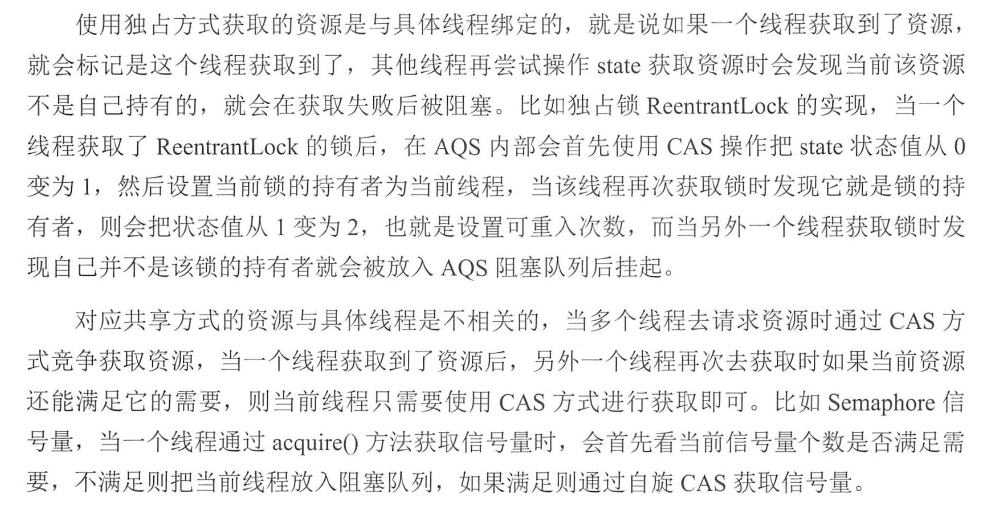

## 介绍：
AQS全称是 AbstractQueuedSynchronizer （抽象队列同步器），是通过一个先进先出的队列（存储等待的线程）来实现同步器的一个框架是一个抽象类，是java.util.concurrent包下很多多线程工具类的实现基础。Lock、CountDownLatch、Semaphore等都是基于AQS实现的。AQS是一个FIFO的双向链表结构，其内部通过head、tail节点标识链表的首节点与尾结点，队列元素为Node类型，Node中的Thread变量是是用来存放到AQS队列里面的线程。

## AQS的实现：
AQS支持两种锁一种是独占锁（独占模式），一种是共享锁（共享模式）
- 独占锁：比如像ReentrantLock就是一种独占锁模式，多个线程去同时抢一个锁，只有一个线程能抢到这个锁，其他线程就只能阻塞等待锁被释放后重新竞争锁。
- 共享锁：比如像读写锁里面的读锁，一个锁可以同时被多个线程拥有（多个线程可以同时拥有读锁），再比如Semaphore 设置一个资源数目（可以理解为一个锁能同时被多少个线程拥有）。
- 共享锁跟独占锁可以同时存在，比如比如读写锁，读锁写锁分别对应共享锁和独占锁。

## 源码分析：
### AQS成员变量：
```java
//AQS等待队列的头结点，AQS的等待队列是基于一个双向链表来实现的，这个头结点并不包含具体的线程是一个空结点（注意不是null）
private transient volatile Node head;
//AQS等待队列的尾部结点
private transient volatile Node tail;
//AQS同步器状态，也可以说是锁的状态，注意volatile修饰证明这个变量状态要对多线程可见
private volatile int state;
```
>> AQS内部维持了一个单一状态信息state，可以通过```getState、setState、compareAndSetState```修改state的值。在ReentrantLock里，state表示当前线程获得锁的可重入次数。对于读写锁ReentrantReadWriteLock来说，state的高16位表示读状态，也就是获取读锁的次数，低16位表示该线程获取写锁的可重入次数。对于Semaphore来说，state表示当前可用信号的个数；对于CountDownLatch来说，state表示计数器当前的值。对于AQS来说，线程同步的关键是对state变量的操作，根据state是否属于一个线程，操作的方式分为独占和共享。

### AQS内部类Node:
Node顾名思义就是接点的意思，前面说过AQS等待队列是一个双链表，每个线程进入AQS的等待队列的时候都会被包装成一个Node节点。
```java
static final class Node {
    // 共享锁是空对象
    static final Node SHARED = new Node();
    // 独占锁是null
    static final Node EXCLUSIVE = null;

    // 下面这四个属性就是说明结点(当前线程的状态)的状态
    static final int CANCELLED =  1;
    // SIGNAL 表示线程需要被unparking
    static final int SIGNAL    = -1;
    static final int CONDITION = -2;
    static final int PROPAGATE = -3;
    volatile int waitStatus;
    // 前驱节点
    volatile Node prev;
    // 后继节点
    volatile Node next;
    // 结点所包装的线程
    volatile Thread thread;
    //对于Condtion表示下一个等待条件变量的节点；其它情况下用于区分共享模式和独占模式
    Node nextWaiter;
  }
```
>> Node节点内部的SHARED是用来标记该线程在获取共享资源被阻塞挂起后放入AQS队列的；EXCLUSIVE用来标记该现场获取独占资源阻塞挂起后放入AQS队列的。```waitStatus```记录当前线程的状态，可以为CANCELLED(线程被取消了),SIGNAL(线程需要被唤醒),CONDITION(线程在条件队列中等待),PROPAGATE(释放共享资源时，需要通知其他节点)。

### AQS 独占模式下获取锁的基本方法acquire(int arg)分析：
```java
public final void acquire(int arg) {
    // 如果尝试获得锁失败
    if (!tryAcquire(arg) &&
        acquireQueued(addWaiter(Node.EXCLUSIVE), arg))
        selfInterrupt();
}
```
>> 该方法会试图获取锁，如果获取不到，就会被加入等待队列等待被唤醒.首先是 tryAcquire 方法，也就是尝试获取锁，该方法是需要被写的，父类默认的方法是抛出异常。如何重写呢？抽象类定义一个标准：如果返回 true，表示获取锁成功，反之失败。在ReenterLock已经分析。我们回到 acquire 方法，如果获取锁成功，就直接返回了，如果失败了，则继续后面的操作，也就是将线程放入等待队列中：

- tryAcquire方法抢锁失败就执行acquireQueued(addWaiter(Node.EXCLUSIVE), arg)
- 先是addWaiter(Node.EXCLUSIVE)方法，这个方法表示将当前抢锁线程包装成结点并加入等待队列，返回包装后的结点
- addWaiter方法返回的结点，作为acquireQueued方法的参数，该方法主要是等待队列顺序获取资源
- 注意acquireQueued返回true表示线程发生中断，这时就会执行selfInterrupt方法响应中断。
由于tryAcquire AQS没有具体实现，下面我们就接着看下addWaiter这个方法:
```java
// 将当前线程放入到队列节点
private Node addWaiter(Node mode) {
    Node node = new Node(Thread.currentThread(), mode);
    Node pred = tail;
    if (pred != null) {
        node.prev = pred;
        if (compareAndSetTail(pred, node)) {
            pred.next = node;
            return node;
        }
    }
    // cas更新tail失败就以自旋的方式继续尝试入队列
    enq(node);
    return node;
}
private final boolean compareAndSetTail(Node expect, Node update) {
    return unsafe.compareAndSwapObject(this, tailOffset, expect, update);
}
addWaiter步骤如下：
1.创建一个当前线程的 Node 对象（nextWaiter 属性为 null， thread 属性为 当前线程）
2.如果当前节点node不为null，并且把node节点插入到尾部，CAS更新tail节点的引用。
3.如果步骤2失败，进入enq(node)
```

```java
// 以自旋的方式进入AQS队列(FIFO)
private Node enq(final Node node) {
    for (;;) {
        Node t = tail;
        if (t == null) { // Must initialize
            if (compareAndSetHead(new Node()))
                tail = head;
        } else {
            node.prev = t;
            if (compareAndSetTail(t, node)) {
                t.next = node;
                return t;
            }
        }
    }
}
```
enq方法分析：该方法主要就是初始化头节点和末端节点，并将新的节点追加到末端节点并更新末端节点，最后返回node节点。

我们回到 addWaiter 方法中，该方法主要作用就是根据当前线程创建一个 node 对象，并追加到队列的末端。

addWaiter方法返回刚创建的node对象，接着调用acquireQueued方法：
```java
final boolean acquireQueued(final Node node, int arg) {
    boolean failed = true;
    try {
        boolean interrupted = false;
        // 死循环
        for (;;) {
            // 获取前一个节点
            final Node p = node.predecessor();
            if (p == head && tryAcquire(arg)) {
                setHead(node);
                p.next = null; // help GC
                failed = false;
                return interrupted;
            }
            // 挂起. 如果被唤醒，那么会继续for循环
            if (shouldParkAfterFailedAcquire(p, node) &&
                parkAndCheckInterrupt())
                // parkAndCheckInterrupt阻塞线程，并返回线程是否被中断。
                interrupted = true;
        }
    } finally {
        if (failed)
            cancelAcquire(node);
    }
}
```
该方法步骤如下：  
1.死循环。先获取 node 对象 prev 节点，如果该节点和 head 相等，说明是他是第二个节点，那么此时就可以尝试获取锁了。  
1.1 如果获取锁成功，就设置当前节点为 head 节点（同时设置当前node的线程为null，prev为null），并设置他的 prev 节点的 next 节点为 null（帮助GC回收）。最后，返回等待过程中是否中断的布尔值。  
2.如果上面的两个条件不成立，则调用  shouldParkAfterFailedAcquire 方法和 parkAndCheckInterrupt 方法。这两个方法的目的就是将当前线程挂起。然后等待被唤醒或者被中断。  
3.如果挂起后被当前线程唤醒，则再度循环，判断是该节点的 prev 节点是否是 head，一般来讲，当你被唤醒，说明你被准许去拿锁了，也就是 head 节点完成了任务释放了锁。然后重复步骤 1。最后返回。

shouldParkAfterFailedAcquire方法如下：
```java
private static boolean shouldParkAfterFailedAcquire(Node pred, Node node) {
    int ws = pred.waitStatus;
    if (ws == Node.SIGNAL) {
        return true;
    }
    if (ws > 0) {
        do {
            // 跳过cancel的节点
            node.prev = pred = pred.prev;
        } while (pred.waitStatus > 0);
        pred.next = node;
    } else {
        // 设置node节点的pre节点状态为有效
        compareAndSetWaitStatus(pred, ws, Node.SIGNAL);
    }
    return false;
}
```
该方法步骤如下：  
- 获取去上一个节点的等待状态，如果状态是 SIGNAL -1，就直接返回 true，表示可以挂起并休息。
- 如果 waitStatus 大于 0， 则循环检查 prev 节点的 prev 的waitStatus，直到遇到一个状态不大于0。该字段有4个状态，分别是 CANCELLED =  1，SIGNAL    = -1， CONDITION = -2， PROPAGATE = -3，也就是说，如果大于 0，就是取消状态。那么，往上找到那个不大于0的节点后怎么办？将当前节点指向 那个节点的 next 节点，也就是说，那些大于0 状态的节点都失效这里，随时会被GC回收。
如果不大于0 也不是 -1，则将上一个节点的状态设置为需要被唤醒状态， 也就是 -1.最后返回 false。注意，在acquireQueued 方法中，返回 false 后会继续循环，此时 pred 节点已经是 -1 了，因此最终会返回 true。

```java
private final boolean parkAndCheckInterrupt() {
    // 挂起当前线程。线程被唤醒时，会从这里继续往下执行。
    LockSupport.park(this);
    // 返回当前线程是否是被中断了，注意，该方法会清除中断状态.
    // 如果被中断了，那么返回true，并且重置中断标志位为false.
    return Thread.interrupted();
}
```

>> 回到 acquireQueued 方法，总结一下该方法，该方法就是将刚刚创建的线程节点挂起，然后等待唤醒，如果被唤醒了，则将自己设置为 head 节点。最后，返回是否被中断。

### AQS 独占模式的release释放锁：
```java
public final boolean release(int arg) {
    // 由子类重写
    if (tryRelease(arg)) {
        Node h = head;
        if (h != null && h.waitStatus != 0)
            unparkSuccessor(h);
        return true;
    }
    // 释放锁失败，其实啥也没干
    return false;
}

private void unparkSuccessor(Node node) {
    int ws = node.waitStatus;
    if (ws < 0)
        compareAndSetWaitStatus(node, ws, 0);
    // 获取头结点的下一个节点
    Node s = node.next;
    // 如果头结点的下一个节点为null,或者是cacel状态(随时可能被GC)
    if (s == null || s.waitStatus > 0) {
        s = null;
        // 从后往前找第一个正常节点
        for (Node t = tail; t != null && t != node; t = t.prev) {
            if (t.waitStatus <= 0) {
                s = t;
            }
        }
    }
    if (s != null)
    // 唤醒该线程
    LockSupport.unpark(s.thread);
}
```

> 可重入锁基于AQS，AQS是基于state、队列来完成的。使用独占的方式，是与具体的线程进行绑定的，就是说如果一个线程获取到了资源，就会标记这个线程获取到了，其他线程再想操作state获取资源时，就会阻塞。

### AQS共享模式分析：
```java
public final void acquireShared(int arg) {
    // 尝试获取共享锁
    // 取共享锁失败的线程也会阻塞,比如读写锁，读锁线程发现写锁已被占用，因此会进入阻塞状态
    if (tryAcquireShared(arg) < 0)
        doAcquireShared(arg);
}
```
> 获取共享锁失败的线程也会阻塞,比如读写锁，读锁线程发现写锁已被占用，因此会进入阻塞状态。

```java
private void doAcquireShared(int arg) {
    // 把当前线程构造共享节点，加入AQS阻塞队列
    final Node node = addWaiter(Node.SHARED);
    boolean failed = true;
    try {
        boolean interrupted = false;
        for (;;) {
            final Node p = node.predecessor();
            if (p == head) {
                // 尝试获取共享锁
                int r = tryAcquireShared(arg);
                if (r >= 0) {
                    setHeadAndPropagate(node, r);
                    p.next = null; // help GC
                    if (interrupted)
                        selfInterrupt();
                    failed = false;
                    return;
                }
            }
            // 挂起线程
            if (shouldParkAfterFailedAcquire(p, node) &&
                parkAndCheckInterrupt())
                interrupted = true;
        }
    } finally {
        if (failed)
            cancelAcquire(node);
    }
}
```
> AQS共享模式下，与独占模式有很大相似之处。


## AQS独占模式与共享模式总结：



