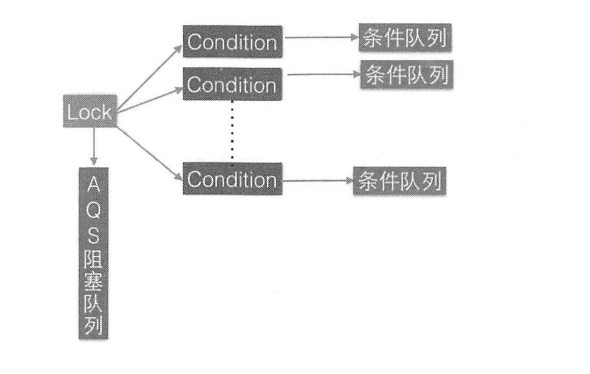

# AQS对条件变量Condition的支持：
## 使用与简单介绍：
```java
public static void main(String[] args) {
    ReentrantLock lock = new ReentrantLock();
    Condition condition = lock.newCondition();
    try {
        lock.lock();
        condition.await();
        // 演示作用
        condition.signal();
    } catch (Exception e) {
        e.printStackTrace();
    }
    finally {
        lock.unlock();
    }
}
```
> notify与wait是配合synchronized内置锁实现线程同步，条件变量的signal和await是用来配合锁(利用AQS实现的)来实现线程同步的。```他们的不同在于，synchronized同时只能与一个共享变量的notify与wait方法实现同步，而AQS的一个锁可以对应多个条件变量。```

## 源码逻辑介绍：
### 构造函数
```java
// java.util.concurrent.locks.ReentrantLock#newCondition
public Condition newCondition() {
    return sync.newCondition();
}
final ConditionObject newCondition() {
    return new ConditionObject();
}
```
调用ReentrantLock重写AQS的newCondition方法，创建一个Condition对象。

### await方法介绍：
```java
// java.util.concurrent.locks.AbstractQueuedLongSynchronizer.ConditionObject#await()
public final void await() throws InterruptedException {
    if (Thread.interrupted())
        throw new InterruptedException();
    // 封装当前线程，创建新的节点 加入该条件队列末尾(注意，不是AQS队列)
    Node node = addConditionWaiter();
    // 释放当前线程拥有的锁
    long savedState = fullyRelease(node);
    int interruptMode = 0;
    // 判断节点是否在AQS阻塞队列中
    while (!isOnSyncQueue(node)) {
        // 不在AQS队列中，挂起当前线程。(当调用unpark时，会从这里继续执行)
        LockSupport.park(this);
        // 判断线程是否被中断
        if ((interruptMode = checkInterruptWhileWaiting(node)) != 0)
            break;
    }
    // 如果在AQS队列中，调用acquireQueued尝试获得锁，获取锁失败重新挂起
    if (acquireQueued(node, savedState) && interruptMode != THROW_IE)
        interruptMode = REINTERRUPT;
    if (node.nextWaiter != null) // clean up if cancelled
        unlinkCancelledWaiters();
    if (interruptMode != 0)
        reportInterruptAfterWait(interruptMode);
}
```

### signal方法介绍
```java
public final void signal() {
    if (!isHeldExclusively())
        throw new IllegalMonitorStateException();
    Node first = firstWaiter;
    if (first != null)
        // 把条件队列的队头元素加入AQS队列末尾
        doSignal(first);
}
```
signal方法逻辑如下：  
当另外一个线程调用条件变量的signal方法时，在内部会把条件队列(单链表)里的队头的线程节点移除，并放入AQS阻塞队列中，并且唤醒这个线程。

```java
private void doSignal(Node first) {
    do {
        if ( (firstWaiter = first.nextWaiter) == null)
            lastWaiter = null;
        first.nextWaiter = null;
        // 把第一个节点从条件队列移除，放入AQS末尾
    } while (!transferForSignal(first) &&
                (first = firstWaiter) != null);
}

final boolean transferForSignal(Node node) {
    if (!compareAndSetWaitStatus(node, Node.CONDITION, 0))
        return false;
    // 加入AQS队列
    Node p = enq(node);
    int ws = p.waitStatus;
    if (ws > 0 || !compareAndSetWaitStatus(p, ws, Node.SIGNAL))
        // 唤醒该节点。(与上面分析的挂起该线程对比)
        LockSupport.unpark(node.thread);
    return true;
}
```

### lock与condition的关系：
