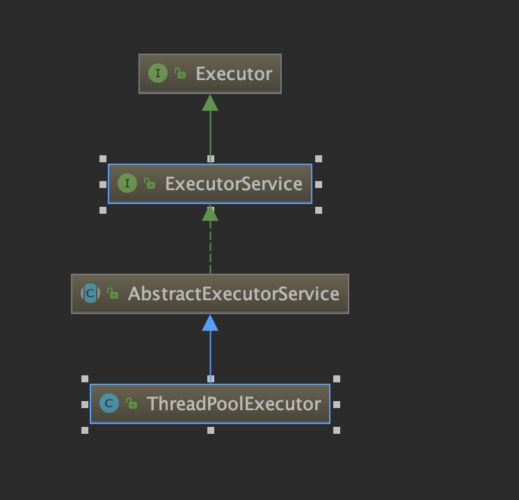

## 类结构介绍：


## 重要方法介绍：
### submit方法介绍：
```java
// 提交Runnable任务
public Future<?> submit(Runnable task) {
    if (task == null) throw new NullPointerException();
    // 封装成FutureTask
    RunnableFuture<Void> ftask = newTaskFor(task, null);
    // 最终仍然调用的是threadpoolExecutor的execute方法
    execute(ftask);
    return ftask;
}
// 提交Callable任务，返回Future<T>
public <T> Future<T> submit(Callable<T> task) {
    if (task == null) throw new NullPointerException();
    RunnableFuture<T> ftask = newTaskFor(task);
    execute(ftask);
    return ftask;
}
```
**```FutrueTask最终获取结果get方法会导致线程阻塞，其本质还是调用LockSupport.park与LockSupport.parkNanos方法阻塞获取结果的线程。```**